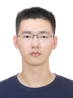
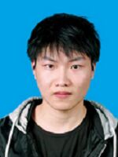
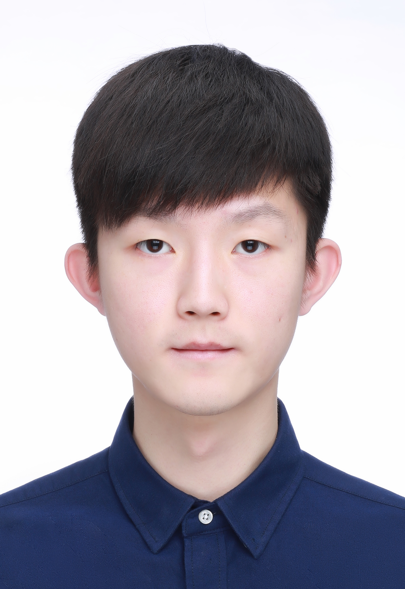
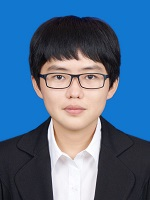
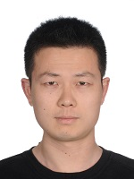

# 2010年至今指导和协助指导的毕业研究生
- 2021级：熊玺、龙泽泓、舒曼、张玉树、马强、罗敬
- 2020级：张峻伟、李宗泽、康勐、龚晓宇、朱盛
- 2019级：于佳玉、张正昊、路笳艺
- 2018级：李静瑶、李俊劼、刘京、韩帅
- 2017级：周文博、张桐搏、徐玥
- 2016级：贺甫霖、邹璐琨
- 2015级：牛当当、李壮、王强、李广力、王冠成
- 2014级：杨洋、刘丰
- 2012级：牛当当、李壮
- 2011级：张鑫、刘冬清
- 2010级：魏唯、邹婷婷

***

## 熊玺，男，1997年05月生，山西省运城市人。
- 2017.09-2021.06，山西大学数学科学学院信息与计算科学专业，本科生
- 2021.09-2024.06，吉林大学计算机科学与技术学院计算机科学与技术专业，硕士生（导师：吕帅副教授、申春副教授）
- 研究方向：人工智能、机器学习
- 毕业去向：待更新

## 【学术论文】在国内外期刊和会议上发表学术论文1篇，在审学术论文2篇。
1. **Xiong Xi**, Shen Chun, Wu Junhong, Lü Shuai*, Zhang Xiaodan. Combined data augmentation framework for generalizing deep reinforcement learning from pixels. 2023. (Submitted)
2. Wu Junhong, Liu Jie, **Xiong Xi**, An Daolong, Lü Shuai*. Focus on primary: Differential diverse data augmentation for generalization in visual reinforcement learning. 2023. (Submitted)
3. Zhang Junwei, Han Shuai, **Xiong Xi**, Zhu Sheng, Lü Shuai*. Explorer-Actor-Critic: Better actors for deep reinforcement learning. **Information Sciences**, 2024, 662: 120255. **(中科院1区TOP期刊, CCF推荐B类期刊, SCI)**

## 【学位论文】
1. **熊玺**. 用于泛化图像深度强化学习的组合数据增强框架[硕士学位论文]. 长春: 吉林大学, 2024.

## 【荣誉奖励】
- 2017-2018学年，校优秀学生干部
- 2018-2019学年，国家励志奖学金、校三好学生
- 2019-2020学年，国家励志奖学金、三等奖学金
- 2020-2021学年，三等奖学金、校三好学生
- 2021-2022学年，研究生学业奖学金
- 2022-2023学年，研究生学业奖学金

## 【联系方式】
- 邮箱：xiongxi21@mails.jlu.edu.cn
- 办公：吉林大学王湘浩楼B230室
- 地址：长春市前进大街2699号，130012

***

## 龙泽泓，男，1999年06月生，山西省大同市人。
- 2017.09-2021.06，山西大学数学科学学院信息与计算科学专业，本科生
- 2021.09-2024.06，吉林大学计算机科学与技术学院计算机科学与技术专业，硕士生（导师：吕帅副教授）
- 研究方向：人工智能、机器学习
- 毕业去向：待更新

## 【学术论文】在国内外期刊和会议上发表学术论文0篇，在审学术论文5篇。
1. **Long Zehong**, Zhu Wenbo, Zhang Yushu, Lü Shuai*, Lin Dajun. Efficient exploration via state distribution discrepancy maximization in deep reinforcement learning. 2024. (Submitted)
2. Zhu Wenbo, Lü Shuai*, **Long Zehong**, Wu Junhong. Feature distillation for exploration in reinforcement learning. 2023. (Submitted)
3. Zhong Taihong, Han Shuai, Zhang Yushu, **Long Zehong**, Lü Shuai*, Wu Junhong. TATRC: Triple actor-critic structure with regularization for better performance. 2023. (Submitted)
4. **Long Zehong**, Zhu Wenbo, Lü Shuai*, Wu Junhong, Zhong Taihong. Breaking the sample efficiency barrier by rethinking experience replay. 2023. (Submitted)
5. Luo Jing, Liu Jie, **Long Zehong**, Zhu Wenbo, Zhang Yushu, Lü Shuai*. Reduce overestimation bias with single Q-function and use entropy regularization to increase exploration. 2023. (Submitted)

## 【学位论文】
1. **龙泽泓**. 基于高效经验回放与空间覆盖的深度强化学习优化算法研究[硕士学位论文]. 长春: 吉林大学, 2024.

## 【联系方式】
- 邮箱：longzh21@mails.jlu.edu.cn
- 办公：吉林大学王湘浩楼B227室
- 地址：长春市前进大街2699号，130012

***

## 舒曼，女，1999年10月生，吉林省长春市人。
- 2017.09-2021.06，吉林大学软件学院软件工程专业，本科生
- 2021.09-2024.06，吉林大学计算机科学与技术学院计算机技术专业，硕士生（导师：吕帅副教授）
- 研究方向：人工智能、机器学习
- 毕业去向：[长春] 中国科学院长春光学精密机械与物理研究所

## 【学术论文】在国内外期刊和会议上发表学术论文0篇，在审学术论文1篇。
1. **Shu Man**, Lü Shuai*, Gong Xiaoyu, An Daolong, Li Songlin. Double actor-critic with episodic memory. 2023. (Submitted)

## 【学位论文】
1. **舒曼**. 基于情节记忆的深度强化学习方法研究[硕士学位论文]. 长春: 吉林大学, 2024.

## 【荣誉奖励】
- 2017-2018学年，三等奖学金
- 2018.12，全国大学生数学建模竞赛，省级一等奖
- 2018-2019学年，三等奖学金
- 2019.04，美国大学生数学建模竞赛，国家级一等奖
- 2019.12，全国大学生数学建模竞赛，省级一等奖
- 2019-2020学年，三等奖学金
- 2022-2023学年，研究生学业奖学金

## 【联系方式】
- 邮箱：shuman21@mails.jlu.edu.cn
- 办公：吉林大学王湘浩楼B227室
- 地址：长春市前进大街2699号，130012

***

## 张玉树，男，1999年06月生，河北省辛集市人。
- 2017.09-2021.06，吉林大学计算机科学与技术学院计算机科学与技术专业，本科生
- 2021.09-2024.06，吉林大学计算机科学与技术学院计算机科学与技术专业，硕士生（导师：吕帅副教授、申春副教授）
- 研究方向：人工智能、机器学习
- 毕业去向：[济南] 神思电子技术股份有限公司

## 【学术论文】在国内外期刊和会议上发表学术论文0篇，在审学术论文4篇。
1. Long Zehong, Zhu Wenbo, **Zhang Yushu**, Lü Shuai*, Lin Dajun. Efficient exploration via state distribution discrepancy maximization in deep reinforcement learning. 2024. (Submitted)
2. **Zhang Yushu**, Shen Chun, An Daolong, Wu Junhong, Lü Shuai*. Reinforcement learning with extreme minimum distribution. 2023. (Submitted) 
3. Zhong Taihong, Han Shuai, **Zhang Yushu**, Long Zehong, Lü Shuai*, Wu Junhong. TATRC: Triple actor-critic structure with regularization for better performance. 2023. (Submitted)
4. Luo Jing, Liu Jie, Long Zehong, Zhu Wenbo, **Zhang Yushu**, Lü Shuai*. Reduce overestimation bias with single Q-function and use entropy regularization to increase exploration. 2023. (Submitted)

## 【学位论文】
1. **张玉树**. 基于极值理论的强化学习优化算法研究[硕士学位论文]. 长春: 吉林大学, 2024.

## 【联系方式】
- 邮箱：yushu21@mails.jlu.edu.cn
- 办公：吉林大学王湘浩楼B230室
- 地址：长春市前进大街2699号，130012

***

## 马强，男，1996年01月生，山西省阳泉市人。
- 2014.09-2018.06，上海电机学院电子信息学院物联网工程专业，本科生
- 2021.09-2024.06，吉林大学软件学院软件工程专业，硕士生（导师：吕帅副教授）
- 研究方向：人工智能、机器学习
- 毕业去向：[杭州] 浙江大华技术股份有限公司

## 【学术论文】在国内外期刊和会议上发表学术论文0篇，在审学术论文2篇。
1. **Ma Qiang**, Lü Shuai*, Zhang Shaojie, Wu Junhong, Zhou Wenbo. Contrastive label self-correction for unsupervised domain adaption. 2023. (Submitted)
2. Zhang Zeyu, Shen Chun, **Ma Qiang**, Kang Meng, Lü Shuai*. Prototype-driven active domain adaptation with density consideration. 2023. (Submitted)

## 【学位论文】
1. **马强**. 结合自监督学习的无监督领域自适应方法研究[硕士学位论文]. 长春: 吉林大学, 2024.

## 【荣誉奖励】
- 2014-2015学年，二等奖学金
- 2015-2016学年，二等奖学金
- 2016-2017学年，上海市奖学金、一等奖学金、校三好学生
- 2017.08，全国大学生物联网设计竞赛（华为杯），华东赛区二等奖
- 2018.06，上海电机学院优秀本科毕业生

## 【联系方式】
- 邮箱：maqiang21@mails.jlu.edu.cn
- 办公：吉林大学王湘浩楼B230室
- 地址：长春市前进大街2699号，130012

***

## 罗敬，男，1999年07月生，四川省自贡市人。
- 2017.09-2021.06，成都信息工程大学计算机学院计算机科学与技术专业，本科生
- 2021.09-2024.06，吉林大学计算机科学与技术学院计算机技术专业，硕士生（导师：吕帅副教授、刘杰副教授）
- 研究方向：人工智能、机器学习
- 毕业去向：[北京] 北京字节跳动科技有限公司

## 【学术论文】在国内外期刊和会议上发表学术论文0篇，在审学术论文1篇。
1. **Luo Jing**, Liu Jie, Long Zehong, Zhu Wenbo, Zhang Yushu, Lü Shuai*. Reduce overestimation bias with single Q-function and use entropy regularization to increase exploration. 2023. (Submitted)

## 【学位论文】
1. **罗敬**. 基于探索和偏差估计的深度强化学习方法研究[硕士学位论文]. 长春: 吉林大学, 2024.

## 【荣誉奖励】
- 2017-2018学年，二等奖学金
- 2018-2019学年，国家励志奖学金、一等奖学金
- 2019.03，蓝桥杯全国软件和信息技术专业人才大赛，省级一等奖
- 2020.12，成都信息工程大学优秀本科毕业生
- 2020-2021学年，一等奖学金
- 2021-2022学年，二等奖学金
- 2022-2023学年，研究生学业奖学金

## 【联系方式】
- 邮箱：luojing21@mails.jlu.edu.cn
- 办公：吉林大学王湘浩楼B227室
- 地址：长春市前进大街2699号，130012

***

## 张峻伟，男，1998年12月生，吉林省通化市人。
- 2016.09-2020.06，吉林大学计算机科学与技术学院计算机科学与技术专业，本科生
- 2020.09-2023.06，吉林大学计算机科学与技术学院计算机科学与技术专业，推免硕士生（导师：吕帅副教授）
- 研究方向：人工智能、机器学习
- 毕业去向：[北京] 天翼云科技有限公司

## 【学术论文】在国内外期刊和会议上发表学术论文7篇，在审学术论文1篇。
1. Zheng Mingsheng, **Zhang Junwei**, Zhan Changshuai, Ren Xinyu, Lü Shuai*. Proximal policy optimization with reward-based prioritization. 2023. (Submitted)
2. **Zhang Junwei**, Han Shuai, Xiong Xi, Zhu Sheng, Lü Shuai*. Explorer-Actor-Critic: Better actors for deep reinforcement learning. **Information Sciences**, 2024, 662: 120255. **(中科院1区TOP期刊, CCF推荐B类期刊, SCI)**
3. **张峻伟**, 吕帅*, 张正昊, 于佳玉, 龚晓宇. 基于样本效率优化的深度强化学习方法综述. **软件学报**, 2022, 33(11): 4217-4238. **(CCF推荐中文A类期刊)**
4. Lu Jiayi, Han Shuai, Lü Shuai*, Kang Meng, **Zhang Junwei**. Sampling diversity driven exploration with state difference guidance. **Expert Systems with Applications**, 2022, 203: 117418. **(中科院1区TOP期刊, CCF推荐C类期刊, SCI, IF: 8.5)**
5. **Zhang Junwei**, Zhang Zhenghao, Han Shuai, Lü Shuai*. Proximal policy optimization via enhanced exploration efficiency. **Information Sciences**, 2022, 609: 750-765. **(中科院1区TOP期刊, CCF推荐B类期刊, SCI, IF: 8.1)**
6. 吕帅, 龚晓宇, 张正昊, 韩帅, **张峻伟**. 结合进化算法的深度强化学习方法研究综述. **计算机学报**, 2022, 45(7): 1478-1499. **(CCF推荐中文A类期刊)**
7. Li Junjie, **Zhang Junwei**, Gong Xiaoyu, Lü Shuai*. Evolutionary generative adversarial networks with crossover based knowledge distillation. In: **Proceedings of the International Joint Conference on Neural Networks (IJCNN 2021)**, Virtual Event, July 18-22, 2021, 1-8. **(CCF推荐C类会议)**
8. Lü Shuai*, Han Shuai, Zhou Wenbo, **Zhang Junwei**. Recruitment-imitation mechanism for evolutionary reinforcement learning. **Information Sciences**, 2021, 553: 172-188. **(中科院1区TOP期刊, CCF推荐B类期刊, SCI, IF: 8.233)**

## 【学位论文】
1. **张峻伟**. 基于过估计控制与探索增强的强化学习优化方法[硕士学位论文]. 长春: 吉林大学, 2023.

## 【荣誉奖励】
- 2016-2017学年，一等奖学金、校优秀学生
- 2017年度，吉工•励志奖学金
- 2017-2018学年，一等奖学金、院优秀学生
- 2018.04，美国大学生数学建模竞赛，国家级二等奖
- 2018-2019学年，一等奖学金、校优秀学生
- 2019.03，CCF计算机软件能力认证，300分
- 2019-2020学年，二等奖学金、院优秀学生
- 2020.05，吉林大学优秀本科毕业生
- 2020.06，吉林大学优秀本科毕业论文：基于增强探索效率的PPO强化学习算法的设计与实现
- 2020.12，中国研究生数学建模竞赛，国家级三等奖
- 2020年度，研究生新生奖学金
- 2020-2021学年，二等奖学金、优秀研究生、研究生学业奖学金
- 2021年度，解放领航奖学金
- 2021-2022学年，一等奖学金、优秀研究生、优秀研究生干部、研究生学业奖学金
- 2022年度，研究生国家奖学金
- 2022年度，南瑞继保奖学金
- 2022年度，研究生学术业绩二等奖学金
- 2022-2023学年，研究生学业奖学金
- 2023.06，吉林大学优秀毕业研究生
- 2023.06，吉林大学优秀硕士学位论文：基于过估计控制与探索增强的强化学习优化方法

## 【联系方式】
- 邮箱：junwei20@mails.jlu.edu.cn

***

## 李宗泽，男，1998年08月生，河南省焦作市人。
- 2016.09-2020.06，吉林大学软件学院软件工程专业，本科生
- 2020.09-2023.06，吉林大学计算机科学与技术学院计算机科学与技术专业，硕士生（导师：吕帅副教授）
- 研究方向：人工智能、机器学习
- 毕业去向：[上海] 北京酷克数据科技有限公司

## 【学术论文】在国内外期刊和会议上发表学术论文2篇，在审学术论文1篇。
1. Lü Shuai, Zhang Xinyu, **Li Zongze**, Li Jingyao*, Kang Meng. Bi-classifier with neighborhood aggregation for unsupervised domain adaptation. 2022. (Submitted)
2. Lü Shuai, **Li Zongze**, Zhang Xinyu, Li Jingyao*. Consistency regularization-based mutual alignment for source-free domain adaptation. **Expert Systems with Applications**, 2024, 241: 122577. **(中科院1区TOP期刊, CCF推荐C类期刊, SCI, 目前IF: 7.5)**
3. Gong Xiaoyu, Lü Shuai*, Yu Jiayu, Zhu Sheng, **Li Zongze**. Adaptive estimation Q-learning with uncertainty and familiarity. In: **Proceedings of the 32nd International Joint Conference on Artificial Intelligence (IJCAI 2023)**, Macao, China, August 19-25, 2023, 3750-3758. **(CCF推荐A类会议)**

## 【学位论文】
1. **李宗泽**. 无需源域的无监督领域自适应算法研究[硕士学位论文]. 长春: 吉林大学, 2023.

## 【荣誉奖励】
- 2016-2017学年，三等奖学金
- 2017-2018学年，二等奖学金
- 2018.09，CCF计算机软件能力认证，320分
- 2018-2019学年，二等奖学金、院优秀学生
- 2020.06，吉林大学优秀本科毕业论文：基于生成对抗网络的域自适应算法设计与实现
- 2020.12，中国研究生数学建模竞赛，国家级三等奖
- 2020-2021学年，研究生学业奖学金
- 2021-2022学年，研究生学业奖学金

## 【联系方式】
- 邮箱：zzli20@mails.jlu.edu.cn

***

## 康勐，男，1998年06月生，陕西省西安市人。
- 2016.09-2020.06，吉林大学软件学院软件工程专业，本科生
- 2020.09-2023.06，吉林大学计算机科学与技术学院计算机科学与技术专业，硕士生（导师：吕帅副教授）
- 研究方向：人工智能、机器学习
- 毕业去向：[北京] 北京京东世纪贸易有限公司

## 【学术论文】在国内外期刊和会议上发表学术论文3篇，在审学术论文3篇。
1. Zhang Zeyu, Shen Chun, Ma Qiang, **Kang Meng**, Lü Shuai*. Prototype-driven active domain adaptation with density consideration. 2023. (Submitted)
2. Zhou Ruikai, Zhu Wenbo, Han Shuai, **Kang Meng**, Lü Shuai*. Online reinforcement learning exploration method based on visitation count of state-action pairs. 2023. (Submitted)
3. Lü Shuai, Zhang Xinyu, Li Zongze, Li Jingyao*, **Kang Meng**. Bi-classifier with neighborhood aggregation for unsupervised domain adaptation. 2022. (Submitted)
4. Lü Shuai, **Kang Meng**, Li Ximing*. Alleviating imbalanced pseudo-label distribution: Self-supervised multi-source domain adaptation with label-specific confidence.  In: **Proceedings of the 33rd International Joint Conference on Artificial Intelligence (IJCAI 2024)**, Jeju Island, South Korea, August 3-9, 2024. **(CCF推荐A类会议)**
5. Zhang Xinyu, **Kang Meng**, Lü Shuai*. Low category uncertainty and high training potential instance learning for unsupervised domain adaptation. In: **Proceedings of the 38th Annual AAAI Conference on Artificial Intelligence (AAAI 2024)**, Vancouver, Canada, February 20-27, 2024, 16881-16889. **(CCF推荐A类会议)**
6. Lu Jiayi, Han Shuai, Lü Shuai*, **Kang Meng**, Zhang Junwei. Sampling diversity driven exploration with state difference guidance. **Expert Systems with Applications**, 2022, 203: 117418. **(中科院1区TOP期刊, CCF推荐C类期刊, SCI, IF: 8.5)**

## 【学位论文】
1. **康勐**. 基于自监督学习的多源领域适应方法研究[硕士学位论文]. 长春: 吉林大学, 2023.

## 【荣誉奖励】
- 2016-2017学年，二等奖学金、院优秀学生
- 2017-2018学年，三等奖学金
- 2018-2019学年，二等奖学金、院优秀学生
- 2020.06，吉林大学优秀本科毕业论文：基于条件对抗网络的域适应和域泛化方法研究
- 2020.12，中国研究生数学建模竞赛，国家级三等奖

## 【联系方式】
- 邮箱：kangmeng20@mails.jlu.edu.cn

***

## 龚晓宇，男，1997年12月生，湖北省十堰市人。
- 2016.09-2020.06，吉林大学计算机科学与技术学院物联网工程专业，本科生
- 2020.09-2023.06，吉林大学计算机科学与技术学院计算机科学与技术专业，创新人才推免硕士生（导师：吕帅副教授）
- 研究方向：人工智能、机器学习
- 毕业去向：[上海] 中信证券股份有限公司

## 【学术论文】在国内外期刊和会议上发表学术论文7篇，在审学术论文1篇。
1. Shu Man, Lü Shuai*, **Gong Xiaoyu**, An Daolong, Li Songlin. Double actor-critic with episodic memory. 2023. (Submitted)
2. Shen Chun, Zhu Sheng, Han Shuai, **Gong Xiaoyu**, Lü Shuai*. Guided deterministic policy optimization with gradient-free policy parameters information. **Expert Systems with Applications**, 2023, 231: 120693. **(中科院1区TOP期刊, CCF推荐C类期刊, SCI, IF: 7.5)**
3. **Gong Xiaoyu**, Lü Shuai*, Yu Jiayu, Zhu Sheng, Li Zongze. Adaptive estimation Q-learning with uncertainty and familiarity. In: **Proceedings of the 32nd International Joint Conference on Artificial Intelligence (IJCAI 2023)**, Macao, China, August 19-25, 2023, 3750-3758. **(CCF推荐A类会议)**
4. Han Shuai, Zhou Wenbo, Lü Shuai*, Zhu Sheng, **Gong Xiaoyu**. Entropy regularization methods for parameter space exploration. **Information Sciences**, 2023, 622: 476-489. **(中科院1区TOP期刊, CCF推荐B类期刊, SCI)**
5. 张峻伟, 吕帅*, 张正昊, 于佳玉, **龚晓宇**. 基于样本效率优化的深度强化学习方法综述. **软件学报**, 2022, 33(11): 4217-4238. **(CCF推荐中文A类期刊)**
6. 吕帅, **龚晓宇**, 张正昊, 韩帅, 张峻伟. 结合进化算法的深度强化学习方法研究综述. **计算机学报**, 2022, 45(7): 1478-1499. **(CCF推荐中文A类期刊)**
7. **Gong Xiaoyu**, Yu Jiayu, Lü Shuai*, Lu Hengwei. Actor-critic with familiarity-based trajectory experience replay. **Information Sciences**, 2022, 582: 633-647. **(中科院1区TOP期刊, CCF推荐B类期刊, SCI, IF: 8.1)**
8. Li Junjie, Zhang Junwei, **Gong Xiaoyu**, Lü Shuai*. Evolutionary generative adversarial networks with crossover based knowledge distillation. In: **Proceedings of the International Joint Conference on Neural Networks (IJCNN 2021)**, Virtual Event, July 18-22, 2021, 1-8. **(CCF推荐C类会议)**

## 【学位论文】
1. **龚晓宇**. 基于熟悉度的深度强化学习优化算法研究[硕士学位论文]. 长春: 吉林大学, 2023.

## 【荣誉奖励】
- 2017-2018学年，二等奖学金、院优秀学生
- 2018.07，吉林省“互联网+”大学生创新创业大赛，省级金奖
- 2018-2019学年，二等奖学金、院优秀学生
- 2019-2020学年，二等奖学金、院优秀学生
- 2020年度，研究生新生奖学金
- 2020-2021学年，二等奖学金、研究生学业奖学金
- 2021年度，吉林银行王湘浩奖学金
- 2021-2022学年，一等奖学金、优秀研究生、研究生学业奖学金
- 2022年度，研究生国家奖学金
- 2022年度，研究生学术业绩二等奖学金
- 2022-2023学年，研究生学业奖学金
- 2023.06，吉林大学优秀毕业研究生

## 【联系方式】
- 邮箱：gongxy20@mails.jlu.edu.cn

***

## 朱盛，男，1999年04月生，江西省赣州市人。
- 2016.09-2020.06，南昌航空大学软件学院软件工程专业，本科生
- 2020.09-2023.06，吉林大学软件学院软件工程专业，硕士生（导师：吕帅副教授、申春副教授）
- 研究方向：人工智能、机器学习
- 毕业去向：[北京] 北京蓝色创想网络科技有限责任公司

## 【学术论文】在国内外期刊和会议上发表学术论文5篇，在审学术论文1篇。
1. **Zhu Sheng**, Shen Chun, Zhu Wenbo, Han Shuai, Lü Shuai*. Actor-critic of multi-agent collaboration on single-agent task. 2022. (Submitted)
2. Zhang Junwei, Han Shuai, Xiong Xi, **Zhu Sheng**, Lü Shuai*. Explorer-Actor-Critic: Better actors for deep reinforcement learning. **Information Sciences**, 2024, 662: 120255. **(中科院1区TOP期刊, CCF推荐B类期刊, SCI)**
3. **Zhu Sheng**, Shen Chun, Lü Shuai*, Wu Junhong, An Daolong. Double buffers CEM-TD3: More efficient evolution and richer exploration. In: **Proceedings of the 38th Annual AAAI Conference on Artificial Intelligence (AAAI 2024)**, Vancouver, Canada, February 20-27, 2024, 17193-17201. **(CCF推荐A类会议)**
4. Shen Chun, **Zhu Sheng**, Han Shuai, Gong Xiaoyu, Lü Shuai*. Guided deterministic policy optimization with gradient-free policy parameters information. **Expert Systems with Applications**, 2023, 231: 120693. **(中科院1区TOP期刊, CCF推荐C类期刊, SCI, IF: 7.5)**
5. Gong Xiaoyu, Lü Shuai*, Yu Jiayu, **Zhu Sheng**, Li Zongze. Adaptive estimation Q-learning with uncertainty and familiarity. In: **Proceedings of the 32nd International Joint Conference on Artificial Intelligence (IJCAI 2023)**, Macao, China, August 19-25, 2023, 3750-3758. **(CCF推荐A类会议)**
6. Han Shuai, Zhou Wenbo, Lü Shuai*, **Zhu Sheng**, Gong Xiaoyu. Entropy regularization methods for parameter space exploration. **Information Sciences**, 2023, 622: 476-489. **(中科院1区TOP期刊, CCF推荐B类期刊, SCI)**

## 【学位论文】
1. **朱盛**. 双智能体协作的深度强化学习算法研究[硕士学位论文]. 长春: 吉林大学, 2023.

## 【荣誉奖励】
- 2016-2017学年，三等奖学金
- 2017-2018学年，三等奖学金
- 2018-2019学年，三等奖学金
- 2020-2021学年，二等奖学金
- 2021-2022学年，研究生学业奖学金
- 2023年度，研究生学术业绩二等奖学金

## 【联系方式】
- 邮箱：zhusheng20@mails.jlu.edu.cn

***

## 于佳玉，男，1997年04月生，河北省沧州市人。
- 2015.09-2019.06，吉林大学软件学院软件工程专业，本科生
- 2019.09-2022.06，吉林大学软件学院软件工程专业，推免硕士生（导师：吕帅副教授）
- 研究方向：人工智能、机器学习
- 毕业去向：[广东深圳] 深圳市腾讯计算机系统有限公司

## 【学术论文】在国内外期刊和会议上发表学术论文5篇。
1. **Yu Jiayu**, Li Jingyao, Lü Shuai*, Han Shuai. Mixed experience sampling for off-policy reinforcement learning. **Expert Systems with Applications**, 2024, 251: 124017. **(中科院1区TOP期刊, CCF推荐C类期刊, SCI, 目前IF: 7.5)**
2. Gong Xiaoyu, Lü Shuai*, **Yu Jiayu**, Zhu Sheng, Li Zongze. Adaptive estimation Q-learning with uncertainty and familiarity. In: **Proceedings of the 32nd International Joint Conference on Artificial Intelligence (IJCAI 2023)**, Macao, China, August 19-25, 2023, 3750-3758. **(CCF推荐A类会议)**
3. 张峻伟, 吕帅*, 张正昊, **于佳玉**, 龚晓宇. 基于样本效率优化的深度强化学习方法综述. **软件学报**, 2022, 33(11): 4217-4238. **(CCF推荐中文A类期刊)**
4. Gong Xiaoyu, **Yu Jiayu**, Lü Shuai*, Lu Hengwei. Actor-critic with familiarity-based trajectory experience replay. **Information Sciences**, 2022, 582: 633-647. **(中科院1区TOP期刊, CCF推荐B类期刊, SCI, IF: 8.1)**
5. Han Shuai, Zhou Wenbo, Lü Shuai*, **Yu Jiayu**. Regularly updated deterministic policy gradient algorithm. **Knowledge-Based Systems**, 2021, 214: 106736. **(中科院1区TOP期刊, CCF推荐C类期刊, SCI, IF: 8.139)**

## 【学位论文】
1. **于佳玉**. 基于采样频次和相似性的经验回放[硕士学位论文]. 长春: 吉林大学, 2022.

## 【荣誉奖励】
- 2015-2016学年，一等奖学金、校优秀学生
- 2016-2017学年，二等奖学金、院优秀学生
- 2017.12，全国大学生数学建模竞赛，省级一等奖
- 2017-2018学年，一等奖学金、院优秀学生
- 2018-2019学年，三等奖学金
- 2019.06，吉林大学优秀本科毕业论文：基于Q值估计的深度Q网络学习方法的设计与实现
- 2019年度，研究生新生奖学金
- 2019-2020学年，二等奖学金、优秀研究生干部、研究生学业奖学金
- 2020-2021学年，研究生学业奖学金
- 2021-2022学年，研究生学业奖学金

***

## 张正昊，男，1996年07月生，河南省安阳市人。
- 2015.09-2019.06，吉林大学计算机科学与技术学院计算机科学与技术专业，本科生
- 2019.09-2022.06，吉林大学计算机科学与技术学院计算机技术专业，推免硕士生（导师：吕帅副教授）
- 研究方向：人工智能、机器学习
- 毕业去向：[北京] 北京字节跳动科技有限公司

## 【学术论文】在国内外期刊和会议上发表学术论文3篇。
1. 张峻伟, 吕帅*, **张正昊**, 于佳玉, 龚晓宇. 基于样本效率优化的深度强化学习方法综述. **软件学报**, 2022, 33(11): 4217-4238. **(CCF推荐中文A类期刊)**
2. Zhang Junwei, **Zhang Zhenghao**, Han Shuai, Lü Shuai*. Proximal policy optimization via enhanced exploration efficiency. **Information Sciences**, 2022, 609: 750-765. **(中科院1区TOP期刊, CCF推荐B类期刊, SCI, IF: 8.1)**
3. 吕帅, 龚晓宇, **张正昊**, 韩帅, 张峻伟. 结合进化算法的深度强化学习方法研究综述. **计算机学报**, 2022, 45(7): 1478-1499. **(CCF推荐中文A类期刊)**

## 【学位论文】
1. **张正昊**. 进化强化学习的优化算法研究[硕士学位论文]. 长春: 吉林大学, 2022.

## 【荣誉奖励】
- 2016-2017学年，二等奖学金、院优秀学生
- 2017.07，吉林省大学生数学建模竞赛，省级一等奖
- 2017.10，全国大学生网络商务创新应用大赛大数据分析专业竞赛，省级一等奖
- 2017.12，全国大学生数学建模竞赛，省级一等奖
- 2017-2018学年，一等奖学金、校优秀学生
- 2018-2019学年，二等奖学金、院优秀学生
- 2019年度，研究生新生奖学金
- 2019-2020学年，一等奖学金、优秀研究生、研究生学业奖学金
- 2020-2021学年，研究生学业奖学金

***

## 路笳艺，女，1997年03月生，吉林省四平市人。
- 2015.09-2019.06，吉林大学计算机科学与技术学院计算机科学与技术专业，本科生
- 2019.09-2022.06，吉林大学计算机科学与技术学院计算机软件与理论专业，硕士生（导师：吕帅副教授）
- 研究方向：人工智能、机器学习
- 毕业去向：[长春] 北京经纬恒润科技股份有限公司

## 【学术论文】在国内外期刊和会议上发表学术论文2篇。
1. **Lu Jiayi**, Han Shuai, Lü Shuai*, Kang Meng, Zhang Junwei. Sampling diversity driven exploration with state difference guidance. **Expert Systems with Applications**, 2022, 203: 117418. **(中科院1区TOP期刊, CCF推荐C类期刊, SCI, IF: 8.5)**
2. Han Shuai, Zhou Wenbo, **Lu Jiayi**, Liu Jing, Lü Shuai*. NROWAN-DQN: A stable noisy network with noise reduction and online weight adjustment for exploration. **Expert Systems with Applications**, 2022, 203: 117343. **(中科院1区TOP期刊, CCF推荐C类期刊, SCI, IF: 8.5)**

## 【学位论文】
1. **路笳艺**. 采样多样性驱动的深度强化学习探索方法研究[硕士学位论文]. 长春: 吉林大学, 2022.

## 【荣誉奖励】
- 2015-2016学年，三等奖学金
- 2016-2017学年，二等奖学金、院优秀学生
- 2017.12，全国大学生数学建模竞赛，省级一等奖
- 2017-2018学年，三等奖学金
- 2019-2020学年，二等奖学金、研究生学业奖学金
- 2020-2021学年，研究生学业奖学金
- 2022.06，吉林大学优秀毕业研究生
- 2022.06，吉林大学优秀硕士学位论文：采样多样性驱动的深度强化学习探索方法研究

***

## 李静瑶，女，1994年10月生，吉林省松原市人。
- 2012.09-2016.06，吉林大学计算机科学与技术学院计算机科学与技术专业，本科生
- 2016.09-2018.06，吉林大学计算机科学与技术学院计算机技术专业，推免硕士生
- 2018.07-2022.06，吉林大学计算机科学与技术学院软件工程专业，推免博士生
- 研究方向：人工智能、机器学习
- 毕业去向：[长春] 吉林大学教师，现为吉林大学讲师

## 【学术论文】在国内外期刊和会议上发表学术论文9篇，在审学术论文2篇。
1. Lü Shuai, Zhang Xinyu, Li Zongze, **Li Jingyao***, Kang Meng. Bi-classifier with neighborhood aggregation for unsupervised domain adaptation. 2022. (Submitted)
2. Li Junjie, **Li Jingyao**, Zhou Wenbo, Lü Shuai*. IE-GAN: An improved evolutionary generative adversarial network using a new fitness function and a generic crossover operator. 2021. (Submitted)
3. Yu Jiayu, **Li Jingyao**, Lü Shuai*, Han Shuai. Mixed experience sampling for off-policy reinforcement learning. **Expert Systems with Applications**, 2024, 251: 124017. **(中科院1区TOP期刊, CCF推荐C类期刊, SCI, 目前IF: 7.5)**
4. Lü Shuai, Li Zongze, Zhang Xinyu, **Li Jingyao***. Consistency regularization-based mutual alignment for source-free domain adaptation. **Expert Systems with Applications**, 2024, 241: 122577. **(中科院1区TOP期刊, CCF推荐C类期刊, SCI, 目前IF: 7.5)**
5. **Li Jingyao**, Lü Shuai, Li Zhanshan*. Unsupervised domain adaptation via softmax-based prototype construction and adaptation. **Information Sciences**, 2022, 609: 257-275. **(中科院1区TOP期刊, CCF推荐B类期刊, SCI, IF: 8.1)**
6. **Li Jingyao**, Lü Shuai, Zhu Wenbo, Li Zhanshan*. Enhancing transferability and discriminability simultaneously for unsupervised domain adaptation. **Knowledge-Based Systems**, 2022, 247: 108705. **(中科院1区TOP期刊, CCF推荐C类期刊, SCI, IF: 8.8)**
7. **Li Jingyao**, Li Zhanshan, Lü Shuai*. Feature concatenation for adversarial domain adaptation. **Expert Systems with Applications**, 2021, 169: 114490. **(中科院1区TOP期刊, CCF推荐C类期刊, SCI, IF: 8.665)**
8. **Li Jingyao**, Li Zhanshan, Lü Shuai*. Unsupervised double weighted domain adaptation. **Neural Computing and Applications**, 2021, 33(8): 3545-3566. **(中科院2区期刊, CCF推荐C类期刊, SCI, IF: 5.102)**
9. **Li Jingyao**, Liu Lei, Zhang Peng*. Tabular-expression-based method for constructing metamorphic relations. **Software: Practice and Experience**, 2020, 50(8): 1345-1380. **(中科院3区期刊, CCF推荐B类期刊, SCI, IF: 2.028)**
10. Hou Yun, **Li Jingyao**, Yu Haihong, Li Zhanshan*. BIFFOA: A novel binary improved fruit fly algorithm for feature selection. **IEEE Access**, 2019, 7: 81177-81194. **(中科院2区期刊, SCI, IF: 3.745)**
11. Zhou Wenbo, Liu Lei, Zhang Peng*, Lü Shuai, **Li Jingyao**. SDAC: A model for analysis of the execution semantics of data processing framework in cloud. **Computer Languages, Systems & Structures**, 2018, 54: 406-426. **(中科院2区期刊, CCF推荐C类期刊, SCI, IF: 1.714)**

## 【学位论文】
1. **李静瑶**. 无监督领域适配方法研究[博士学位论文]. 长春: 吉林大学, 2022.

## 【荣誉奖励】
- 2016-2017学年，一等奖学金、优秀研究生、研究生学业奖学金
- 2017-2018学年，研究生学业奖学金
- 2018-2019学年，研究生学业奖学金
- 2019-2020学年，一等奖学金、优秀研究生、研究生学业奖学金
- 2020年度，研究生学术业绩二等奖学金
- 2020-2021学年，研究生学业奖学金
- 2022年度，研究生学术业绩二等奖学金

## 【联系方式】
- 邮箱：jingyao@jlu.edu.cn
- 办公：吉林大学计算机楼B522室
- 地址：长春市前进大街2699号，130012

***

## 李俊劼，男，1995年10月生，安徽省黄山市人。
- 2013.09-2018.06，吉林大学计算机科学与技术学院计算机科学与技术专业，本科生
- 2018.09-2021.06，吉林大学计算机科学与技术学院计算机软件与理论专业，推免硕士生（导师：吕帅副教授）
- 研究方向：人工智能、机器学习
- 毕业去向：[广东深圳] 哈尔滨工业大学（深圳）博士生

## 【学术论文】在国内外期刊和会议上发表学术论文1篇，在审学术论文1篇。
1. **Li Junjie**, Li Jingyao, Zhou Wenbo, Lü Shuai*. IE-GAN: An improved evolutionary generative adversarial network using a new fitness function and a generic crossover operator. 2021. (Submitted)
2. **Li Junjie**, Zhang Junwei, Gong Xiaoyu, Lü Shuai*. Evolutionary generative adversarial networks with crossover based knowledge distillation. In: **Proceedings of the International Joint Conference on Neural Networks (IJCNN 2021)**, Virtual Event, July 18-22, 2021, 1-8. **(CCF推荐C类会议)**

## 【学位论文】
1. **李俊劼**. 含有通用交叉算子的进化生成对抗网络[硕士学位论文]. 长春: 吉林大学, 2021.

## 【荣誉奖励】
- 2015-2016学年，二等奖学金、院优秀学生
- 2016-2017学年，三等奖学金
- 2018年度，研究生新生奖学金
- 2018-2019学年，研究生学业奖学金
- 2019-2020学年，研究生学业奖学金

## 【联系方式】
- 邮箱：junjiel18@mails.jlu.edu.cn

***

## 刘京，男，1995年11月生，河南省灵宝市人。
- 2014.09-2018.06，吉林大学软件学院软件工程专业，本科生
- 2018.09-2021.06，吉林大学软件学院软件工程专业，推免硕士生（导师：吕帅副教授）
- 研究方向：人工智能、机器学习与自动推理
- 毕业去向：[北京] 华为技术有限公司2012实验室

## 【学术论文】在国内外期刊和会议上发表学术论文2篇。
1. Han Shuai, Zhou Wenbo, Lu Jiayi, **Liu Jing**, Lü Shuai*. NROWAN-DQN: A stable noisy network with noise reduction and online weight adjustment for exploration. **Expert Systems with Applications**, 2022, 203: 117343. **(中科院1区TOP期刊, CCF推荐C类期刊, SCI, IF: 8.5)**
2. 吕帅, **刘京**. 基于深度强化学习的随机局部搜索启发式方法. **吉林大学学报(工学版)**, 2021, 51(4): 1420-1426.

## 【学位论文】
1. **刘京**. 基于深度学习的SAT问题随机局部搜索算法[硕士学位论文]. 长春: 吉林大学, 2021.

## 【荣誉奖励】
- 2014-2015学年，国家奖学金、校优秀学生
- 2015-2016学年，国家奖学金、校优秀学生
- 2016-2017学年，一等奖学金、院优秀学生
- 2017-2018学年，一等奖学金、校优秀学生
- 2018年度，研究生新生奖学金
- 2018-2019学年，二等奖学金、研究生学业奖学金
- 2019-2020学年，研究生学业奖学金
- 2020-2021学年，研究生学业奖学金
- 2021.06，吉林大学优秀毕业研究生

***

## 韩帅，男，1996年07月生，河北省廊坊市人。
- 2014.09-2018.06，吉林大学软件学院软件工程专业，本科生
- 2018.09-2021.06，吉林大学计算机科学与技术学院计算机软件与理论专业，硕士生（导师：吕帅副教授）
- 研究方向：人工智能、机器学习
- 毕业去向：[荷兰] Utrecht University（乌特列支大学）国家公派博士生（导师：Mehdi Dastani教授）

## 【学术论文】在国内外期刊和会议上发表学术论文11篇，在审学术论文4篇。
1. Zhou Ruikai, Zhong Taihong, Zhu Wenbo, **Han Shuai**, Lü Shuai*. Revealing the potential of distributions: Balancing exploration and exploitation by reducing the entropy of action distribution. 2023. (Submitted)
2. Zhong Taihong, **Han Shuai**, Zhang Yushu, Long Zehong, Lü Shuai*, Wu Junhong. TATRC: Triple actor-critic structure with regularization for better performance. 2023. (Submitted)
3. Zhou Ruikai, Zhu Wenbo, **Han Shuai**, Kang Meng, Lü Shuai*. Online reinforcement learning exploration method based on visitation count of state-action pairs. 2023. (Submitted)
4. Zhu Sheng, Shen Chun, Zhu Wenbo, **Han Shuai**, Lü Shuai*. Actor-critic of multi-agent collaboration on single-agent task. 2022. (Submitted)
5. Yu Jiayu, Li Jingyao, Lü Shuai*, **Han Shuai**. Mixed experience sampling for off-policy reinforcement learning. **Expert Systems with Applications**, 2024, 251: 124017. **(中科院1区TOP期刊, CCF推荐C类期刊, SCI, 目前IF: 7.5)**
6. Zhang Junwei, **Han Shuai**, Xiong Xi, Zhu Sheng, Lü Shuai*. Explorer-Actor-Critic: Better actors for deep reinforcement learning. **Information Sciences**, 2024, 662: 120255. **(中科院1区TOP期刊, CCF推荐B类期刊, SCI)**
7. Shen Chun, Zhu Sheng, **Han Shuai**, Gong Xiaoyu, Lü Shuai*. Guided deterministic policy optimization with gradient-free policy parameters information. **Expert Systems with Applications**, 2023, 231: 120693. **(中科院1区TOP期刊, CCF推荐C类期刊, SCI, IF: 7.5)**
8. **Han Shuai**, Zhou Wenbo, Lü Shuai*, Zhu Sheng, Gong Xiaoyu. Entropy regularization methods for parameter space exploration. **Information Sciences**, 2023, 622: 476-489. **(中科院1区TOP期刊, CCF推荐B类期刊, SCI)**
9. Lu Jiayi, **Han Shuai**, Lü Shuai*, Kang Meng, Zhang Junwei. Sampling diversity driven exploration with state difference guidance. **Expert Systems with Applications**, 2022, 203: 117418. **(中科院1区TOP期刊, CCF推荐C类期刊, SCI, IF: 8.5)**
10. **Han Shuai**, Zhou Wenbo, Lu Jiayi, Liu Jing, Lü Shuai*. NROWAN-DQN: A stable noisy network with noise reduction and online weight adjustment for exploration. **Expert Systems with Applications**, 2022, 203: 117343. **(中科院1区TOP期刊, CCF推荐C类期刊, SCI, IF: 8.5)**
11. Zhang Junwei, Zhang Zhenghao, **Han Shuai**, Lü Shuai*. Proximal policy optimization via enhanced exploration efficiency. **Information Sciences**, 2022, 609: 750-765. **(中科院1区TOP期刊, CCF推荐B类期刊, SCI, IF: 8.1)**
12. 吕帅, 龚晓宇, 张正昊, **韩帅**, 张峻伟. 结合进化算法的深度强化学习方法研究综述. **计算机学报**, 2022, 45(7): 1478-1499. **(CCF推荐中文A类期刊)**
13. Lü Shuai*, **Han Shuai**, Zhou Wenbo, Zhang Junwei. Recruitment-imitation mechanism for evolutionary reinforcement learning. **Information Sciences**, 2021, 553: 172-188. **(中科院1区TOP期刊, CCF推荐B类期刊, SCI, IF: 8.233)**
14. **Han Shuai**, Zhou Wenbo, Lü Shuai*, Yu Jiayu. Regularly updated deterministic policy gradient algorithm. **Knowledge-Based Systems**, 2021, 214: 106736. **(中科院1区TOP期刊, CCF推荐C类期刊, SCI, IF: 8.139)**
15. Zhang Lei, **Han Shuai**, Zhang Zhiruo, Li Lefan, Lü Shuai*. Deep recurrent deterministic policy gradient for physical control. In: **Proceedings of the 29th International Conference on Artificial Neural Networks (ICANN 2020)**, Bratislava, Slovakia, September 15-18, 2020, LNCS 12397, 257-268. **(CCF推荐C类会议)**

## 【学位论文】
1. **韩帅**. 基于熵正则化和定期更新的深度确定性策略梯度[硕士学位论文]. 长春: 吉林大学, 2021.

## 【荣誉奖励】
- 2014-2015学年，三等奖学金
- 2015-2016学年，二等奖学金
- 2016-2017学年，二等奖学金
- 2018-2019学年，二等奖学金、研究生学业奖学金
- 2019-2020学年，研究生学业奖学金
- 2021.06，吉林大学优秀硕士学位论文：基于熵正则化和定期更新的深度确定性策略梯度
- 2021.06，吉林省优秀硕士学位论文：基于熵正则化和定期更新的深度确定性策略梯度
- 2021.06，吉林大学优秀毕业研究生
- 2021年度，研究生学术业绩二等奖学金

## 【联系方式】
- 单位：Department of Information and Computing Sciences, Utrecht University, Utrecht 3584 CC, The Netherlands
- 邮箱：s.han@uu.nl

***

## 周文博，男，1991年05月生，吉林省四平市人。
- 2010.09-2014.06，吉林大学计算机科学与技术学院计算机科学与技术专业，本科生
- 2014.09-2017.06，吉林大学计算机科学与技术学院计算机软件与理论专业，推免硕士生
- 2017.09-2021.06，吉林大学计算机科学与技术学院计算机软件与理论专业，博士生
- 2019.09-2021.03，[法国] Paris-Saclay University（巴黎萨克雷大学），国家公派联合培养博士生（合作导师：Dague Philippe教授，Ye Lina副教授，Zaidi Fatiha副教授）
- 研究方向：形式化方法与云计算
- 毕业去向：[长春] 东北师范大学教师

## 【学术论文】在国内外期刊和会议上发表学术论文12篇，在审学术论文2篇。
1. Ma Qiang, Lü Shuai*, Zhang Shaojie, Wu Junhong, **Zhou Wenbo**. Contrastive label self-correction for unsupervised domain adaption. 2023. (Submitted)
2. Li Junjie, Li Jingyao, **Zhou Wenbo**, Lü Shuai*. IE-GAN: An improved evolutionary generative adversarial network using a new fitness function and a generic crossover operator. 2021. (Submitted)
3. Lü Shuai, Zhang Tongbo, Xu Yue, **Zhou Wenbo**, Lai Yong*. Combining bounded solving and controllable randomization for approximate model counting. **Journal of Experimental & Theoretical Artificial Intelligence**, 2024. **(中科院4区期刊, CCF推荐C类期刊, SCI, 目前IF: 1.7)**
4. Han Shuai, **Zhou Wenbo**, Lü Shuai*, Zhu Sheng, Gong Xiaoyu. Entropy regularization methods for parameter space exploration. **Information Sciences**, 2023, 622: 476-489. **(中科院1区TOP期刊, CCF推荐B类期刊, SCI)**
5. Han Shuai, **Zhou Wenbo**, Lu Jiayi, Liu Jing, Lü Shuai*. NROWAN-DQN: A stable noisy network with noise reduction and online weight adjustment for exploration. **Expert Systems with Applications**, 2022, 203: 117343. **(中科院1区TOP期刊, CCF推荐C类期刊, SCI, IF: 8.5)**
6. 李壮, 刘磊, 张桐搏, **周文博**, 吕帅*. 基于局部搜索的并行扩展规则推理方法. **软件学报**, 2021, 32(9): 2744-2754. **(CCF推荐中文A类期刊)**
7. Lü Shuai*, Han Shuai, **Zhou Wenbo**, Zhang Junwei. Recruitment-imitation mechanism for evolutionary reinforcement learning. **Information Sciences**, 2021, 553: 172-188. **(中科院1区TOP期刊, CCF推荐B类期刊, SCI, IF: 8.233)**
8. Han Shuai, **Zhou Wenbo**, Lü Shuai*, Yu Jiayu. Regularly updated deterministic policy gradient algorithm. **Knowledge-Based Systems**, 2021, 214: 106736. **(中科院1区TOP期刊, CCF推荐C类期刊, SCI, IF: 8.139)**
9. **Zhou Wenbo**, Dague Philippe, Liu Lei*, Ye Lina, Zaidi Fatiha. A coloured Petri nets based attack tolerance framework. In: **Proceedings of the 27th Asia-Pacific Software Engineering Conference (APSEC 2020)**, Singapore, December 1-4, 2020, 159-168. **(CCF推荐C类会议)**
10. **Zhou Wenbo**, Liu Lei, Lü Shuai, Zhang Peng*. Toward formal modeling and verification of resource provisioning as a service in cloud. **IEEE Access**, 2019, 7: 26721-26730. **(中科院2区期刊, SCI, IF: 3.745)**
11. **周文博**, 刘磊, 张鹏*, 吕帅. Tabular表达式中正规函数表操作的形式语义. **华南理工大学学报(自然科学版)**, 2019, 47(2): 85-91.
12. Ren Junqi, Liu Lei, Liu Feng, **Zhou Wenbo**, Lü Shuai*. An executable specification of Map-Join-Reduce using Haskell. **IEEE Access**, 2019, 7: 10892-10904. **(中科院2区期刊, SCI, IF: 3.745)**
13. **Zhou Wenbo**, Liu Lei, Zhang Peng*, Lü Shuai, Li Jingyao. SDAC: A model for analysis of the execution semantics of data processing framework in cloud. **Computer Languages, Systems & Structures**, 2018, 54: 406-426. **(中科院2区期刊, CCF推荐C类期刊, SCI, IF: 1.714)**
14. **周文博**, 刘洪佳, 刘磊, 张鹏*, 吕帅. 一种服务消息交互行为的元建模方法. **计算机科学**, 2017, 44(4): 24-29. **(CCF推荐中文B类期刊)**

## 【学位论文】
1. **周文博**. 云计算系统的形式化建模与验证方法研究[博士学位论文]. 长春: 吉林大学, 2021.

## 【科研项目】
- 吉林大学2018年研究生创新研究计划项目：时间与环境感知的云服务形式化验证方法研究
项目负责人：周文博；执行期间：2018.10-2019.09；经费：0.6万

## 【社会实践】
- 吉林大学2015年研究生暑期社会实践调研项目：历史遗迹的文化剩余价值——以丹东战争遗址为例
- 2015.11-2016.11，CCF吉林大学学生分会主席

## 【荣誉奖励】
- 2014-2015学年，二等奖学金、研究生学业奖学金
- 2015-2016学年，二等奖学金、研究生学业奖学金
- 2016.12，全国大学生软件测试大赛嵌入式测试大赛，国家级一等奖
- 2016.12，获得中国商业联合会2016年度全国商业科技进步一等奖：形式化新方法及其在云计算中的应用（2016-1-54）第11完成人
- 2016年度，浪潮奖学金
- 2016-2017学年，研究生学业奖学金
- 2017.06，吉林大学优秀毕业研究生
- 2017-2018学年，二等奖学金、研究生学业奖学金
- 2018-2019学年，二等奖学金、研究生学业奖学金
- 2019年度，研究生国家奖学金
- 2019-2020学年，研究生学业奖学金
- 2020年度，研究生学术业绩三等奖学金
- 2020年度，"科研之星"荣誉称号

## 【联系方式】
- 单位：东北师范大学信息科学与技术学院, 长春 130117; 应用统计教育部重点实验室(东北师范大学), 长春 130024; 符号计算与知识工程教育部重点实验室(吉林大学), 长春 130012; 广西多源信息挖掘与安全重点实验室(广西师范大学), 广西桂林 541004
- 单位：School of Information Science and Technology, Northeast Normal University, Changchun 130117, China; Key Laboratory of Applied Statistics (Northeast Normal University), Ministry of Education, Changchun 130024, China; Key Laboratory of Symbolic Computation and Knowledge Engineering (Jilin University), Ministry of Education, Changchun 130012, China; Guangxi Key Laboratory of Multi-source Information Mining and Security (Guangxi Normal University), Guilin 541004, China
- 邮箱：zhouwb646@nenu.edu.cn

***

## 张桐搏，男，1995年01月生，吉林省长春市人。
- 2013.09-2017.06，吉林大学计算机科学与技术学院计算机科学与技术专业，本科生
- 2017.09-2020.06，吉林大学计算机科学与技术学院计算机技术专业，创新人才推免硕士生（导师：吕帅副教授）
- 研究方向：人工智能、自动推理
- 毕业去向：[北京] 微软亚洲互联网工程院

## 【学术论文】在国内外期刊和会议上发表学术论文15篇。
1. Lü Shuai, **Zhang Tongbo**, Xu Yue, Zhou Wenbo, Lai Yong*. Combining bounded solving and controllable randomization for approximate model counting. **Journal of Experimental & Theoretical Artificial Intelligence**, 2024. **(中科院4区期刊, CCF推荐C类期刊, SCI, 目前IF: 1.7)**
2. 李壮, 刘磊, **张桐搏**, 周文博, 吕帅*. 基于局部搜索的并行扩展规则推理方法. **软件学报**, 2021, 32(9): 2744-2754. **(CCF推荐中文A类期刊)**
3. 吕帅, 徐玥, **张桐搏**, 李广力, 池策. 云环境下网络感知的虚拟机分配问题的求解方法. **吉林大学学报(工学版)**, 2020, 50(4): 1455-1464.
4. 李壮, 刘磊, **张桐搏**, 吕帅*. 基于格局检测的并行模型计数方法. **吉林大学学报(工学版)**, 2020, 50(4): 1443-1448.
5. Li Guangli, Liu Lei, **Zhang Tongbo**, Yu Hang, Xu Yue, Lü Shuai*. Visual field movement detection model based on low-resolution images. **International Journal of Embedded Systems**, 2020, 12(1): 93-105.
6. 李壮, 刘磊, **张桐搏**, 吕帅*. 基于重启策略的学习子句优化方法. **东北大学学报(自然科学版)**, 2020, 41(1): 44-48.
7. 吕帅, **张桐搏**, 王强, 刘磊*. 两种新的基于扩展规则#SAT问题求解算法. **东北大学学报(自然科学版)**, 2019, 40(5): 630-634, 646.
8. Liu Hao, Ni Ziao, Zhou Wenyang, **Zhang Tongbo**, Lü Shuai*. Approximate model counting via extension rule and clause reduction. In: **Proceedings of the 3rd International Conference on Intelligent Information Processing (ICIIP 2018)**, Guilin, China, May 19-20, 2018, ACM ICPS 140156, 40-45.
9. 杨洋, 刘磊, 李广力, **张桐搏**, 吕帅*. 一种新的基于局部搜索的扩展规则推理方法. **计算机学报**, 2018, 41(4): 825-839. **(CCF推荐中文A类期刊)**
10. 刘磊, 李广力, 徐玥, **张桐搏**, 吕帅*. 基于移动平台的异构并行字符串匹配算法. **吉林大学学报(理学版)**, 2017, 55(1): 82-88.
11. 杨洋, 李广力, **张桐搏**, 刘磊, 吕帅*. 命题模态逻辑S5系统中并行推理方法. **计算机科学与探索**, 2016, 10(12): 1783-1792. **(CCF推荐中文B类期刊)**
12. **Zhang Tongbo**, Li Guangli, Wu Yu, Lü Shuai*. Bitmap image vectorization algorithm based on edge detection. In: **Proceedings of the 2nd International Conference on Mechanical Engineering and Control System (MECS2016)**, Wuhan, China, April 15-17, 2016, 275-281.
13. **Zhang Tongbo**, Li Guangli, Xu Yue, Yang Yang, Lü Shuai*. Prediction of transportation network based on PageRank algorithm. In: **Proceedings of the 5th International Conference on Advanced Materials and Computer Science (ICAMCS 2016)**, Qingdao, China, March 26-27, 2016, AER 80, 88-94.
14. **Zhang Tongbo**, Li Guangli, Yang Yang, Xu Yue, Lü Shuai*. Fragmented files restoration algorithm based on character characteristic. **Journal of Computational Information Systems**, 2015, 11(22): 8405-8412.
15. **Zhang Tongbo**, Xu Yue, Li Guangli, Weng Jie, Lü Shuai*. HCCA: A cryptogram analysis algorithm based on hill climbing. In: **Proceedings of the 5th International Conference on Logistics Engineering, Management and Computer Science (LEMCS 2015)**, Shenyang, China, July 29-31, 2015, AISR 117, 336-340.

## 【学位论文】
1. **张桐搏**. 基于异或约束约简的近似#SAT求解算法研究[硕士学位论文]. 长春: 吉林大学, 2020.

## 【荣誉奖励】
- 2015.04，美国大学生数学建模竞赛，国家级三等奖
- 2015-2016学年，三等奖学金
- 2016.04，大学生创新创业训练计划——创新训练项目：基于半监督学习的自适应云任务分配策略研究，国家级优秀结题（项目负责人）
- 2017.04，大学生创新创业训练计划——创新训练项目：云环境下虚拟机迁移选址策略研究，国家级优秀结题（项目负责人）
- 2017.06，吉林大学优秀本科毕业论文：基于约简策略的模型计数求解方法研究
- 2017.12，中国研究生数学建模竞赛，国家级二等奖
- 2017年度，研究生新生奖学金
- 2017-2018学年，研究生学业奖学金
- 2018-2019学年，二等奖学金
- 2019-2020学年，研究生学业奖学金
- 2020.06，吉林大学优秀毕业研究生

***

## 徐玥，女，1994年08月生，吉林省长春市人。
- 2013.09-2017.06，吉林大学计算机科学与技术学院计算机科学与技术专业，本科生
- 2017.09-2020.06，吉林大学计算机科学与技术学院计算机技术专业，硕士生（导师：吕帅副教授）
- 研究方向：人工智能、自动推理
- 毕业去向：[北京] FreeWheel公司

## 【学术论文】在国内外期刊和会议上发表学术论文8篇。
1. Lü Shuai, Zhang Tongbo, **Xu Yue**, Zhou Wenbo, Lai Yong*. Combining bounded solving and controllable randomization for approximate model counting. **Journal of Experimental & Theoretical Artificial Intelligence**, 2024. **(中科院4区期刊, CCF推荐C类期刊, SCI, 目前IF: 1.7)**
2. 吕帅, **徐玥**, 张桐搏, 李广力, 池策. 云环境下网络感知的虚拟机分配问题的求解方法. **吉林大学学报(工学版)**, 2020, 50(4): 1455-1464.
3. Li Guangli, Liu Lei, Zhang Tongbo, Yu Hang, **Xu Yue**, Lü Shuai*. Visual field movement detection model based on low-resolution images. **International Journal of Embedded Systems**, 2020, 12(1): 93-105.
4. Niu Dangdang, Liu Lei, Lü Shuai*, **Xu Yue**. Complementary knowledge compilation using the hyper extension rule. **Chinese Journal of Electronics**, 2019, 28(2): 259-265. **(中科院4区期刊, SCI, IF: 0.941)**
5. 刘磊, 李广力, **徐玥**, 张桐搏, 吕帅*. 基于移动平台的异构并行字符串匹配算法. **吉林大学学报(理学版)**, 2017, 55(1): 82-88.
6. Zhang Tongbo, Li Guangli, **Xu Yue**, Yang Yang, Lü Shuai*. Prediction of transportation network based on PageRank algorithm. In: **Proceedings of the 5th International Conference on Advanced Materials and Computer Science (ICAMCS 2016)**, Qingdao, China, March 26-27, 2016, AER 80, 88-94.
7. Zhang Tongbo, Li Guangli, Yang Yang, **Xu Yue**, Lü Shuai*. Fragmented files restoration algorithm based on character characteristic. **Journal of Computational Information Systems**, 2015, 11(22): 8405-8412.
8. Zhang Tongbo, **Xu Yue**, Li Guangli, Weng Jie, Lü Shuai*. HCCA: A cryptogram analysis algorithm based on hill climbing. In: **Proceedings of the 5th International Conference on Logistics Engineering, Management and Computer Science (LEMCS 2015)**, Shenyang, China, July 29-31, 2015, AISR 117, 336-340.

## 【学位论文】
1. **徐玥**. 云环境下网络感知的虚拟机分配方法研究[硕士学位论文]. 长春: 吉林大学, 2020.

## 【荣誉奖励】
- 2015-2016学年，二等奖学金
- 2016.04，大学生创新创业训练计划——创新训练项目：基于半监督学习的自适应云任务分配策略研究，国家级优秀结题（项目成员）
- 2017.04，大学生创新创业训练计划——创新训练项目：云环境下虚拟机迁移选址策略研究，国家级优秀结题（项目成员）
- 2017.12，中国研究生数学建模竞赛，国家级二等奖
- 2017年度，研究生新生奖学金
- 2017-2018学年，二等奖学金
- 2018-2019学年，二等奖学金、优秀研究生干部、研究生学业奖学金
- 2019-2020学年，研究生学业奖学金
- 2020.06，吉林大学优秀毕业研究生

***

## 贺甫霖，男，1993年05月生，吉林省吉林市人。
- 2012.09-2016.06，吉林大学计算机科学与技术学院计算机科学与技术专业，本科生
- 2016.09-2019.06，吉林大学计算机科学与技术学院计算机技术专业，硕士生
- 研究方向：人工智能、自动推理
- 毕业去向：[长春] 中车长春轨道客车股份有限公司，现为中国科学院沈阳自动化研究所科研人员

## 【学术论文】在国内外期刊和会议上发表学术论文1篇。
1. **贺甫霖**, 刘磊, 吕帅*, 牛当当, 王强. 基于格局检测的模型计数方法. **软件学报**, 2020, 31(2): 395-405. **(CCF推荐中文A类期刊)**

## 【学位论文】
1. **贺甫霖**. 基于局部搜索的模型计数方法研究[硕士学位论文]. 长春: 吉林大学, 2019.

## 【荣誉奖励】
- 2016.06，吉林大学优秀本科毕业论文：基于格局检测的模型计数方法
- 2017-2018学年，二等奖学金、研究生学业奖学金
- 2018年度，研究生国家奖学金
- 2018-2019学年，研究生学业奖学金
- 2020年度，研究生学术业绩三等奖学金

***

## 邹璐琨，男，1994年01月生，河南省三门峡市人。
- 2012.09-2016.06，吉林大学计算机科学与技术学院计算机科学与技术专业，本科生
- 2016.09-2019.06，吉林大学计算机科学与技术学院计算机技术专业，硕士生
- 研究方向：云计算、编译优化
- 毕业去向：[上海] 中国银联股份有限公司

## 【学位论文】
1. **邹璐琨**. 基于信任模型的云服务评价与推荐方法研究[硕士学位论文]. 长春: 吉林大学, 2019.

***

## 王强，男，1994年07月生，山西省霍州市人。
- 2011.09-2015.06，吉林大学计算机科学与技术学院计算机科学与技术专业，本科生
- 2015.09-2018.06，吉林大学计算机科学与技术学院计算机软件与理论专业，推免硕士生
- 研究方向：人工智能、自动推理与机器学习
- 毕业去向：[北京] 阿里巴巴网络技术有限公司

## 【学术论文】在国内外期刊和会议上发表学术论文5篇。
1. 贺甫霖, 刘磊, 吕帅*, 牛当当, **王强**. 基于格局检测的模型计数方法. **软件学报**, 2020, 31(2): 395-405. **(CCF推荐中文A类期刊)**
2. 吕帅, 张桐搏, **王强**, 刘磊*. 两种新的基于扩展规则#SAT问题求解算法. **东北大学学报(自然科学版)**, 2019, 40(5): 630-634, 646.
3. **王强**, 刘磊, 吕帅*. 基于扩展规则的启发式#SAT求解算法. **软件学报**, 2018, 29(11): 3517-3527. **(CCF推荐中文A类期刊)**
4. 刘磊, **王强**, 吕帅*. 模糊命题模态逻辑的Tableau方法. **哈尔滨工程大学学报**, 2017, 38(6): 914-920.
5. Li Guangli, Wang Guancheng, **Wang Qiang**, Fei Fan, Lü Shuai, Guo Degui*. ANN*: A heuristic search algorithm based on artificial neural networks. In: **Proceedings of the International Conference on Intelligent Information Processing (ICIIP 2016)**, Wuhan, China, December 23-25, 2016, ACM ICPS 126594, 51.

## 【学位论文】
1. **王强**. 基于扩展规则的#SAT求解算法研究[硕士学位论文]. 长春: 吉林大学, 2018.

## 【社会实践】
- 吉林大学2016年研究生暑期社会实践调研项目：寻找红色印记，传承革命精神

## 【荣誉奖励】
- 2015年度，研究生新生奖学金
- 2015-2016学年，一等奖学金、优秀研究生、优秀研究生干部、研究生学业奖学金
- 2016.11，全国研究生数学建模竞赛，国家级二等奖
- 2016.12，CCF大数据与计算智能大赛：农产品价格预测分析，三等奖，4/740
- 2016.12，获得中国商业联合会2016年度全国商业科技进步一等奖：形式化新方法及其在云计算中的应用（2016-1-54）第12完成人
- 2016年度，华为奖学金
- 2016-2017学年，一等奖学金、优秀研究生、优秀研究生干部、研究生学业奖学金
- 2017年度，研究生国家奖学金
- 2017-2018学年，研究生学业奖学金
- 2018.06，吉林大学优秀毕业研究生

***

## 李广力，男，1992年03月生，吉林省长春市人。
- 2011.09-2015.06，吉林大学计算机科学与技术学院计算机科学与技术专业，本科生
- 2015.09-2018.06，吉林大学计算机科学与技术学院计算机技术专业，创新人才推免硕士生
- 研究方向：人工智能、深度学习、程序优化
- 毕业去向：[北京] 中国科学院计算技术研究所博士生，现为中国科学院计算技术研究所助理研究员

## 【学术论文】在国内外期刊和会议上发表学术论文12篇，第一完成人获得国家实用新型专利授权1项。
1. 吕帅, 徐玥, 张桐搏, **李广力**, 池策. 云环境下网络感知的虚拟机分配问题的求解方法. **吉林大学学报(工学版)**, 2020, 50(4): 1455-1464.
2. **Li Guangli**, Liu Lei, Zhang Tongbo, Yu Hang, Xu Yue, Lü Shuai*. Visual field movement detection model based on low-resolution images. **International Journal of Embedded Systems**, 2020, 12(1): 93-105.
3. Yu Boyang, Shao Jiejing, Cheng Quan, Yu Hang, **Li Guangli**, Lü Shuai*. Multi-source news recommender system based on convolutional neural networks. In: **Proceedings of the 3rd International Conference on Intelligent Information Processing (ICIIP 2018)**, Guilin, China, May 19-20, 2018, ACM ICPS 140156, 17-23.
4. 杨洋, 刘磊, **李广力**, 张桐搏, 吕帅*. 一种新的基于局部搜索的扩展规则推理方法. **计算机学报**, 2018, 41(4): 825-839. **(CCF推荐中文A类期刊)**
5. Yu Hang, Cheng Quan, Shao Jiejing, Yu Boyang, **Li Guangli**, Lü Shuai*. WPNet: Wallpaper recommendation with deep convolutional neural networks. In: **Proceedings of the 5th International Conference on Geo-Spatial Knowledge and Intelligence (GSKI 2017)**, Chiang Mai, Thailand, December 8-10, 2017, CCIS 849, 531-543.
6. Tan Mingzhe, Chi Ce, Zhang Jiahao, Zhao Shichang, **Li Guangli**, Lü Shuai*. An energy-aware virtual machine placement algorithm in cloud data center. In: **Proceedings of the 2nd International Conference on Intelligent Information Processing (IIP 2017)**, Bangkok, Thailand, July 17-18, 2017, ACM ICPS 131840, a1.
7. Liu Lei, Yang Yang, **Li Guangli**, Wang Qi, Lü Shuai*. Redundancy checking algorithms based on parallel novel extension rule. **Journal of Experimental & Theoretical Artificial Intelligence**, 2017, 29(3): 629-647. **(中科院4区期刊, CCF推荐C类期刊, SCI, IF: 1.011)**
8. 刘磊, **李广力**, 徐玥, 张桐搏, 吕帅*. 基于移动平台的异构并行字符串匹配算法. **吉林大学学报(理学版)**, 2017, 55(1): 82-88.
9. **Li Guangli**, Wang Guancheng, Wang Qiang, Fei Fan, Lü Shuai, Guo Degui*. ANN*: A heuristic search algorithm based on artificial neural networks. In: **Proceedings of the International Conference on Intelligent Information Processing (ICIIP 2016)**, Wuhan, China, December 23-25, 2016, ACM ICPS 126594, 51.
10. 杨洋, **李广力**, 张桐搏, 刘磊, 吕帅*. 命题模态逻辑S5系统中并行推理方法. **计算机科学与探索**, 2016, 10(12): 1783-1792. **(CCF推荐中文B类期刊)**
11. Zhang Tongbo, **Li Guangli**, Yang Yang, Xu Yue, Lü Shuai*. Fragmented files restoration algorithm based on character characteristic. **Journal of Computational Information Systems**, 2015, 11(22): 8405-8412.
12. Zhang Tongbo, Xu Yue, **Li Guangli**, Weng Jie, Lü Shuai*. HCCA: A cryptogram analysis algorithm based on hill climbing. In: **Proceedings of the 5th International Conference on Logistics Engineering, Management and Computer Science (LEMCS 2015)**, Shenyang, China, July 29-31, 2015, AISR 117, 336-340.

## 【学位论文】
1. **李广力**. 面向稀疏数据的GPU程序优化技术研究[硕士学位论文]. 长春: 吉林大学, 2018.

## 【科研项目】
- 吉林大学2016年研究生创新研究计划项目：面向深度学习的领域特定语言的设计与实现（2016181）
项目负责人：李广力；执行期间：2016.07-2017.06；经费：0.6万

## 【社会实践】
- 吉林大学2016年研究生暑期社会实践调研项目：寻找红色印记，传承革命精神

## 【荣誉奖励】
- 2014.07，吉林省大学生数学建模竞赛，省级二等奖
- 2015.04，美国大学生数学建模竞赛，国家级三等奖
- 2015.06，吉林大学优秀本科毕业论文：异构环境下云计算模型研究
- 2015.12，全国研究生数学建模竞赛，国家级二等奖
- 2015年度，研究生新生奖学金
- 2015-2016学年，一等奖学金、优秀研究生、研究生学业奖学金
- 2016.11，全国研究生数学建模竞赛，国家级二等奖
- 2016.12，获得中国商业联合会2016年度全国商业科技进步一等奖：形式化新方法及其在云计算中的应用（2016-1-54）第10完成人
- 2016年度，研究生国家奖学金
- 2016年度，奇虎360奖学金
- 2016-2017学年，一等奖学金、优秀研究生、研究生学业奖学金
- 2017.12，中国研究生数学建模竞赛，国家级二等奖
- 2017-2018学年，研究生学业奖学金
- 2018.06，吉林大学优秀毕业研究生

***

## 王冠成，男，1993年07月生，江苏省连云港市人。
- 2011.09-2015.06，吉林大学计算机科学与技术学院计算机科学与技术专业，本科生
- 2015.09-2018.06，吉林大学计算机科学与技术学院计算机软件与理论专业，推免硕士生
- 研究方向：编程语言与机器学习
- 毕业去向：[北京] 北京大学博士生

## 【学术论文】在国内外期刊和会议上发表学术论文2篇。
1. 郭德贵, **王冠成**, 吕帅, 刘磊*. peC语言的部分求值器及在编译器测试中的应用. **软件学报**, 2017, 28(5): 1221-1232. **(CCF推荐中文A类期刊)**
2. Li Guangli, **Wang Guancheng**, Wang Qiang, Fei Fan, Lü Shuai, Guo Degui*. ANN*: A heuristic search algorithm based on artificial neural networks. In: **Proceedings of the International Conference on Intelligent Information Processing (ICIIP 2016)**, Wuhan, China, December 23-25, 2016, ACM ICPS 126594, 51.

## 【学位论文】
1. **王冠成**. 基于机器学习的编译器测试优化方法研究[硕士学位论文]. 长春: 吉林大学, 2018.

## 【社会实践】
- 吉林大学2016年研究生暑期社会实践调研项目：寻找红色印记，传承革命精神

## 【荣誉奖励】
- 2015年度，研究生新生奖学金
- 2015-2016学年，二等奖学金、研究生学业奖学金
- 2016.11，全国研究生数学建模竞赛，国家级二等奖
- 2016年度，华为奖学金
- 2016-2017学年，一等奖学金、优秀研究生、研究生学业奖学金
- 2017年度，研究生国家奖学金
- 2017-2018学年，研究生学业奖学金
- 2018.06，吉林大学优秀硕士学位论文：基于机器学习的编译器测试优化方法研究
- 2018.06，吉林大学优秀毕业研究生

***

## 杨洋，男，1992年01月生，江苏省南京市人。
- 2010.09-2014.06，吉林大学计算机科学与技术学院计算机科学与技术专业，本科生
- 2014.09-2017.06，吉林大学计算机科学与技术学院计算机软件与理论专业，推免硕士生
- 研究方向：人工智能、自动推理
- 毕业去向：[南京] 华为技术有限公司

## 【学术论文】在国内外期刊和会议上发表学术论文5篇。
1. **杨洋**, 刘磊, 李广力, 张桐搏, 吕帅*. 一种新的基于局部搜索的扩展规则推理方法. **计算机学报**, 2018, 41(4): 825-839. **(CCF推荐中文A类期刊)**
2. Liu Lei, **Yang Yang**, Li Guangli, Wang Qi, Lü Shuai*. Redundancy checking algorithms based on parallel novel extension rule. **Journal of Experimental & Theoretical Artificial Intelligence**, 2017, 29(3): 629-647. **(中科院4区期刊, CCF推荐C类期刊, SCI, IF: 1.011)**
3. **杨洋**, 李广力, 张桐搏, 刘磊, 吕帅*. 命题模态逻辑S5系统中并行推理方法. **计算机科学与探索**, 2016, 10(12): 1783-1792. **(CCF推荐中文B类期刊)**
4. Zhang Tongbo, Li Guangli, Xu Yue, **Yang Yang**, Lü Shuai*. Prediction of transportation network based on PageRank algorithm. In: **Proceedings of the 5th International Conference on Advanced Materials and Computer Science (ICAMCS 2016)**, Qingdao, China, March 26-27, 2016, AER 80, 88-94.
5. Zhang Tongbo, Li Guangli, **Yang Yang**, Xu Yue, Lü Shuai*. Fragmented files restoration algorithm based on character characteristic. **Journal of Computational Information Systems**, 2015, 11(22): 8405-8412.

## 【学位论文】
1. **杨洋**. 基于扩展规则的推理方法研究[硕士学位论文]. 长春: 吉林大学, 2017.

## 【社会实践】
- 吉林大学2015年研究生暑期社会实践调研项目：历史遗迹的文化剩余价值——以丹东战争遗址为例

## 【荣誉奖励】
- 2014.06，吉林大学优秀本科毕业论文：命题逻辑知识约简与命题模态逻辑推理方法研究
- 2014年度，研究生新生奖学金
- 2014-2015学年，一等奖学金、优秀研究生、研究生学业奖学金
- 2015.12，全国研究生数学建模竞赛，国家级二等奖
- 2015年度，三星奖学金
- 2015-2016学年，一等奖学金、优秀研究生、研究生学业奖学金
- 2016年度，研究生国家奖学金
- 2016-2017学年，研究生学业奖学金
- 2017.06，吉林大学优秀硕士学位论文：基于扩展规则的推理方法研究
- 2017.06，吉林省优秀硕士学位论文：基于扩展规则的推理方法研究
- 2017.06，吉林大学优秀毕业研究生
- 2017年度，吉林大学十佳研究生

***

## 刘丰，男，1992年07月生，湖北省天门市人。
- 2010.09-2014.06，吉林大学计算机科学与技术学院计算机科学与技术专业，本科生
- 2014.09-2017.06，吉林大学计算机科学与技术学院计算机软件与理论专业，推免硕士生
- 研究方向：人工智能、形式化方法与云计算
- 毕业去向：[杭州] 网易互动娱乐有限公司

## 【学术论文】在国内外期刊和会议上发表学术论文2篇。
1. Ren Junqi, Liu Lei, **Liu Feng**, Zhou Wenbo, Lü Shuai*. An executable specification of Map-Join-Reduce using Haskell. **IEEE Access**, 2019, 7: 10892-10904. **(中科院2区期刊, SCI, IF: 3.745)**
2. 刘磊, **刘丰**, 任俊绮, 吕帅*. 基于细胞膜演算的Dryad形式化描述. **哈尔滨工程大学学报**, 2016, 37(11): 1539-1545.

## 【学位论文】
1. **刘丰**. 基于细胞膜演算的Dryad形式化描述[硕士学位论文]. 长春: 吉林大学, 2017.

## 【社会实践】
- 吉林大学2015年研究生暑期社会实践调研项目：历史遗迹的文化剩余价值——以丹东战争遗址为例

## 【荣誉奖励】
- 2014年度，研究生新生奖学金
- 2014-2015学年，二等奖学金、研究生学业奖学金
- 2015-2016学年，二等奖学金、研究生学业奖学金
- 2016-2017学年，研究生学业奖学金
- 2017.06，吉林大学优秀毕业研究生

***

## 牛当当，男，1990年02月生，陕西省西安市人。
- 2008.09-2012.06，吉林大学计算机科学与技术学院计算机科学与技术专业，本科生
- 2012.09-2015.06，吉林大学计算机科学与技术学院计算机软件与理论专业，硕士生
- 2015.09-2018.06，吉林大学计算机科学与技术学院计算机软件与理论专业，博士生
- 研究方向：人工智能、自动推理
- 毕业去向：[陕西杨凌] 西北农林科技大学教师，现为西北农林科技大学副教授、硕士生导师

## 【学术论文】在国内外期刊和会议上发表学术论文15篇。
1. **牛当当***, 吕帅, 王金艳, 刘斌. 基于MACR和CAL启发式的求差知识编译算法. **电子学报**, 2020, 48(2): 285-290. **(CCF推荐中文A类期刊)**
2. 贺甫霖, 刘磊, 吕帅*, **牛当当**, 王强. 基于格局检测的模型计数方法. **软件学报**, 2020, 31(2): 395-405. **(CCF推荐中文A类期刊)**
3. **牛当当***, 吕帅, 王金艳. 基于相邻子句规约的求差知识编译算法. **哈尔滨工程大学学报**, 2019, 40(12): 2044-2049.
4. **牛当当***, 吕帅, 王金艳. 基于MOVR启发式的求差知识编译算法. **电子学报**, 2019, 47(11): 2299-2303. **(CCF推荐中文A类期刊)**
5. **Niu Dangdang**, Liu Lei, Lü Shuai*. Augmenting negation normal form with irrelevant variables. **IEEE Access**, 2019, 7: 91360-91366. **(中科院2区期刊, SCI, IF: 3.745)**
6. **Niu Dangdang**, Liu Lei, Lü Shuai*, Xu Yue. Complementary knowledge compilation using the hyper extension rule. **Chinese Journal of Electronics**, 2019, 28(2): 259-265. **(中科院4区期刊, SCI, IF: 0.941)**
7. **Niu Dangdang**, Liu Lei, Lü Shuai*. Knowledge compilation methods based on the clausal relevance and extension rule. **Chinese Journal of Electronics**, 2018, 27(5): 1037-1042. **(中科院4区期刊, SCI, IF: 0.945)**
8. **Niu Dangdang**, Liu Lei, Lü Shuai*. New stochastic local search approaches for computing preferred extensions of abstract argumentation. **AI Communications**, 2018, 31(4): 369-382. **(中科院4区期刊, SCI, IF: 0.765)**
9. **牛当当**, 刘磊, 吕帅*. EPCCL理论的并行知识编译算法. **电子学报**, 2018, 46(3): 537-543. **(CCF推荐中文A类期刊)**
10. **牛当当**, 刘磊, 吕帅*. EPCCL理论的求交知识编译算法. **软件学报**, 2017, 28(8): 2096-2112. **(CCF推荐中文A类期刊)**
11. Zhang Xindi, Xie Xiaojie, Pan Yancen, **Niu Dangdang**, Lü Shuai*. A new method for computing preferred extensions. In: **Proceedings of the 2nd International Conference on Intelligent Information Processing (IIP 2017)**, Bangkok, Thailand, July 17-18, 2017, ACM ICPS 131840, a3.
12. **Niu Dangdang**, Liu Lei, Zhang Xin, Lü Shuai*, Li Zhuang. Security analysis model, system architecture and relation model of enterprise cloud services. **International Journal of Automation and Computing**, 2016, 13(6): 574-584.
13. **Niu Dangdang**, Liu Lei, Lü Shuai*. A new stochastic local search approach for computing preferred extensions of abstract argumentation. In: **Proceedings of the 22nd European Conference on Artificial Intelligence (ECAI 2016)**, The Hague, The Netherlands, August 29 - September 2, 2016, FAIA 285, 1652-1653. **(CCF推荐B类会议, 短文)**
14. 刘磊, **牛当当**, 吕帅*. 基于超扩展规则的知识编译方法. **计算机学报**, 2016, 39(8): 1681-1696. **(CCF推荐中文A类期刊)**
15. 刘磊, **牛当当**, 李壮, 吕帅*. 基于超扩展规则的动态在线推理算法. **哈尔滨工程大学学报**, 2015, 36(12): 1614-1619.

## 【学位论文】
1. **牛当当**. 基于扩展规则的知识编译方法研究[博士学位论文]. 长春: 吉林大学, 2018.
2. **牛当当**. 基于超扩展规则的高效知识编译方法研究[硕士学位论文]. 长春: 吉林大学, 2015.

## 【荣誉奖励】
- 2015.06，吉林大学优秀硕士学位论文：基于超扩展规则的高效知识编译方法研究
- 2015.06，吉林省优秀硕士学位论文：基于超扩展规则的高效知识编译方法研究
- 2015-2016学年，二等奖学金、研究生学业奖学金
- 2016.12，获得中国商业联合会2016年度全国商业科技进步一等奖：形式化新方法及其在云计算中的应用（2016-1-54）第6完成人
- 2016年度，浪潮奖学金
- 2016-2017学年，二等奖学金、研究生学业奖学金
- 2017年度，研究生国家奖学金
- 2017-2018学年，研究生学业奖学金
- 2018.06，吉林大学优秀博士学位论文：基于扩展规则的知识编译方法研究
- 2019年度，研究生学术业绩三等奖学金

***

## 李壮，男，1988年11月生，吉林省白城市人。
- 2012.09-2015.06，吉林大学软件学院软件工程专业，硕士生
- 2015.09-2020.09，吉林大学计算机科学与技术学院计算机软件与理论专业，博士生
- 研究方向：人工智能、自动推理与机器学习
- 毕业去向：[吉林吉林] 东北电力大学教师，现为东北电力大学副教授、硕士生导师

## 【学术论文】在国内外期刊和会议上发表学术论文7篇。
1. **李壮**, 刘磊, 张桐搏, 周文博, 吕帅*. 基于局部搜索的并行扩展规则推理方法. **软件学报**, 2021, 32(9): 2744-2754. **(CCF推荐中文A类期刊)**
2. **李壮**, 刘磊, 张桐搏, 吕帅*. 基于格局检测的并行模型计数方法. **吉林大学学报(工学版)**, 2020, 50(4): 1443-1448.
3. **李壮**, 刘磊, 张桐搏, 吕帅*. 基于重启策略的学习子句优化方法. **东北大学学报(自然科学版)**, 2020, 41(1): 44-48.
4. **李壮**, 刘磊, 吕帅*, 任俊绮. 利用细胞膜演算描述带子句学习的DPLL算法. **哈尔滨工程大学学报**, 2019, 40(4): 799-804.
5. Niu Dangdang, Liu Lei, Zhang Xin, Lü Shuai*, **Li Zhuang**. Security analysis model, system architecture and relation model of enterprise cloud services. **International Journal of Automation and Computing**, 2016, 13(6): 574-584.
6. 刘磊, 牛当当, **李壮**, 吕帅*. 基于超扩展规则的动态在线推理算法. **哈尔滨工程大学学报**, 2015, 36(12): 1614-1619.
7. 刘磊, **李壮**, 张鑫, 吕帅*. 中文网络文本的语义信息处理研究综述. **计算机应用研究**, 2015, 32(1): 6-10, 16. **(CCF推荐中文C类期刊)**

## 【学位论文】
1. **李壮**. 可满足性问题的相关问题研究[博士学位论文]. 长春: 吉林大学, 2020.
2. **李壮**. 基于细胞膜演算的伴随子句学习的DPLL算法描述[硕士学位论文]. 长春: 吉林大学, 2015.

## 【荣誉奖励】
- 2015-2016学年，研究生学业奖学金
- 2016-2017学年，研究生学业奖学金
- 2017-2018学年，研究生学业奖学金

***

## 张鑫，女，1988年10月生，北京市人。
- 2007.09-2011.06，吉林大学计算机科学与技术学院计算机科学与技术专业，本科生
- 2011.09-2014.06，吉林大学计算机科学与技术学院计算机软件与理论专业，推免硕士生
- 研究方向：人工智能、自动推理、软件安全与云计算
- 毕业去向：[北京] 中国工商银行业务研发中心

## 【学术论文】在国内外期刊和会议上发表学术论文3篇。
1. Niu Dangdang, Liu Lei, **Zhang Xin**, Lü Shuai*, Li Zhuang. Security analysis model, system architecture and relation model of enterprise cloud services. **International Journal of Automation and Computing**, 2016, 13(6): 574-584.
2. 刘磊, 李壮, **张鑫**, 吕帅*. 中文网络文本的语义信息处理研究综述. **计算机应用研究**, 2015, 32(1): 6-10, 16. **(CCF推荐中文C类期刊)**
3. Liu Lei, **Zhang Xin**, Wang Mengmeng, Lü Shuai*. An improved propositional tableau method based on ordering and indexing strategies. **International Journal of Advancements in Computing Technology**, 2013, 5(8): 971-978.

## 【学位论文】
1. **张鑫**. SaaS企业云服务安全问题研究[硕士学位论文]. 长春: 吉林大学, 2014.

## 【荣誉奖励】
- 2011-2012学年，一等奖学金、优秀研究生
- 2012-2013学年，二等奖学金

***

## 刘冬清，男，1989年01月生，山东省威海市人。
- 2007.09-2011.06，吉林大学计算机科学与技术学院计算机科学与技术专业，本科生
- 2011.09-2014.06，吉林大学计算机科学与技术学院计算机软件与理论专业，推免硕士生
- 研究方向：云计算
- 毕业去向：[法国] University of Technology of Troyes（特鲁瓦技术大学）、[加拿大] University of Montreal（蒙特利尔大学）国家公派博士生（导师：Lyes Khoukhi教授，Abdelhakim Hafid教授），现为郑州大学附属第一医院科研人员

## 【学术论文】在国内外期刊和会议上发表学术论文1篇。
1. Liu Lei, **Liu Dongqing**, Lü Shuai*, Zhang Peng. An abstract description method of Map-Reduce-Merge using Haskell. **Mathematical Problems in Engineering**, 2013, 2013: 147593. **(中科院3区期刊, SCI, IF: 1.082)**

## 【学位论文】
1. **刘冬清**. 云计算编程模型的形式化描述方法研究[硕士学位论文]. 长春: 吉林大学, 2014.

## 【荣誉奖励】
- 2011-2012学年，二等奖学金
- 2012-2013学年，一等奖学金、优秀研究生
- 2013年度，研究生国家奖学金
- 2014.06，吉林大学优秀硕士学位论文：云计算编程模型的形式化描述方法研究
- 2014.06，吉林省优秀硕士学位论文：云计算编程模型的形式化描述方法研究
- 2014.06，吉林大学优秀毕业研究生

***

## 魏唯，女，1984年12月生，吉林省长春市人。
- 2007.09-2010.06，吉林大学计算机科学与技术学院计算机软件与理论专业，推免硕士生
- 2010.09-2013.06，吉林大学计算机科学与技术学院计算机软件与理论专业，推免博士生
- 研究方向：人工智能、智能规划与自动推理
- 毕业去向：[长春] 吉林大学教师，现为吉林大学副教授

## 【学术论文】在国内外期刊和会议上发表学术论文13篇。
1. **魏唯**, 欧阳丹彤*, 吕帅. 路标计数启发式引导的分解规划方法. **软件学报**, 2013, 24(10): 2327-2339. **(CCF推荐中文A类期刊)**
2. **魏唯**, 欧阳丹彤*, 吕帅. 基于缩减信念状态的Conformant规划方法. **软件学报**, 2013, 24(7): 1557-1570. **(CCF推荐中文A类期刊)**
3. **Wei Wei**, Ouyang Dantong*, Zou Tingting, Lü Shuai. A novel heuristic usage of helpful actions for Conformant-FF system. **Journal of Computers**, 2013, 8(6): 1385-1393.
4. Zou Tingting, Lü Shuai, **Wei Wei**, Liu Lei*. Interval-based possibilistic description logics. **Journal of Information and Computational Science**, 2012, 9(15): 4271-4278.
5. 吕帅, 刘磊*, **魏唯**, 高冰冰. 智能规划的逻辑编码方式研究. **计算机研究与发展**, 2012, 49(3): 607-619. **(CCF推荐中文A类期刊)**
6. **魏唯**, 欧阳丹彤, 吕帅, 冯宇轩. 动态不确定环境下多目标路径规划方法. **计算机学报**, 2011, 34(5): 836-846. **(CCF推荐中文A类期刊)**
7. 杨超, 吕帅*, 刘磊, **魏唯**, 张波, 吴俊. 智能规划中的动作互斥编码方式研究. **计算机工程**, 2011, 37(9): 213-215. **(CCF推荐中文C类期刊)**
8. 吕帅, 刘磊*, 石莲, **魏唯**, 杨超. 依赖公理约简的经典规划方法. **电子学报**, 2011, 39(2): 322-328. **(CCF推荐中文A类期刊)**
9. **魏唯**, 欧阳丹彤, 吕帅, 殷明浩. 结合增量与启发式搜索的多目标问题处理方法. **计算机研究与发展**, 2010, 47(11): 1954-1961. **(CCF推荐中文A类期刊)**
10. 吕帅, 刘磊*, 江鸿, **魏唯**. 基于压缩编码的经典最优规划方法. **吉林大学学报(工学版)**, 2010, 40(6): 1644-1649.
11. **魏唯**, 欧阳丹彤, 吕帅. 一种实时多目标路径规划方法. **计算机科学**, 2010, 37(7): 236-239, 269. **(CCF推荐中文B类期刊)**
12. 吕帅, 刘磊, 江鸿, **魏唯**. 基于命题可满足性的经典最优规划方法. **计算机科学**, 2010, 37(4): 192-196. **(CCF推荐中文B类期刊)**
13. **魏唯**, 欧阳丹彤*, 吕帅, 殷明浩. 一种多目标增量启发式搜索算法. **吉林大学学报(理学版)**, 2009, 47(4): 752-758.

## 【学位论文】
1. **魏唯**. 智能规划方法中启发式搜索策略的研究[博士学位论文]. 长春: 吉林大学, 2013.
2. **魏唯**. 不确定环境下多目标路径规划方法研究[硕士学位论文]. 长春: 吉林大学, 2010.

## 【科研项目】
- 吉林大学2011年研究生创新研究计划项目：基于增量搜索的动态多目标路径规划方法（20111060）
项目负责人：魏唯；执行期间：2011.01-2011.12；经费：1.2万

## 【荣誉奖励】
- 2010.10，吉林大学博士研究生杰出人才培育资助计划
- 2012年度，研究生国家奖学金
- 2013.06，吉林大学优秀毕业研究生

***

## 邹婷婷，女，1984年11月生，吉林省集安市人。
- 2010.09-2013.06，吉林大学计算机科学与技术学院计算机软件与理论专业，博士生
- 研究方向：人工智能、自动推理
- 毕业去向：[辽宁大连] 大连海事大学教师，现为大连海事大学副教授、硕士生导师

## 【学术论文】在国内外期刊和会议上发表学术论文5篇。
1. Wei Wei, Ouyang Dantong*, **Zou Tingting**, Lü Shuai. A novel heuristic usage of helpful actions for Conformant-FF system. **Journal of Computers**, 2013, 8(6): 1385-1393.
2. **Zou Tingting**, Lü Shuai, Wei Wei, Liu Lei*. Interval-based possibilistic description logics. **Journal of Information and Computational Science**, 2012, 9(15): 4271-4278.
3. **Zou Tingting**, Lü Shuai, Liu Lei*. Rough description logic programs. **Journal of Computers**, 2012, 7(11): 2719-2725.
4. **Zou Tingting**, Liu Lei*, Lü Shuai. Knowledge compilation for description logic based on concept extension rule. **Journal of Computational Information Systems**, 2012, 8(6): 2409-2416.
5. Liu Lei, **Zou Tingting**, Lü Shuai*. Rough description logics with concrete domain. **ICIC Express Letters, Part B: Applications**, 2011, 2(5): 1143-1149.

## 【学位论文】
1. **邹婷婷**. 描述逻辑中若干问题的研究[博士学位论文]. 长春: 吉林大学, 2013.
