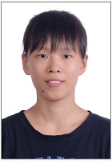
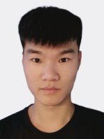
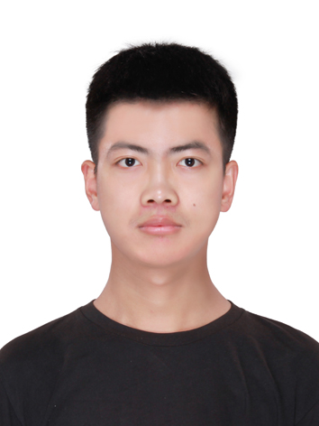
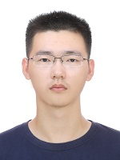
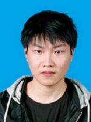
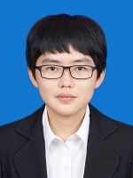
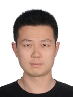

# 毕业硕士生
- 2022级硕士生（8人）：朱文博，张鑫宇，张泽宇，林炟君，张少杰，钟太鸿，吴珺泓，安道龙
- 2021级硕士生（6人）：熊玺，龙泽泓，舒曼，张玉树，马强，罗敬
- 2020级硕士生（5人）：张峻伟，李宗泽，康勐，龚晓宇，朱盛
- 2019级硕士生（3人）：于佳玉，张正昊，路笳艺
- 2018级硕士生（3人）：李俊劼，刘京，韩帅
- 2017级硕士生（2人）：张桐搏，徐玥
- 2016级硕士生（2人）：贺甫霖，邹璐琨
- 2015级硕士生（3人）：王强，李广力，王冠成
- 2014级硕士生（2人）：杨洋，刘丰
- 2012级硕士生（2人）：牛当当，李壮
- 2011级硕士生（2人）：张鑫，刘冬清

***

## 朱文博，女，2000年08月生，吉林省长春市人。
- 2018.09-2022.06，吉林大学软件学院软件工程专业，本科生
- 2022.09-2025.06，吉林大学计算机科学与技术学院计算机科学与技术专业，推免硕士生（导师：吕帅教授）
- 研究方向：人工智能、机器学习
- 毕业去向：[上海] 华为技术有限公司

## 【学术论文】在国内外期刊和会议上发表学术论文3篇，在审学术论文2篇。
1. **Zhu Wenbo**, Xiao Wei, Lü Shuai\*. Soft-penalty guided exploration in reinforcement learning. 2025. (Submitted)
2. Long Zehong, **Zhu Wenbo**, Zhang Yushu, Lü Shuai\*, Lin Dajun. Efficient exploration via state distribution discrepancy maximization in deep reinforcement learning. 2025. (Submitted)
3. Zhou Ruikai, Zhong Taihong, **Zhu Wenbo**, Han Shuai, Lü Shuai\*. Influence of Gaussian distribution on performance metrics in continuous reinforcement learning. **Information Processing and Management**, 2026, 63(2): 104428. **(中科院1区TOP期刊, CCF推荐B类期刊, SCI, 目前IF: 6.9)**
4. Zhou Ruikai, **Zhu Wenbo**, Han Shuai, Kang Meng, Lü Shuai\*. VCSAP: Online reinforcement learning exploration method based on visitation count of state-action pairs. **Neural Networks**, 2025, 184: 107052. **(中科院2区TOP期刊, CCF推荐B类期刊, SCI, 目前IF: 6.3)**
5. Li Jingyao, Lü Shuai, **Zhu Wenbo**, Li Zhanshan\*. Enhancing transferability and discriminability simultaneously for unsupervised domain adaptation. **Knowledge-Based Systems**, 2022, 247: 108705. **(中科院1区TOP期刊, CCF推荐C类期刊, SCI, IF: 8.8)**

## 【学位论文】
1. **朱文博**. 基于特征蒸馏和软惩罚引导的强化学习探索方法研究[硕士学位论文]. 长春: 吉林大学, 2025.

## 【荣誉奖励】
- 2018-2019学年，二等奖学金
- 2019.11，全国大学生数学建模竞赛，省级一等奖
- 2019-2020学年，二等奖学金
- 2020.11，全国大学生数学建模竞赛，省级一等奖
- 2020-2021学年，二等奖学金、院优秀学生
- 2022.06，吉林大学优秀本科毕业论文：基于策略参数多样性的深度强化学习算法的设计与实现
- 2022年度，研究生新生奖学金
- 2022-2023学年，一等奖学金、优秀研究生、研究生学业奖学金
- 2023-2024学年，研究生学业奖学金

## 【联系方式】
- 邮箱：zhuwb22@mails.jlu.edu.cn

***

## 张鑫宇，男，1999年04月生，黑龙江省齐齐哈尔市人。
- 2018.09-2022.06，吉林大学计算机科学与技术学院计算机科学与技术专业，本科生
- 2022.09-2025.06，吉林大学计算机科学与技术学院计算机科学与技术专业，推免硕士生（导师：吕帅教授）
- 研究方向：人工智能、机器学习
- 毕业去向：[北京] 北京字节跳动科技有限公司

## 【学术论文】在国内外期刊和会议上发表学术论文3篇，在审学术论文2篇。
1. Yuan Jianhui, **Zhang Xinyu**, Li Guixiang, Tan Lei, Li Jingyao\*, Zhou Wenbo\*. GRACE: Enhancing source-free universal domain adaptation via gradient-aware contrastive learning and entropy-aware alignment. 2025. (Submitted)
2. Lü Shuai, Yuan Jianhui, **Zhang Xinyu**, Zhang Shaojie, Fang Wensi, Li Jingyao\*. Pre-trained initialization and memory-enhanced correction for source-free universal domain adaptation. 2025. (Submitted)
3. Lü Shuai, **Zhang Xinyu**, Li Zongze, Li Jingyao\*, Kang Meng. Bi-classifier with neighborhood aggregation for unsupervised domain adaptation. **Information Sciences**, 2025, 718: 122399. **(中科院2区期刊, CCF推荐B类期刊, SCI, 目前IF: 6.8)**
4. **Zhang Xinyu**, Kang Meng, Lü Shuai\*. Low category uncertainty and high training potential instance learning for unsupervised domain adaptation. In: **Proceedings of the 38th AAAI Conference on Artificial Intelligence (AAAI 2024)**, Vancouver, Canada, February 20-27, 2024, 16881-16889. **(CCF推荐A类会议)**
5. Lü Shuai, Li Zongze, **Zhang Xinyu**, Li Jingyao\*. Consistency regularization-based mutual alignment for source-free domain adaptation. **Expert Systems with Applications**, 2024, 241: 122577. **(中科院1区TOP期刊, CCF推荐C类期刊, SCI, IF: 7.5)**

## 【学位论文】
1. **张鑫宇**. 基于自监督学习的无监督领域自适应方法研究[硕士学位论文]. 长春: 吉林大学, 2025.

## 【荣誉奖励】
- 2018-2019学年，二等奖学金、院优秀学生
- 2019-2020学年，二等奖学金、院优秀学生
- 2020-2021学年，二等奖学金、院优秀学生
- 2021-2022学年，三等奖学金
- 2022.06，吉林大学优秀本科毕业论文：基于双分类器确定性最大化的无监督领域自适应算法的设计和实现
- 2022年度，研究生新生奖学金
- 2022-2023学年，研究生学业奖学金
- 2023年度，南瑞继保奖学金
- 2023-2024学年，一等奖学金、优秀研究生、研究生学业奖学金
- 2024年度，研究生国家奖学金
- 2024年度，比亚迪奖学金
- 2024年度，研究生学术业绩三等奖学金
- 2024-2025学年，研究生学业奖学金
- 2025.06，吉林大学优秀硕士学位论文：基于自监督学习的无监督领域自适应方法研究
- 2025.06，吉林大学优秀毕业研究生

## 【联系方式】
- 邮箱：zhang_xinyu22@mails.jlu.edu.cn

***

## 张泽宇，男，2000年09月生，山东省滨州市人。
- 2018.09-2022.06，内蒙古大学计算机学院（软件学院）计算机科学与技术专业，本科生（学业排名和综合排名均为第1/38名）
- 2022.09-2025.06，吉林大学计算机科学与技术学院计算机科学与技术专业，推免硕士生（导师：吕帅教授、申春副教授）
- 研究方向：人工智能、机器学习
- 毕业去向：[山东滨州] 滨州魏桥国科高等技术研究院

## 【学术论文】在国内外期刊和会议上发表学术论文3篇。
1. **Zhang Zeyu**, Shen Chun, Ma Qiang, Kang Meng, Lü Shuai\*. Prototype-driven active domain adaptation with density consideration. In: **Proceedings of the 40th AAAI Conference on Artificial Intelligence (AAAI 2026)**, Singapore, January 20-27, 2026. **(CCF推荐A类会议)**
2. **Zhang Zeyu**, Shen Chun, Lü Shuai\*, Zhang Shaojie. Reconfigurability-aware selection for contrastive active domain adaptation. In: **Proceedings of the 33rd International Joint Conference on Artificial Intelligence (IJCAI 2024)**, Jeju, South Korea, August 3-9, 2024, 5545-5553. **(CCF推荐A类会议)**
3. Zhang Shaojie, Shen Chun, Lü Shuai\*, **Zhang Zeyu**. Reviewing the forgotten classes for domain adaptation of black-box predictors. In: **Proceedings of the 38th AAAI Conference on Artificial Intelligence (AAAI 2024)**, Vancouver, Canada, February 20-27, 2024, 16830-16837. **(CCF推荐A类会议)**

## 【学位论文】
1. **张泽宇**. 基于主动学习的领域自适应方法研究[硕士学位论文]. 长春: 吉林大学, 2025.

## 【荣誉奖励】
- 2019.04，中国高校计算机大赛团体程序设计天梯赛，团队省级特等奖
- 2019-2020学年，一等奖学金、校三好学生
- 2020.10，东北地区大学生程序设计竞赛，优胜奖
- 2020.12，中国高校计算机大赛团体程序设计天梯赛，团队省级一等奖
- 2020-2021学年，国家奖学金
- 2022.06，内蒙古大学优秀本科毕业论文：面向OBE模式的工程教育认证自评与辅助管理系统
- 2022.12，中国研究生数学建模竞赛，国家级一等奖
- 2022-2023学年，一等奖学金、优秀研究生、研究生学业奖学金
- 2023年度，浪潮奖学金
- 2023-2024学年，一等奖学金、优秀研究生、研究生学业奖学金
- 2024年度，研究生国家奖学金
- 2024年度，吉林银行王湘浩奖学金
- 2024年度，研究生学术业绩三等奖学金
- 2024-2025学年，研究生学业奖学金
- 2025.06，吉林大学优秀硕士学位论文：基于主动学习的领域自适应方法研究
- 2025.06，吉林大学优秀毕业研究生
- 2025年度，王湘浩奖学金

***

## 林炟君，女，2000年08月生，福建省莆田市人。
- 2018.09-2022.06，海南大学计算机科学与技术学院软件工程专业，本科生
- 2022.09-2025.06，吉林大学软件学院软件工程专业，推免硕士生（导师：吕帅教授、刘磊教授）
- 研究方向：人工智能、机器学习
- 毕业去向：[广东深圳] 比亚迪股份有限公司

## 【学术论文和发明专利】在国内外期刊和会议上发表学术论文0篇，在审学术论文2篇，授权发明专利1项。
1. **Lin Dajun**, Li Songlin, Lü Shuai\*, Zhou Wenbo\*, Zhong Taihong, An Daolong. WCPC-TD3: Weighted contrastive policy constraint for offline reinforcement learning. 2025. (Submitted)
2. Long Zehong, Zhu Wenbo, Zhang Yushu, Lü Shuai\*, **Lin Dajun**. Efficient exploration via state distribution discrepancy maximization in deep reinforcement learning. 2025. (Submitted)
3. 吕帅, 龙泽泓, 钟太鸿, **林炟君**. 一种基于SAC强化学习算法的智能运动控制方法. (专利号: ZL 2024 1 0726196.6, 授权公告日: 2024.08.13)

## 【学位论文】
1. **林炟君**. 基于策略约束和反探索的离线强化学习方法研究[硕士学位论文]. 长春: 吉林大学, 2025.

## 【荣誉奖励】
- 2018-2019学年，三等奖学金、院优秀学生会干部
- 2019-2020学年，二等奖学金
- 2020.11，全国大学生数学建模竞赛，国家级二等奖、省级一等奖
- 2020-2021学年，三等奖学金
- 2022-2023学年，研究生学业奖学金
- 2023-2024学年，研究生学业奖学金
- 2024-2025学年，研究生学业奖学金

## 【联系方式】
- 邮箱：lindj22@mails.jlu.edu.cn

***

## 张少杰，男，2000年04月生，安徽省合肥市人。
- 2018.09-2022.06，哈尔滨工程大学软件学院软件工程专业，本科生
- 2022.09-2025.06，吉林大学软件学院软件工程专业，推免硕士生（导师：吕帅教授、申春副教授）
- 研究方向：人工智能、机器学习
- 毕业去向：[上海] 华为技术有限公司

## 【学术论文】在国内外期刊和会议上发表学术论文2篇，在审学术论文1篇。
1. Lü Shuai, Yuan Jianhui, Zhang Xinyu, **Zhang Shaojie**, Fang Wensi, Li Jingyao\*. Pre-trained initialization and memory-enhanced correction for source-free universal domain adaptation. 2025. (Submitted)
2. Zhang Zeyu, Shen Chun, Lü Shuai\*, **Zhang Shaojie**. Reconfigurability-aware selection for contrastive active domain adaptation. In: **Proceedings of the 33rd International Joint Conference on Artificial Intelligence (IJCAI 2024)**, Jeju, South Korea, August 3-9, 2024, 5545-5553. **(CCF推荐A类会议)**
3. **Zhang Shaojie**, Shen Chun, Lü Shuai\*, Zhang Zeyu. Reviewing the forgotten classes for domain adaptation of black-box predictors. In: **Proceedings of the 38th AAAI Conference on Artificial Intelligence (AAAI 2024)**, Vancouver, Canada, February 20-27, 2024, 16830-16837. **(CCF推荐A类会议)**

## 【学位论文】
1. **张少杰**. 基于黑盒模型的无源领域自适应方法研究[硕士学位论文]. 长春: 吉林大学, 2025.

## 【荣誉奖励】
- 2018-2019学年，三等奖学金、二等奖学金
- 2019-2020学年，二等奖学金、二等奖学金
- 2020-2021学年，二等奖学金、二等奖学金、院三好学生
- 2021-2022学年，二等奖学金、一等奖学金
- 2022.12，中国研究生数学建模竞赛，国家级一等奖
- 2022-2023学年，二等奖学金、优秀研究生
- 2023-2024学年，一等奖学金、优秀研究生、研究生学业奖学金
- 2024年度，研究生国家奖学金
- 2024年度，吉林银行王湘浩奖学金
- 2024年度，研究生学术业绩一等奖学金
- 2024-2025学年，研究生学业奖学金
- 2025.06，吉林大学优秀硕士学位论文：基于黑盒模型的无源领域自适应方法研究
- 2025.06，吉林大学优秀毕业研究生

## 【联系方式】
- 邮箱：sjzhang22@mails.jlu.edu.cn

***

## 钟太鸿，男，1999年11月生，辽宁省大连市人。
- 2018.09-2022.06，沈阳工业大学软件学院软件工程专业，本科生（学业排名和综合排名均为第1/296名）
- 2022.09-2025.06，吉林大学软件学院软件工程专业，推免硕士生（导师：吕帅教授）
- 研究方向：人工智能、机器学习
- 毕业去向：[北京] 国家电网有限公司

## 【学术论文和发明专利】在国内外期刊和会议上发表学术论文2篇，在审学术论文3篇，授权发明专利1项。
1. Wu Hao, Li Songlin, Xiao Wei, **Zhong Taihong**, Lü Shuai\*. Offline-to-online reinforcement learning with triple-intensity policy constraints. 2025. (Submitted)
2. Lin Dajun, Li Songlin, Lü Shuai\*, Zhou Wenbo\*, **Zhong Taihong**, An Daolong. WCPC-TD3: Weighted contrastive policy constraint for offline reinforcement learning. 2025. (Submitted)
3. Zhou Ruikai, **Zhong Taihong**, Li Songlin, Lü Shuai\*. A Kullback-Leibler divergence perspective on policy gradient methods in reinforcement learning. 2026. (Submitted)
4. **Zhong Taihong**, Han Shuai, Zhang Yushu, Long Zehong, Lü Shuai\*, Wu Junhong. TATRC: Triple actor-critic structure with regularization for better performance. **Information Processing and Management**, 2026, 63(2): 104452. **(中科院1区TOP期刊, CCF推荐B类期刊, SCI, 目前IF: 6.9)**
5. Zhou Ruikai, **Zhong Taihong**, Zhu Wenbo, Han Shuai, Lü Shuai\*. Influence of Gaussian distribution on performance metrics in continuous reinforcement learning. **Information Processing and Management**, 2026, 63(2): 104428. **(中科院1区TOP期刊, CCF推荐B类期刊, SCI, 目前IF: 6.9)**
6. 吕帅, 龙泽泓, **钟太鸿**, 林炟君. 一种基于SAC强化学习算法的智能运动控制方法. (专利号: ZL 2024 1 0726196.6, 授权公告日: 2024.08.13)

## 【学位论文】
1. **钟太鸿**. 基于分布偏移的深度强化学习方法研究[硕士学位论文]. 长春: 吉林大学, 2025.

## 【荣誉奖励】
- 2018-2019学年，辽宁省政府奖学金、一等奖学金、三好学生标兵
- 2019-2020学年，国家奖学金、特等奖学金、校三好学生
- 2020.11，软件设计师（软考中级）
- 2020-2021学年，国家奖学金、特等奖学金、校三好学生
- 2020-2021学年，“一带一路”耿飚奖学金
- 2022.06，沈阳工业大学优秀毕业生
- 2023-2024学年，研究生学业奖学金
- 2024-2025学年，研究生学业奖学金

## 【联系方式】
- 邮箱：zhongth22@mails.jlu.edu.cn

***

## 吴珺泓，男，2000年09月生，山东省莱西市人。
- 2018.09-2022.06，成都理工大学计算机与网络安全学院（牛津布鲁克斯学院）软件工程专业，本科生
- 2022.09-2025.06，吉林大学软件学院软件工程专业，推免硕士生（导师：吕帅教授、刘杰副教授）
- 研究方向：人工智能、机器学习
- 毕业去向：[北京] 北京京东世纪贸易有限公司

## 【学术论文】在国内外期刊和会议上发表学术论文3篇，在审学术论文1篇。
1. **Wu Junhong**, Liu Jie, Xiong Xi, An Daolong, Lü Shuai\*. Focus on primary: Differential diverse data augmentation for generalization in visual reinforcement learning. 2025. (Submitted)
2. Zhong Taihong, Han Shuai, Zhang Yushu, Long Zehong, Lü Shuai\*, **Wu Junhong**. TATRC: Triple actor-critic structure with regularization for better performance. **Information Processing and Management**, 2026, 63(2): 104452. **(中科院1区TOP期刊, CCF推荐B类期刊, SCI, 目前IF: 6.9)**
3. Xiong Xi, Shen Chun, **Wu Junhong**, Lü Shuai\*, Zhang Xiaodan. Combined data augmentation framework for generalizing deep reinforcement learning from pixels. **Expert Systems with Applications**, 2025, 264: 125810. **(中科院1区TOP期刊, CCF推荐C类期刊, SCI, 目前IF: 7.5)**
4. Zhu Sheng, Shen Chun, Lü Shuai\*, **Wu Junhong**, An Daolong. Double buffers CEM-TD3: More efficient evolution and richer exploration. In: **Proceedings of the 38th AAAI Conference on Artificial Intelligence (AAAI 2024)**, Vancouver, Canada, February 20-27, 2024, 17193-17201. **(CCF推荐A类会议)**

## 【学位论文】
1. **吴珺泓**. 基于数据增强的可泛化视觉强化学习研究[硕士学位论文]. 长春: 吉林大学, 2025.

## 【荣誉奖励】
- 2018-2019学年，一等奖学金、校优秀学生
- 2019-2020学年，一等奖学金、校优秀学生
- 2020.11，全国大学生数学建模竞赛，省级一等奖
- 2020-2021学年，国家奖学金、一等奖学金、校优秀学生
- 2021.12，成都理工大学十佳大学生
- 2022.03，四川省优秀大学毕业生
- 2022.06，成都理工大学优秀毕业生
- 2022.12，中国研究生数学建模竞赛，国家级一等奖
- 2022年度，研究生学术业绩三等奖学金
- 2022-2023学年，研究生学业奖学金
- 2023-2024学年，一等奖学金、优秀研究生
- 2024年度，研究生国家奖学金
- 2024年度，吉林银行王湘浩奖学金
- 2024-2025学年，研究生学业奖学金
- 2025.06，吉林大学优秀毕业研究生

## 【联系方式】
- 邮箱：chwu22@mails.jlu.edu.cn

***

## 安道龙，男，1998年10月生，河南省濮阳市人。
- 2017.09-2021.06，吉林大学计算机科学与技术学院物联网工程专业，本科生
- 2022.09-2025.06，吉林大学计算机科学与技术学院计算机技术专业，硕士生（导师：吕帅教授、申春副教授）
- 研究方向：人工智能、机器学习
- 毕业去向：[上海] 华为技术有限公司

## 【学术论文】在国内外期刊和会议上发表学术论文4篇，在审学术论文3篇。
1. Xiao Wei, Li Songlin, **An Daolong**, Wu Hao, Zhang Xiaodan, Lü Shuai\*. Corrected critic and adaptive constraint for offline-to-online reinforcement learning. 2025. (Submitted)
2. Lin Dajun, Li Songlin, Lü Shuai\*, Zhou Wenbo\*, Zhong Taihong, **An Daolong**. WCPC-TD3: Weighted contrastive policy constraint for offline reinforcement learning. 2025. (Submitted)
3. Wu Junhong, Liu Jie, Xiong Xi, **An Daolong**, Lü Shuai\*. Focus on primary: Differential diverse data augmentation for generalization in visual reinforcement learning. 2025. (Submitted)
4. **An Daolong**, Shen Chun, Li Songlin, Xiao Wei, Lü Shuai\*, Zhou Wenbo\*. Result constraint behavior clone for offline reinforcement learning. **Neural Networks**, 2026, 196: 108355. **(中科院2区TOP期刊, CCF推荐B类期刊, SCI, 目前IF: 6.3)**
5. Li Songlin, Xiao Wei, Wu Hao, Zhang Xiaodan, **An Daolong**, Lü Shuai\*. State proficiency-based adaptive fine-tuning for offline-to-online reinforcement learning. In: **Proceedings of the 40th AAAI Conference on Artificial Intelligence (AAAI 2026)**, Singapore, January 20-27, 2026. **(CCF推荐A类会议)**
6. Shu Man, Lü Shuai\*, Gong Xiaoyu, **An Daolong**, Li Songlin. Episodic memory-double actor-critic twin delayed deep deterministic policy gradient. **Neural Networks**, 2025, 187: 107286. **(中科院2区TOP期刊, CCF推荐B类期刊, SCI, 目前IF: 6.3)**
7. Zhu Sheng, Shen Chun, Lü Shuai\*, Wu Junhong, **An Daolong**. Double buffers CEM-TD3: More efficient evolution and richer exploration. In: **Proceedings of the 38th AAAI Conference on Artificial Intelligence (AAAI 2024)**, Vancouver, Canada, February 20-27, 2024, 17193-17201. **(CCF推荐A类会议)**

## 【学位论文】
1. **安道龙**. 基于结果约束和梯度权重的离线强化学习方法研究[硕士学位论文]. 长春: 吉林大学, 2025.

## 【荣誉奖励】
- 2019.07，全国大学生水利创新设计大赛，国家级二等奖
- 2019-2020学年，国家励志奖学金
- 2020.08，全国大学生物联网设计竞赛（华为杯），东北赛区一等奖
- 2020-2021学年，二等奖学金
- 2022-2023学年，二等奖学金
- 2023-2024学年，研究生学业奖学金
- 2024-2025学年，研究生学业奖学金

## 【联系方式】
- 邮箱：andl22@mails.jlu.edu.cn

***

## 熊玺，男，1997年05月生，山西省运城市人。
- 2017.09-2021.06，山西大学数学科学学院信息与计算科学专业，本科生
- 2021.09-2024.06，吉林大学计算机科学与技术学院计算机科学与技术专业，硕士生（导师：吕帅副教授、申春副教授）
- 研究方向：人工智能、机器学习
- 毕业去向：[山东青岛] 青岛市工业和信息化局

## 【学术论文】在国内外期刊和会议上发表学术论文2篇，在审学术论文1篇。
1. Wu Junhong, Liu Jie, **Xiong Xi**, An Daolong, Lü Shuai\*. Focus on primary: Differential diverse data augmentation for generalization in visual reinforcement learning. 2025. (Submitted)
2. **Xiong Xi**, Shen Chun, Wu Junhong, Lü Shuai\*, Zhang Xiaodan. Combined data augmentation framework for generalizing deep reinforcement learning from pixels.  **Expert Systems with Applications**, 2025, 264: 125810. **(中科院1区TOP期刊, CCF推荐C类期刊, SCI, 目前IF: 7.5)**
3. Zhang Junwei, Han Shuai, **Xiong Xi**, Zhu Sheng, Lü Shuai\*. Explorer-Actor-Critic: Better actors for deep reinforcement learning. **Information Sciences**, 2024, 662: 120255. **(中科院2区期刊, CCF推荐B类期刊, SCI, IF: 6.8)**

## 【学位论文】
1. **熊玺**. 用于泛化图像深度强化学习的组合数据增强框架[硕士学位论文]. 长春: 吉林大学, 2024.

## 【荣誉奖励】
- 2017-2018学年，校优秀学生干部
- 2018-2019学年，国家励志奖学金、校三好学生
- 2019-2020学年，国家励志奖学金、三等奖学金
- 2020-2021学年，三等奖学金、校三好学生
- 2021-2022学年，研究生学业奖学金
- 2022-2023学年，研究生学业奖学金

## 【联系方式】
- 邮箱：xiongxi21@mails.jlu.edu.cn

***

## 龙泽泓，男，1999年06月生，山西省大同市人。
- 2017.09-2021.06，山西大学数学科学学院信息与计算科学专业，本科生
- 2021.09-2024.06，吉林大学计算机科学与技术学院计算机科学与技术专业，硕士生（导师：吕帅副教授）
- 研究方向：人工智能、机器学习
- 毕业去向：[西安] XXXX大学教师

## 【学术论文和发明专利】在国内外期刊和会议上发表学术论文1篇，在审学术论文1篇，授权发明专利1项。
1. **Long Zehong**, Zhu Wenbo, Zhang Yushu, Lü Shuai\*, Lin Dajun. Efficient exploration via state distribution discrepancy maximization in deep reinforcement learning. 2025. (Submitted)
2. Zhong Taihong, Han Shuai, Zhang Yushu, **Long Zehong**, Lü Shuai\*, Wu Junhong. TATRC: Triple actor-critic structure with regularization for better performance. **Information Processing and Management**, 2026, 63(2): 104452. **(中科院1区TOP期刊, CCF推荐B类期刊, SCI, 目前IF: 6.9)**
3. 吕帅, **龙泽泓**, 钟太鸿, 林炟君. 一种基于SAC强化学习算法的智能运动控制方法. (专利号: ZL 2024 1 0726196.6, 授权公告日: 2024.08.13)

## 【学位论文】
1. **龙泽泓**. 基于高效经验回放与空间覆盖的深度强化学习优化算法研究[硕士学位论文]. 长春: 吉林大学, 2024.

## 【联系方式】
- 邮箱：longzh21@mails.jlu.edu.cn

***

## 舒曼，女，1999年10月生，吉林省长春市人。
- 2017.09-2021.06，吉林大学软件学院软件工程专业，本科生
- 2021.09-2024.06，吉林大学计算机科学与技术学院计算机技术专业，硕士生（导师：吕帅副教授）
- 研究方向：人工智能、机器学习
- 毕业去向：[长春] 吉林大学博士生

## 【学术论文】在国内外期刊和会议上发表学术论文1篇。
1. **Shu Man**, Lü Shuai\*, Gong Xiaoyu, An Daolong, Li Songlin. Episodic memory-double actor-critic twin delayed deep deterministic policy gradient. **Neural Networks**, 2025, 187: 107286. **(中科院2区TOP期刊, CCF推荐B类期刊, SCI, 目前IF: 6.3)**

## 【学位论文】
1. **舒曼**. 基于情节记忆的深度强化学习方法研究[硕士学位论文]. 长春: 吉林大学, 2024.

## 【荣誉奖励】
- 2017-2018学年，三等奖学金
- 2018.12，全国大学生数学建模竞赛，省级一等奖
- 2018-2019学年，三等奖学金
- 2019.04，美国大学生数学建模竞赛，国家级一等奖
- 2019.12，全国大学生数学建模竞赛，省级一等奖
- 2019-2020学年，三等奖学金
- 2022-2023学年，研究生学业奖学金

***

## 张玉树，男，1999年06月生，河北省辛集市人。
- 2017.09-2021.06，吉林大学计算机科学与技术学院计算机科学与技术专业，本科生
- 2021.09-2024.06，吉林大学计算机科学与技术学院计算机科学与技术专业，硕士生（导师：吕帅副教授、申春副教授）
- 研究方向：人工智能、机器学习
- 毕业去向：[济南] 神思电子技术股份有限公司

## 【学术论文】在国内外期刊和会议上发表学术论文1篇，在审学术论文1篇。
1. Long Zehong, Zhu Wenbo, **Zhang Yushu**, Lü Shuai\*, Lin Dajun. Efficient exploration via state distribution discrepancy maximization in deep reinforcement learning. 2025. (Submitted)
2. Zhong Taihong, Han Shuai, **Zhang Yushu**, Long Zehong, Lü Shuai\*, Wu Junhong. TATRC: Triple actor-critic structure with regularization for better performance. **Information Processing and Management**, 2026, 63(2): 104452. **(中科院1区TOP期刊, CCF推荐B类期刊, SCI, 目前IF: 6.9)**

## 【学位论文】
1. **张玉树**. 基于极值理论的强化学习优化算法研究[硕士学位论文]. 长春: 吉林大学, 2024.

## 【联系方式】
- 邮箱：yushu21@mails.jlu.edu.cn

***

## 马强，男，1996年01月生，山西省阳泉市人。
- 2014.09-2018.06，上海电机学院电子信息学院物联网工程专业，本科生
- 2021.09-2024.06，吉林大学软件学院软件工程专业，硕士生（导师：吕帅副教授）
- 研究方向：人工智能、机器学习
- 毕业去向：[杭州] 浙江大华技术股份有限公司

## 【学术论文】在国内外期刊和会议上发表学术论文1篇。
1. Zhang Zeyu, Shen Chun, **Ma Qiang**, Kang Meng, Lü Shuai\*. Prototype-driven active domain adaptation with density consideration. In: **Proceedings of the 40th AAAI Conference on Artificial Intelligence (AAAI 2026)**, Singapore, January 20-27, 2026. **(CCF推荐A类会议)**

## 【学位论文】
1. **马强**. 结合自监督学习的无监督领域自适应方法研究[硕士学位论文]. 长春: 吉林大学, 2024.

## 【荣誉奖励】
- 2014-2015学年，二等奖学金
- 2015-2016学年，二等奖学金
- 2016-2017学年，上海市奖学金、一等奖学金、校三好学生
- 2017.08，全国大学生物联网设计竞赛（华为杯），华东赛区二等奖
- 2018.06，上海电机学院优秀本科毕业生

***

## 罗敬，男，1999年07月生，四川省自贡市人。
- 2017.09-2021.06，成都信息工程大学计算机学院计算机科学与技术专业，本科生
- 2021.09-2024.06，吉林大学计算机科学与技术学院计算机技术专业，硕士生（导师：吕帅副教授、刘杰副教授）
- 研究方向：人工智能、机器学习
- 毕业去向：[北京] 北京字节跳动科技有限公司

## 【学位论文】
1. **罗敬**. 基于探索和偏差估计的深度强化学习方法研究[硕士学位论文]. 长春: 吉林大学, 2024.

## 【荣誉奖励】
- 2017-2018学年，二等奖学金
- 2018-2019学年，国家励志奖学金、一等奖学金
- 2019.03，蓝桥杯全国软件和信息技术专业人才大赛，省级一等奖
- 2020.12，成都信息工程大学优秀本科毕业生
- 2020-2021学年，一等奖学金
- 2021-2022学年，二等奖学金
- 2022-2023学年，研究生学业奖学金

***

## 张峻伟，男，1998年12月生，吉林省通化市人。
- 2016.09-2020.06，吉林大学计算机科学与技术学院计算机科学与技术专业，本科生
- 2020.09-2023.06，吉林大学计算机科学与技术学院计算机科学与技术专业，推免硕士生（导师：吕帅副教授）
- 研究方向：人工智能、机器学习
- 毕业去向：[北京] 天翼云科技有限公司

## 【学术论文】在国内外期刊和会议上发表学术论文8篇。
1. Zheng Mingsheng, **Zhang Junwei**, Zhan Changshuai, Ren Xinyu, Lü Shuai\*. Proximal policy optimization with reward-based prioritization. **Expert Systems with Applications**, 2025, 283: 127659. **(中科院1区TOP期刊, CCF推荐C类期刊, SCI, 目前IF: 7.5)**
2. **Zhang Junwei**, Han Shuai, Xiong Xi, Zhu Sheng, Lü Shuai\*. Explorer-Actor-Critic: Better actors for deep reinforcement learning. **Information Sciences**, 2024, 662: 120255. **(中科院2区期刊, CCF推荐B类期刊, SCI, IF: 6.8)**
3. **张峻伟**, 吕帅\*, 张正昊, 于佳玉, 龚晓宇. 基于样本效率优化的深度强化学习方法综述. **软件学报**, 2022, 33(11): 4217-4238. **(CCF推荐中文A类期刊)**
4. Lu Jiayi, Han Shuai, Lü Shuai\*, Kang Meng, **Zhang Junwei**. Sampling diversity driven exploration with state difference guidance. **Expert Systems with Applications**, 2022, 203: 117418. **(中科院1区TOP期刊, CCF推荐C类期刊, SCI, IF: 8.5)**
5. **Zhang Junwei**, Zhang Zhenghao, Han Shuai, Lü Shuai\*. Proximal policy optimization via enhanced exploration efficiency. **Information Sciences**, 2022, 609: 750-765. **(中科院1区TOP期刊, CCF推荐B类期刊, SCI, IF: 8.1)**
6. 吕帅, 龚晓宇, 张正昊, 韩帅, **张峻伟**. 结合进化算法的深度强化学习方法研究综述. **计算机学报**, 2022, 45(7): 1478-1499. **(CCF推荐中文A类期刊)**
7. Li Junjie, **Zhang Junwei**, Gong Xiaoyu, Lü Shuai\*. Evolutionary generative adversarial networks with crossover based knowledge distillation. In: **Proceedings of the International Joint Conference on Neural Networks (IJCNN 2021)**, Virtual Event, July 18-22, 2021, 1-8. **(CCF推荐C类会议)**
8. Lü Shuai\*, Han Shuai, Zhou Wenbo, **Zhang Junwei**. Recruitment-imitation mechanism for evolutionary reinforcement learning. **Information Sciences**, 2021, 553: 172-188. **(中科院1区TOP期刊, CCF推荐B类期刊, SCI, IF: 8.233)**

## 【学位论文】
1. **张峻伟**. 基于过估计控制与探索增强的强化学习优化方法[硕士学位论文]. 长春: 吉林大学, 2023.

## 【荣誉奖励】
- 2016-2017学年，一等奖学金、校优秀学生
- 2017年度，吉工•励志奖学金
- 2017-2018学年，一等奖学金、院优秀学生
- 2018.04，美国大学生数学建模竞赛，国家级二等奖
- 2018-2019学年，一等奖学金、校优秀学生
- 2019.03，CCF计算机软件能力认证，300分
- 2019-2020学年，二等奖学金、院优秀学生
- 2020.05，吉林大学优秀本科毕业生
- 2020.06，吉林大学优秀本科毕业论文：基于增强探索效率的PPO强化学习算法的设计与实现
- 2020.12，中国研究生数学建模竞赛，国家级三等奖
- 2020年度，研究生新生奖学金
- 2020-2021学年，二等奖学金、优秀研究生、研究生学业奖学金
- 2021年度，解放领航奖学金
- 2021-2022学年，一等奖学金、优秀研究生、优秀研究生干部、研究生学业奖学金
- 2022年度，研究生国家奖学金
- 2022年度，南瑞继保奖学金
- 2022年度，研究生学术业绩二等奖学金
- 2022-2023学年，研究生学业奖学金
- 2023.06，吉林大学优秀硕士学位论文：基于过估计控制与探索增强的强化学习优化方法
- 2023.06，吉林大学优秀毕业研究生

***

## 李宗泽，男，1998年08月生，河南省焦作市人。
- 2016.09-2020.06，吉林大学软件学院软件工程专业，本科生
- 2020.09-2023.06，吉林大学计算机科学与技术学院计算机科学与技术专业，硕士生（导师：吕帅副教授）
- 研究方向：人工智能、机器学习
- 毕业去向：[上海] 北京酷克数据科技有限公司

## 【学术论文】在国内外期刊和会议上发表学术论文3篇。
1. Lü Shuai, Zhang Xinyu, **Li Zongze**, Li Jingyao\*, Kang Meng. Bi-classifier with neighborhood aggregation for unsupervised domain adaptation. **Information Sciences**, 2025, 718: 122399. **(中科院2区期刊, CCF推荐B类期刊, SCI, 目前IF: 6.8)**
2. Lü Shuai, **Li Zongze**, Zhang Xinyu, Li Jingyao\*. Consistency regularization-based mutual alignment for source-free domain adaptation. **Expert Systems with Applications**, 2024, 241: 122577. **(中科院1区TOP期刊, CCF推荐C类期刊, SCI, IF: 7.5)**
3. Gong Xiaoyu, Lü Shuai\*, Yu Jiayu, Zhu Sheng, **Li Zongze**. Adaptive estimation Q-learning with uncertainty and familiarity. In: **Proceedings of the 32nd International Joint Conference on Artificial Intelligence (IJCAI 2023)**, Macao, China, August 19-25, 2023, 3750-3758. **(CCF推荐A类会议)**

## 【学位论文】
1. **李宗泽**. 无需源域的无监督领域自适应算法研究[硕士学位论文]. 长春: 吉林大学, 2023.

## 【荣誉奖励】
- 2016-2017学年，三等奖学金
- 2017-2018学年，二等奖学金
- 2018.09，CCF计算机软件能力认证，320分
- 2018-2019学年，二等奖学金、院优秀学生
- 2020.06，吉林大学优秀本科毕业论文：基于生成对抗网络的域自适应算法设计与实现
- 2020.12，中国研究生数学建模竞赛，国家级三等奖
- 2020-2021学年，研究生学业奖学金
- 2021-2022学年，研究生学业奖学金

***

## 康勐，男，1998年06月生，陕西省西安市人。
- 2016.09-2020.06，吉林大学软件学院软件工程专业，本科生
- 2020.09-2023.06，吉林大学计算机科学与技术学院计算机科学与技术专业，硕士生（导师：吕帅副教授）
- 研究方向：人工智能、机器学习
- 毕业去向：[北京] 北京京东世纪贸易有限公司

## 【学术论文】在国内外期刊和会议上发表学术论文6篇。
1. Zhang Zeyu, Shen Chun, Ma Qiang, **Kang Meng**, Lü Shuai\*. Prototype-driven active domain adaptation with density consideration. In: **Proceedings of the 40th AAAI Conference on Artificial Intelligence (AAAI 2026)**, Singapore, January 20-27, 2026. **(CCF推荐A类会议)**
2. Lü Shuai, Zhang Xinyu, Li Zongze, Li Jingyao\*, **Kang Meng**. Bi-classifier with neighborhood aggregation for unsupervised domain adaptation. **Information Sciences**, 2025, 718: 122399. **(中科院2区期刊, CCF推荐B类期刊, SCI, 目前IF: 6.8)**
3. Zhou Ruikai, Zhu Wenbo, Han Shuai, **Kang Meng**, Lü Shuai\*. VCSAP: Online reinforcement learning exploration method based on visitation count of state-action pairs. **Neural Networks**, 2025, 184: 107052. **(中科院2区TOP期刊, CCF推荐B类期刊, SCI, 目前IF: 6.3)**
4. Lü Shuai, **Kang Meng**, Li Ximing\*. Alleviating imbalanced pseudo-label distribution: Self-supervised multi-source domain adaptation with label-specific confidence.  In: **Proceedings of the 33rd International Joint Conference on Artificial Intelligence (IJCAI 2024)**, Jeju, South Korea, August 3-9, 2024, 4669-4677. **(CCF推荐A类会议)**
5. Zhang Xinyu, **Kang Meng**, Lü Shuai\*. Low category uncertainty and high training potential instance learning for unsupervised domain adaptation. In: **Proceedings of the 38th AAAI Conference on Artificial Intelligence (AAAI 2024)**, Vancouver, Canada, February 20-27, 2024, 16881-16889. **(CCF推荐A类会议)**
6. Lu Jiayi, Han Shuai, Lü Shuai\*, **Kang Meng**, Zhang Junwei. Sampling diversity driven exploration with state difference guidance. **Expert Systems with Applications**, 2022, 203: 117418. **(中科院1区TOP期刊, CCF推荐C类期刊, SCI, IF: 8.5)**

## 【学位论文】
1. **康勐**. 基于自监督学习的多源领域适应方法研究[硕士学位论文]. 长春: 吉林大学, 2023.

## 【荣誉奖励】
- 2016-2017学年，二等奖学金、院优秀学生
- 2017-2018学年，三等奖学金
- 2018-2019学年，二等奖学金、院优秀学生
- 2020.06，吉林大学优秀本科毕业论文：基于条件对抗网络的域适应和域泛化方法研究
- 2020.12，中国研究生数学建模竞赛，国家级三等奖
- 2024年度，研究生学术业绩三等奖学金

## 【联系方式】
- 邮箱：kangmeng20@mails.jlu.edu.cn

***

## 龚晓宇，男，1997年12月生，湖北省十堰市人。
- 2016.09-2020.06，吉林大学计算机科学与技术学院物联网工程专业，本科生
- 2020.09-2023.06，吉林大学计算机科学与技术学院计算机科学与技术专业，创新人才推免硕士生（导师：吕帅副教授）
- 研究方向：人工智能、机器学习
- 毕业去向：[上海] 中信证券股份有限公司

## 【学术论文】在国内外期刊和会议上发表学术论文8篇。
1. Shu Man, Lü Shuai\*, **Gong Xiaoyu**, An Daolong, Li Songlin. Episodic memory-double actor-critic twin delayed deep deterministic policy gradient. **Neural Networks**, 2025, 187: 107286. **(中科院2区TOP期刊, CCF推荐B类期刊, SCI, 目前IF: 6.3)**
2. Shen Chun, Zhu Sheng, Han Shuai, **Gong Xiaoyu**, Lü Shuai\*. Guided deterministic policy optimization with gradient-free policy parameters information. **Expert Systems with Applications**, 2023, 231: 120693. **(中科院1区TOP期刊, CCF推荐C类期刊, SCI, IF: 7.5)**
3. **Gong Xiaoyu**, Lü Shuai\*, Yu Jiayu, Zhu Sheng, Li Zongze. Adaptive estimation Q-learning with uncertainty and familiarity. In: **Proceedings of the 32nd International Joint Conference on Artificial Intelligence (IJCAI 2023)**, Macao, China, August 19-25, 2023, 3750-3758. **(CCF推荐A类会议)**
4. Han Shuai, Zhou Wenbo, Lü Shuai\*, Zhu Sheng, **Gong Xiaoyu**. Entropy regularization methods for parameter space exploration. **Information Sciences**, 2023, 622: 476-489. **(中科院1区TOP期刊, CCF推荐B类期刊, SCI)**
5. 张峻伟, 吕帅\*, 张正昊, 于佳玉, **龚晓宇**. 基于样本效率优化的深度强化学习方法综述. **软件学报**, 2022, 33(11): 4217-4238. **(CCF推荐中文A类期刊)**
6. 吕帅, **龚晓宇**, 张正昊, 韩帅, 张峻伟. 结合进化算法的深度强化学习方法研究综述. **计算机学报**, 2022, 45(7): 1478-1499. **(CCF推荐中文A类期刊)**
7. **Gong Xiaoyu**, Yu Jiayu, Lü Shuai\*, Lu Hengwei. Actor-critic with familiarity-based trajectory experience replay. **Information Sciences**, 2022, 582: 633-647. **(中科院1区TOP期刊, CCF推荐B类期刊, SCI, IF: 8.1)**
8. Li Junjie, Zhang Junwei, **Gong Xiaoyu**, Lü Shuai\*. Evolutionary generative adversarial networks with crossover based knowledge distillation. In: **Proceedings of the International Joint Conference on Neural Networks (IJCNN 2021)**, Virtual Event, July 18-22, 2021, 1-8. **(CCF推荐C类会议)**

## 【学位论文】
1. **龚晓宇**. 基于熟悉度的深度强化学习优化算法研究[硕士学位论文]. 长春: 吉林大学, 2023.

## 【荣誉奖励】
- 2017-2018学年，二等奖学金、院优秀学生
- 2018.07，吉林省“互联网+”大学生创新创业大赛，省级金奖
- 2018-2019学年，二等奖学金、院优秀学生
- 2019-2020学年，二等奖学金、院优秀学生
- 2020年度，研究生新生奖学金
- 2020-2021学年，二等奖学金、研究生学业奖学金
- 2021年度，吉林银行王湘浩奖学金
- 2021-2022学年，一等奖学金、优秀研究生、研究生学业奖学金
- 2022年度，研究生国家奖学金
- 2022年度，研究生学术业绩二等奖学金
- 2022-2023学年，研究生学业奖学金
- 2023.06，吉林大学优秀毕业研究生
- 2023年度，研究生学术业绩一等奖学金

***

## 朱盛，男，1999年04月生，江西省赣州市人。
- 2016.09-2020.06，南昌航空大学软件学院软件工程专业，本科生
- 2020.09-2023.06，吉林大学软件学院软件工程专业，硕士生（导师：吕帅副教授、申春副教授）
- 研究方向：人工智能、机器学习
- 毕业去向：[北京] 北京蓝色创想网络科技有限责任公司

## 【学术论文】在国内外期刊和会议上发表学术论文5篇。
1. Zhang Junwei, Han Shuai, Xiong Xi, **Zhu Sheng**, Lü Shuai\*. Explorer-Actor-Critic: Better actors for deep reinforcement learning. **Information Sciences**, 2024, 662: 120255. **(中科院2区期刊, CCF推荐B类期刊, SCI, IF: 6.8)**
2. **Zhu Sheng**, Shen Chun, Lü Shuai\*, Wu Junhong, An Daolong. Double buffers CEM-TD3: More efficient evolution and richer exploration. In: **Proceedings of the 38th AAAI Conference on Artificial Intelligence (AAAI 2024)**, Vancouver, Canada, February 20-27, 2024, 17193-17201. **(CCF推荐A类会议)**
3. Shen Chun, **Zhu Sheng**, Han Shuai, Gong Xiaoyu, Lü Shuai\*. Guided deterministic policy optimization with gradient-free policy parameters information. **Expert Systems with Applications**, 2023, 231: 120693. **(中科院1区TOP期刊, CCF推荐C类期刊, SCI, IF: 7.5)**
4. Gong Xiaoyu, Lü Shuai\*, Yu Jiayu, **Zhu Sheng**, Li Zongze. Adaptive estimation Q-learning with uncertainty and familiarity. In: **Proceedings of the 32nd International Joint Conference on Artificial Intelligence (IJCAI 2023)**, Macao, China, August 19-25, 2023, 3750-3758. **(CCF推荐A类会议)**
5. Han Shuai, Zhou Wenbo, Lü Shuai\*, **Zhu Sheng**, Gong Xiaoyu. Entropy regularization methods for parameter space exploration. **Information Sciences**, 2023, 622: 476-489. **(中科院1区TOP期刊, CCF推荐B类期刊, SCI)**

## 【学位论文】
1. **朱盛**. 双智能体协作的深度强化学习算法研究[硕士学位论文]. 长春: 吉林大学, 2023.

## 【荣誉奖励】
- 2016-2017学年，三等奖学金
- 2017-2018学年，三等奖学金
- 2018-2019学年，三等奖学金
- 2020-2021学年，二等奖学金
- 2021-2022学年，研究生学业奖学金
- 2023年度，研究生学术业绩二等奖学金
- 2024年度，研究生学术业绩一等奖学金

***

## 于佳玉，男，1997年04月生，河北省沧州市人。
- 2015.09-2019.06，吉林大学软件学院软件工程专业，本科生
- 2019.09-2022.06，吉林大学软件学院软件工程专业，推免硕士生（导师：吕帅副教授）
- 研究方向：人工智能、机器学习
- 毕业去向：[广东深圳] 深圳市腾讯计算机系统有限公司

## 【学术论文】在国内外期刊和会议上发表学术论文5篇。
1. **Yu Jiayu**, Li Jingyao, Lü Shuai\*, Han Shuai. Mixed experience sampling for off-policy reinforcement learning. **Expert Systems with Applications**, 2024, 251: 124017. **(中科院1区TOP期刊, CCF推荐C类期刊, SCI, IF: 7.5)**
2. Gong Xiaoyu, Lü Shuai\*, **Yu Jiayu**, Zhu Sheng, Li Zongze. Adaptive estimation Q-learning with uncertainty and familiarity. In: **Proceedings of the 32nd International Joint Conference on Artificial Intelligence (IJCAI 2023)**, Macao, China, August 19-25, 2023, 3750-3758. **(CCF推荐A类会议)**
3. 张峻伟, 吕帅\*, 张正昊, **于佳玉**, 龚晓宇. 基于样本效率优化的深度强化学习方法综述. **软件学报**, 2022, 33(11): 4217-4238. **(CCF推荐中文A类期刊)**
4. Gong Xiaoyu, **Yu Jiayu**, Lü Shuai\*, Lu Hengwei. Actor-critic with familiarity-based trajectory experience replay. **Information Sciences**, 2022, 582: 633-647. **(中科院1区TOP期刊, CCF推荐B类期刊, SCI, IF: 8.1)**
5. Han Shuai, Zhou Wenbo, Lü Shuai\*, **Yu Jiayu**. Regularly updated deterministic policy gradient algorithm. **Knowledge-Based Systems**, 2021, 214: 106736. **(中科院1区TOP期刊, CCF推荐C类期刊, SCI, IF: 8.139)**

## 【学位论文】
1. **于佳玉**. 基于采样频次和相似性的经验回放[硕士学位论文]. 长春: 吉林大学, 2022.

## 【荣誉奖励】
- 2015-2016学年，一等奖学金、校优秀学生
- 2016-2017学年，二等奖学金、院优秀学生
- 2017.12，全国大学生数学建模竞赛，省级一等奖
- 2017-2018学年，一等奖学金、院优秀学生
- 2018-2019学年，三等奖学金
- 2019.06，吉林大学优秀本科毕业论文：基于Q值估计的深度Q网络学习方法的设计与实现
- 2019年度，研究生新生奖学金
- 2019-2020学年，二等奖学金、优秀研究生干部、研究生学业奖学金
- 2020-2021学年，研究生学业奖学金
- 2021-2022学年，研究生学业奖学金

***

## 张正昊，男，1996年07月生，河南省安阳市人。
- 2015.09-2019.06，吉林大学计算机科学与技术学院计算机科学与技术专业，本科生
- 2019.09-2022.06，吉林大学计算机科学与技术学院计算机技术专业，推免硕士生（导师：吕帅副教授）
- 研究方向：人工智能、机器学习
- 毕业去向：[北京] 北京字节跳动科技有限公司

## 【学术论文】在国内外期刊和会议上发表学术论文3篇。
1. 张峻伟, 吕帅\*, **张正昊**, 于佳玉, 龚晓宇. 基于样本效率优化的深度强化学习方法综述. **软件学报**, 2022, 33(11): 4217-4238. **(CCF推荐中文A类期刊)**
2. Zhang Junwei, **Zhang Zhenghao**, Han Shuai, Lü Shuai\*. Proximal policy optimization via enhanced exploration efficiency. **Information Sciences**, 2022, 609: 750-765. **(中科院1区TOP期刊, CCF推荐B类期刊, SCI, IF: 8.1)**
3. 吕帅, 龚晓宇, **张正昊**, 韩帅, 张峻伟. 结合进化算法的深度强化学习方法研究综述. **计算机学报**, 2022, 45(7): 1478-1499. **(CCF推荐中文A类期刊)**

## 【学位论文】
1. **张正昊**. 进化强化学习的优化算法研究[硕士学位论文]. 长春: 吉林大学, 2022.

## 【荣誉奖励】
- 2016-2017学年，二等奖学金、院优秀学生
- 2017.07，吉林省大学生数学建模竞赛，省级一等奖
- 2017.10，全国大学生网络商务创新应用大赛大数据分析专业竞赛，省级一等奖
- 2017.12，全国大学生数学建模竞赛，省级一等奖
- 2017-2018学年，一等奖学金、校优秀学生
- 2018-2019学年，二等奖学金、院优秀学生
- 2019年度，研究生新生奖学金
- 2019-2020学年，一等奖学金、优秀研究生、研究生学业奖学金
- 2020-2021学年，研究生学业奖学金

***

## 路笳艺，女，1997年03月生，吉林省四平市人。
- 2015.09-2019.06，吉林大学计算机科学与技术学院计算机科学与技术专业，本科生
- 2019.09-2022.06，吉林大学计算机科学与技术学院计算机软件与理论专业，硕士生（导师：吕帅副教授）
- 研究方向：人工智能、机器学习
- 毕业去向：[长春] 北京经纬恒润科技股份有限公司

## 【学术论文】在国内外期刊和会议上发表学术论文2篇。
1. **Lu Jiayi**, Han Shuai, Lü Shuai\*, Kang Meng, Zhang Junwei. Sampling diversity driven exploration with state difference guidance. **Expert Systems with Applications**, 2022, 203: 117418. **(中科院1区TOP期刊, CCF推荐C类期刊, SCI, IF: 8.5)**
2. Han Shuai, Zhou Wenbo, **Lu Jiayi**, Liu Jing, Lü Shuai\*. NROWAN-DQN: A stable noisy network with noise reduction and online weight adjustment for exploration. **Expert Systems with Applications**, 2022, 203: 117343. **(中科院1区TOP期刊, CCF推荐C类期刊, SCI, IF: 8.5)**

## 【学位论文】
1. **路笳艺**. 采样多样性驱动的深度强化学习探索方法研究[硕士学位论文]. 长春: 吉林大学, 2022.

## 【荣誉奖励】
- 2015-2016学年，三等奖学金
- 2016-2017学年，二等奖学金、院优秀学生
- 2017.12，全国大学生数学建模竞赛，省级一等奖
- 2017-2018学年，三等奖学金
- 2019-2020学年，二等奖学金、研究生学业奖学金
- 2020-2021学年，研究生学业奖学金
- 2022.06，吉林大学优秀硕士学位论文：采样多样性驱动的深度强化学习探索方法研究
- 2022.06，吉林大学优秀毕业研究生

***

## 李俊劼，男，1995年10月生，安徽省黄山市人。
- 2013.09-2018.06，吉林大学计算机科学与技术学院计算机科学与技术专业，本科生
- 2018.09-2021.06，吉林大学计算机科学与技术学院计算机软件与理论专业，推免硕士生（导师：吕帅副教授）
- 研究方向：人工智能、机器学习
- 毕业去向：[广东深圳] 哈尔滨工业大学（深圳）博士生

## 【学术论文】在国内外期刊和会议上发表学术论文1篇。
1. **Li Junjie**, Zhang Junwei, Gong Xiaoyu, Lü Shuai\*. Evolutionary generative adversarial networks with crossover based knowledge distillation. In: **Proceedings of the International Joint Conference on Neural Networks (IJCNN 2021)**, Virtual Event, July 18-22, 2021, 1-8. **(CCF推荐C类会议)**

## 【学位论文】
1. **李俊劼**. 含有通用交叉算子的进化生成对抗网络[硕士学位论文]. 长春: 吉林大学, 2021.

## 【荣誉奖励】
- 2015-2016学年，二等奖学金、院优秀学生
- 2016-2017学年，三等奖学金
- 2018年度，研究生新生奖学金
- 2018-2019学年，研究生学业奖学金
- 2019-2020学年，研究生学业奖学金

***

## 刘京，男，1995年11月生，河南省灵宝市人。
- 2014.09-2018.06，吉林大学软件学院软件工程专业，本科生
- 2018.09-2021.06，吉林大学软件学院软件工程专业，推免硕士生（导师：吕帅副教授）
- 研究方向：人工智能、机器学习与自动推理
- 毕业去向：[北京] 华为技术有限公司2012实验室

## 【学术论文】在国内外期刊和会议上发表学术论文2篇。
1. Han Shuai, Zhou Wenbo, Lu Jiayi, **Liu Jing**, Lü Shuai\*. NROWAN-DQN: A stable noisy network with noise reduction and online weight adjustment for exploration. **Expert Systems with Applications**, 2022, 203: 117343. **(中科院1区TOP期刊, CCF推荐C类期刊, SCI, IF: 8.5)**
2. 吕帅, **刘京**. 基于深度强化学习的随机局部搜索启发式方法. **吉林大学学报(工学版)**, 2021, 51(4): 1420-1426.

## 【学位论文】
1. **刘京**. 基于深度学习的SAT问题随机局部搜索算法[硕士学位论文]. 长春: 吉林大学, 2021.

## 【荣誉奖励】
- 2014-2015学年，国家奖学金、校优秀学生
- 2015-2016学年，国家奖学金、校优秀学生
- 2016-2017学年，一等奖学金、院优秀学生
- 2017-2018学年，一等奖学金、校优秀学生
- 2018年度，研究生新生奖学金
- 2018-2019学年，二等奖学金、研究生学业奖学金
- 2019-2020学年，研究生学业奖学金
- 2020-2021学年，研究生学业奖学金
- 2021.06，吉林大学优秀毕业研究生

***

## 韩帅，男，1996年07月生，河北省廊坊市人。
- 2014.09-2018.06，吉林大学软件学院软件工程专业，本科生
- 2018.09-2021.06，吉林大学计算机科学与技术学院计算机软件与理论专业，硕士生（导师：吕帅副教授）
- 研究方向：人工智能、机器学习
- 毕业去向：[荷兰] Utrecht University（乌特列支大学）国家公派博士生（导师：Mehdi Dastani教授）

## 【学术论文】在国内外期刊和会议上发表学术论文14篇。
1. Zhong Taihong, **Han Shuai**, Zhang Yushu, Long Zehong, Lü Shuai\*, Wu Junhong. TATRC: Triple actor-critic structure with regularization for better performance. **Information Processing and Management**, 2026, 63(2): 104452. **(中科院1区TOP期刊, CCF推荐B类期刊, SCI, 目前IF: 6.9)**
2. Zhou Ruikai, Zhong Taihong, Zhu Wenbo, **Han Shuai**, Lü Shuai\*. Influence of Gaussian distribution on performance metrics in continuous reinforcement learning. **Information Processing and Management**, 2026, 63(2): 104428. **(中科院1区TOP期刊, CCF推荐B类期刊, SCI, 目前IF: 6.9)**
3. Zhou Ruikai, Zhu Wenbo, **Han Shuai**, Kang Meng, Lü Shuai\*. VCSAP: Online reinforcement learning exploration method based on visitation count of state-action pairs. **Neural Networks**, 2025, 184: 107052. **(中科院2区TOP期刊, CCF推荐B类期刊, SCI, 目前IF: 6.3)**
4. Yu Jiayu, Li Jingyao, Lü Shuai\*, **Han Shuai**. Mixed experience sampling for off-policy reinforcement learning. **Expert Systems with Applications**, 2024, 251: 124017. **(中科院1区TOP期刊, CCF推荐C类期刊, SCI, IF: 7.5)**
5. Zhang Junwei, **Han Shuai**, Xiong Xi, Zhu Sheng, Lü Shuai\*. Explorer-Actor-Critic: Better actors for deep reinforcement learning. **Information Sciences**, 2024, 662: 120255. **(中科院2区期刊, CCF推荐B类期刊, SCI, IF: 6.8)**
6. Shen Chun, Zhu Sheng, **Han Shuai**, Gong Xiaoyu, Lü Shuai\*. Guided deterministic policy optimization with gradient-free policy parameters information. **Expert Systems with Applications**, 2023, 231: 120693. **(中科院1区TOP期刊, CCF推荐C类期刊, SCI, IF: 7.5)**
7. **Han Shuai**, Zhou Wenbo, Lü Shuai\*, Zhu Sheng, Gong Xiaoyu. Entropy regularization methods for parameter space exploration. **Information Sciences**, 2023, 622: 476-489. **(中科院1区TOP期刊, CCF推荐B类期刊, SCI)**
8. Lu Jiayi, **Han Shuai**, Lü Shuai\*, Kang Meng, Zhang Junwei. Sampling diversity driven exploration with state difference guidance. **Expert Systems with Applications**, 2022, 203: 117418. **(中科院1区TOP期刊, CCF推荐C类期刊, SCI, IF: 8.5)**
9. **Han Shuai**, Zhou Wenbo, Lu Jiayi, Liu Jing, Lü Shuai\*. NROWAN-DQN: A stable noisy network with noise reduction and online weight adjustment for exploration. **Expert Systems with Applications**, 2022, 203: 117343. **(中科院1区TOP期刊, CCF推荐C类期刊, SCI, IF: 8.5)**
10. Zhang Junwei, Zhang Zhenghao, **Han Shuai**, Lü Shuai\*. Proximal policy optimization via enhanced exploration efficiency. **Information Sciences**, 2022, 609: 750-765. **(中科院1区TOP期刊, CCF推荐B类期刊, SCI, IF: 8.1)**
11. 吕帅, 龚晓宇, 张正昊, **韩帅**, 张峻伟. 结合进化算法的深度强化学习方法研究综述. **计算机学报**, 2022, 45(7): 1478-1499. **(CCF推荐中文A类期刊)**
12. Lü Shuai\*, **Han Shuai**, Zhou Wenbo, Zhang Junwei. Recruitment-imitation mechanism for evolutionary reinforcement learning. **Information Sciences**, 2021, 553: 172-188. **(中科院1区TOP期刊, CCF推荐B类期刊, SCI, IF: 8.233)**
13. **Han Shuai**, Zhou Wenbo, Lü Shuai\*, Yu Jiayu. Regularly updated deterministic policy gradient algorithm. **Knowledge-Based Systems**, 2021, 214: 106736. **(中科院1区TOP期刊, CCF推荐C类期刊, SCI, IF: 8.139)**
14. Zhang Lei, **Han Shuai**, Zhang Zhiruo, Li Lefan, Lü Shuai\*. Deep recurrent deterministic policy gradient for physical control. In: **Proceedings of the 29th International Conference on Artificial Neural Networks (ICANN 2020)**, Bratislava, Slovakia, September 15-18, 2020, LNCS 12397, 257-268. **(CCF推荐C类会议)**

## 【学位论文】
1. **韩帅**. 基于熵正则化和定期更新的深度确定性策略梯度[硕士学位论文]. 长春: 吉林大学, 2021.

## 【荣誉奖励】
- 2014-2015学年，三等奖学金
- 2015-2016学年，二等奖学金
- 2016-2017学年，二等奖学金
- 2018-2019学年，二等奖学金、研究生学业奖学金
- 2019-2020学年，研究生学业奖学金
- 2021.06，吉林大学优秀硕士学位论文：基于熵正则化和定期更新的深度确定性策略梯度
- 2021.06，吉林省优秀硕士学位论文：基于熵正则化和定期更新的深度确定性策略梯度
- 2021.06，吉林大学优秀毕业研究生
- 2021年度，研究生学术业绩二等奖学金

## 【联系方式】
- 单位：Department of Information and Computing Sciences, Utrecht University, Utrecht 3584 CC, The Netherlands
- 邮箱：s.han@uu.nl

***

## 张桐搏，男，1995年01月生，吉林省长春市人。
- 2013.09-2017.06，吉林大学计算机科学与技术学院计算机科学与技术专业，本科生
- 2017.09-2020.06，吉林大学计算机科学与技术学院计算机技术专业，创新人才推免硕士生（导师：吕帅副教授）
- 研究方向：人工智能、自动推理
- 毕业去向：[北京] 微软亚洲互联网工程院

## 【学术论文】在国内外期刊和会议上发表学术论文15篇。
1. Lü Shuai, **Zhang Tongbo**, Xu Yue, Zhou Wenbo, Lai Yong\*. Combining bounded solving and controllable randomization for approximate model counting. **Journal of Experimental & Theoretical Artificial Intelligence**, 2024, 36(7): 1075-1088. **(中科院4区期刊, CCF推荐C类期刊, SCI, IF: 1.7)**
2. 李壮, 刘磊, **张桐搏**, 周文博, 吕帅\*. 基于局部搜索的并行扩展规则推理方法. **软件学报**, 2021, 32(9): 2744-2754. **(CCF推荐中文A类期刊)**
3. 吕帅, 徐玥, **张桐搏**, 李广力, 池策. 云环境下网络感知的虚拟机分配问题的求解方法. **吉林大学学报(工学版)**, 2020, 50(4): 1455-1464.
4. 李壮, 刘磊, **张桐搏**, 吕帅\*. 基于格局检测的并行模型计数方法. **吉林大学学报(工学版)**, 2020, 50(4): 1443-1448.
5. Li Guangli, Liu Lei, **Zhang Tongbo**, Yu Hang, Xu Yue, Lü Shuai\*. Visual field movement detection model based on low-resolution images. **International Journal of Embedded Systems**, 2020, 12(1): 93-105.
6. 李壮, 刘磊, **张桐搏**, 吕帅\*. 基于重启策略的学习子句优化方法. **东北大学学报(自然科学版)**, 2020, 41(1): 44-48.
7. 吕帅, **张桐搏**, 王强, 刘磊\*. 两种新的基于扩展规则#SAT问题求解算法. **东北大学学报(自然科学版)**, 2019, 40(5): 630-634, 646.
8. Liu Hao, Ni Ziao, Zhou Wenyang, **Zhang Tongbo**, Lü Shuai\*. Approximate model counting via extension rule and clause reduction. In: **Proceedings of the 3rd International Conference on Intelligent Information Processing (ICIIP 2018)**, Guilin, China, May 19-20, 2018, ACM ICPS 140156, 40-45.
9. 杨洋, 刘磊, 李广力, **张桐搏**, 吕帅\*. 一种新的基于局部搜索的扩展规则推理方法. **计算机学报**, 2018, 41(4): 825-839. **(CCF推荐中文A类期刊)**
10. 刘磊, 李广力, 徐玥, **张桐搏**, 吕帅\*. 基于移动平台的异构并行字符串匹配算法. **吉林大学学报(理学版)**, 2017, 55(1): 82-88.
11. 杨洋, 李广力, **张桐搏**, 刘磊, 吕帅\*. 命题模态逻辑S5系统中并行推理方法. **计算机科学与探索**, 2016, 10(12): 1783-1792. **(CCF推荐中文B类期刊)**
12. **Zhang Tongbo**, Li Guangli, Wu Yu, Lü Shuai\*. Bitmap image vectorization algorithm based on edge detection. In: **Proceedings of the 2nd International Conference on Mechanical Engineering and Control System (MECS2016)**, Wuhan, China, April 15-17, 2016, 275-281.
13. **Zhang Tongbo**, Li Guangli, Xu Yue, Yang Yang, Lü Shuai\*. Prediction of transportation network based on PageRank algorithm. In: **Proceedings of the 5th International Conference on Advanced Materials and Computer Science (ICAMCS 2016)**, Qingdao, China, March 26-27, 2016, AER 80, 88-94.
14. **Zhang Tongbo**, Li Guangli, Yang Yang, Xu Yue, Lü Shuai\*. Fragmented files restoration algorithm based on character characteristic. **Journal of Computational Information Systems**, 2015, 11(22): 8405-8412.
15. **Zhang Tongbo**, Xu Yue, Li Guangli, Weng Jie, Lü Shuai\*. HCCA: A cryptogram analysis algorithm based on hill climbing. In: **Proceedings of the 5th International Conference on Logistics Engineering, Management and Computer Science (LEMCS 2015)**, Shenyang, China, July 29-31, 2015, AISR 117, 336-340.

## 【学位论文】
1. **张桐搏**. 基于异或约束约简的近似#SAT求解算法研究[硕士学位论文]. 长春: 吉林大学, 2020.

## 【荣誉奖励】
- 2015.04，美国大学生数学建模竞赛，国家级三等奖
- 2015-2016学年，三等奖学金
- 2016.04，大学生创新创业训练计划——创新训练项目：基于半监督学习的自适应云任务分配策略研究，国家级优秀结题（项目负责人）
- 2017.04，大学生创新创业训练计划——创新训练项目：云环境下虚拟机迁移选址策略研究，国家级优秀结题（项目负责人）
- 2017.06，吉林大学优秀本科毕业论文：基于约简策略的模型计数求解方法研究
- 2017.12，中国研究生数学建模竞赛，国家级二等奖
- 2017年度，研究生新生奖学金
- 2017-2018学年，研究生学业奖学金
- 2018-2019学年，二等奖学金
- 2019-2020学年，研究生学业奖学金
- 2020.06，吉林大学优秀毕业研究生

***

## 徐玥，女，1994年08月生，吉林省长春市人。
- 2013.09-2017.06，吉林大学计算机科学与技术学院计算机科学与技术专业，本科生
- 2017.09-2020.06，吉林大学计算机科学与技术学院计算机技术专业，硕士生（导师：吕帅副教授）
- 研究方向：人工智能、自动推理
- 毕业去向：[北京] FreeWheel公司

## 【学术论文】在国内外期刊和会议上发表学术论文8篇。
1. Lü Shuai, Zhang Tongbo, **Xu Yue**, Zhou Wenbo, Lai Yong\*. Combining bounded solving and controllable randomization for approximate model counting. **Journal of Experimental & Theoretical Artificial Intelligence**, 2024, 36(7): 1075-1088. **(中科院4区期刊, CCF推荐C类期刊, SCI, IF: 1.7)**
2. 吕帅, **徐玥**, 张桐搏, 李广力, 池策. 云环境下网络感知的虚拟机分配问题的求解方法. **吉林大学学报(工学版)**, 2020, 50(4): 1455-1464.
3. Li Guangli, Liu Lei, Zhang Tongbo, Yu Hang, **Xu Yue**, Lü Shuai\*. Visual field movement detection model based on low-resolution images. **International Journal of Embedded Systems**, 2020, 12(1): 93-105.
4. Niu Dangdang, Liu Lei, Lü Shuai\*, **Xu Yue**. Complementary knowledge compilation using the hyper extension rule. **Chinese Journal of Electronics**, 2019, 28(2): 259-265. **(中科院4区期刊, SCI, IF: 0.941)**
5. 刘磊, 李广力, **徐玥**, 张桐搏, 吕帅\*. 基于移动平台的异构并行字符串匹配算法. **吉林大学学报(理学版)**, 2017, 55(1): 82-88.
6. Zhang Tongbo, Li Guangli, **Xu Yue**, Yang Yang, Lü Shuai\*. Prediction of transportation network based on PageRank algorithm. In: **Proceedings of the 5th International Conference on Advanced Materials and Computer Science (ICAMCS 2016)**, Qingdao, China, March 26-27, 2016, AER 80, 88-94.
7. Zhang Tongbo, Li Guangli, Yang Yang, **Xu Yue**, Lü Shuai\*. Fragmented files restoration algorithm based on character characteristic. **Journal of Computational Information Systems**, 2015, 11(22): 8405-8412.
8. Zhang Tongbo, **Xu Yue**, Li Guangli, Weng Jie, Lü Shuai\*. HCCA: A cryptogram analysis algorithm based on hill climbing. In: **Proceedings of the 5th International Conference on Logistics Engineering, Management and Computer Science (LEMCS 2015)**, Shenyang, China, July 29-31, 2015, AISR 117, 336-340.

## 【学位论文】
1. **徐玥**. 云环境下网络感知的虚拟机分配方法研究[硕士学位论文]. 长春: 吉林大学, 2020.

## 【荣誉奖励】
- 2015-2016学年，二等奖学金
- 2016.04，大学生创新创业训练计划——创新训练项目：基于半监督学习的自适应云任务分配策略研究，国家级优秀结题（项目成员）
- 2017.04，大学生创新创业训练计划——创新训练项目：云环境下虚拟机迁移选址策略研究，国家级优秀结题（项目成员）
- 2017.12，中国研究生数学建模竞赛，国家级二等奖
- 2017年度，研究生新生奖学金
- 2017-2018学年，二等奖学金
- 2018-2019学年，二等奖学金、优秀研究生干部、研究生学业奖学金
- 2019-2020学年，研究生学业奖学金
- 2020.06，吉林大学优秀毕业研究生

***

## 贺甫霖，男，1993年05月生，吉林省吉林市人。
- 2012.09-2016.06，吉林大学计算机科学与技术学院计算机科学与技术专业，本科生
- 2016.09-2019.06，吉林大学计算机科学与技术学院计算机技术专业，硕士生
- 研究方向：人工智能、自动推理
- 毕业去向：[长春] 中车长春轨道客车股份有限公司，现为中国科学院沈阳自动化研究所科研人员

## 【学术论文】在国内外期刊和会议上发表学术论文1篇。
1. **贺甫霖**, 刘磊, 吕帅\*, 牛当当, 王强. 基于格局检测的模型计数方法. **软件学报**, 2020, 31(2): 395-405. **(CCF推荐中文A类期刊)**

## 【学位论文】
1. **贺甫霖**. 基于局部搜索的模型计数方法研究[硕士学位论文]. 长春: 吉林大学, 2019.

## 【荣誉奖励】
- 2016.06，吉林大学优秀本科毕业论文：基于格局检测的模型计数方法
- 2017-2018学年，二等奖学金、研究生学业奖学金
- 2018年度，研究生国家奖学金
- 2018-2019学年，研究生学业奖学金
- 2020年度，研究生学术业绩三等奖学金

***

## 邹璐琨，男，1994年01月生，河南省三门峡市人。
- 2012.09-2016.06，吉林大学计算机科学与技术学院计算机科学与技术专业，本科生
- 2016.09-2019.06，吉林大学计算机科学与技术学院计算机技术专业，硕士生
- 研究方向：云计算、编译优化
- 毕业去向：[上海] 中国银联股份有限公司

## 【学位论文】
1. **邹璐琨**. 基于信任模型的云服务评价与推荐方法研究[硕士学位论文]. 长春: 吉林大学, 2019.

***

## 王强，男，1994年07月生，山西省霍州市人。
- 2011.09-2015.06，吉林大学计算机科学与技术学院计算机科学与技术专业，本科生
- 2015.09-2018.06，吉林大学计算机科学与技术学院计算机软件与理论专业，推免硕士生
- 研究方向：人工智能、自动推理与机器学习
- 毕业去向：[北京] 阿里巴巴网络技术有限公司

## 【学术论文】在国内外期刊和会议上发表学术论文5篇。
1. 贺甫霖, 刘磊, 吕帅\*, 牛当当, **王强**. 基于格局检测的模型计数方法. **软件学报**, 2020, 31(2): 395-405. **(CCF推荐中文A类期刊)**
2. 吕帅, 张桐搏, **王强**, 刘磊\*. 两种新的基于扩展规则#SAT问题求解算法. **东北大学学报(自然科学版)**, 2019, 40(5): 630-634, 646.
3. **王强**, 刘磊, 吕帅\*. 基于扩展规则的启发式#SAT求解算法. **软件学报**, 2018, 29(11): 3517-3527. **(CCF推荐中文A类期刊)**
4. 刘磊, **王强**, 吕帅\*. 模糊命题模态逻辑的Tableau方法. **哈尔滨工程大学学报**, 2017, 38(6): 914-920.
5. Li Guangli, Wang Guancheng, **Wang Qiang**, Fei Fan, Lü Shuai, Guo Degui\*. ANN*: A heuristic search algorithm based on artificial neural networks. In: **Proceedings of the International Conference on Intelligent Information Processing (ICIIP 2016)**, Wuhan, China, December 23-25, 2016, ACM ICPS 126594, 51.

## 【学位论文】
1. **王强**. 基于扩展规则的#SAT求解算法研究[硕士学位论文]. 长春: 吉林大学, 2018.

## 【社会实践】
- 吉林大学2016年研究生暑期社会实践调研项目：寻找红色印记，传承革命精神

## 【荣誉奖励】
- 2015年度，研究生新生奖学金
- 2015-2016学年，一等奖学金、优秀研究生、优秀研究生干部、研究生学业奖学金
- 2016.11，全国研究生数学建模竞赛，国家级二等奖
- 2016.12，CCF大数据与计算智能大赛：农产品价格预测分析，三等奖，4/740
- 2016.12，获得中国商业联合会2016年度全国商业科技进步一等奖：形式化新方法及其在云计算中的应用（2016-1-54）第12完成人
- 2016年度，华为奖学金
- 2016-2017学年，一等奖学金、优秀研究生、优秀研究生干部、研究生学业奖学金
- 2017年度，研究生国家奖学金
- 2017-2018学年，研究生学业奖学金
- 2018.06，吉林大学优秀毕业研究生

***

## 李广力，男，1992年03月生，吉林省长春市人。
- 2011.09-2015.06，吉林大学计算机科学与技术学院计算机科学与技术专业，本科生
- 2015.09-2018.06，吉林大学计算机科学与技术学院计算机技术专业，创新人才推免硕士生
- 研究方向：人工智能、深度学习、程序优化
- 毕业去向：[北京] 中国科学院计算技术研究所博士生，现为中国科学院计算技术研究所副研究员

## 【学术论文】在国内外期刊和会议上发表学术论文12篇。
1. 吕帅, 徐玥, 张桐搏, **李广力**, 池策. 云环境下网络感知的虚拟机分配问题的求解方法. **吉林大学学报(工学版)**, 2020, 50(4): 1455-1464.
2. **Li Guangli**, Liu Lei, Zhang Tongbo, Yu Hang, Xu Yue, Lü Shuai\*. Visual field movement detection model based on low-resolution images. **International Journal of Embedded Systems**, 2020, 12(1): 93-105.
3. Yu Boyang, Shao Jiejing, Cheng Quan, Yu Hang, **Li Guangli**, Lü Shuai\*. Multi-source news recommender system based on convolutional neural networks. In: **Proceedings of the 3rd International Conference on Intelligent Information Processing (ICIIP 2018)**, Guilin, China, May 19-20, 2018, ACM ICPS 140156, 17-23.
4. 杨洋, 刘磊, **李广力**, 张桐搏, 吕帅\*. 一种新的基于局部搜索的扩展规则推理方法. **计算机学报**, 2018, 41(4): 825-839. **(CCF推荐中文A类期刊)**
5. Yu Hang, Cheng Quan, Shao Jiejing, Yu Boyang, **Li Guangli**, Lü Shuai\*. WPNet: Wallpaper recommendation with deep convolutional neural networks. In: **Proceedings of the 5th International Conference on Geo-Spatial Knowledge and Intelligence (GSKI 2017)**, Chiang Mai, Thailand, December 8-10, 2017, CCIS 849, 531-543.
6. Tan Mingzhe, Chi Ce, Zhang Jiahao, Zhao Shichang, **Li Guangli**, Lü Shuai\*. An energy-aware virtual machine placement algorithm in cloud data center. In: **Proceedings of the 2nd International Conference on Intelligent Information Processing (IIP 2017)**, Bangkok, Thailand, July 17-18, 2017, ACM ICPS 131840, a1.
7. Liu Lei, Yang Yang, **Li Guangli**, Wang Qi, Lü Shuai\*. Redundancy checking algorithms based on parallel novel extension rule. **Journal of Experimental & Theoretical Artificial Intelligence**, 2017, 29(3): 629-647. **(中科院4区期刊, CCF推荐C类期刊, SCI, IF: 1.011)**
8. 刘磊, **李广力**, 徐玥, 张桐搏, 吕帅\*. 基于移动平台的异构并行字符串匹配算法. **吉林大学学报(理学版)**, 2017, 55(1): 82-88.
9. **Li Guangli**, Wang Guancheng, Wang Qiang, Fei Fan, Lü Shuai, Guo Degui\*. ANN*: A heuristic search algorithm based on artificial neural networks. In: **Proceedings of the International Conference on Intelligent Information Processing (ICIIP 2016)**, Wuhan, China, December 23-25, 2016, ACM ICPS 126594, 51.
10. 杨洋, **李广力**, 张桐搏, 刘磊, 吕帅\*. 命题模态逻辑S5系统中并行推理方法. **计算机科学与探索**, 2016, 10(12): 1783-1792. **(CCF推荐中文B类期刊)**
11. Zhang Tongbo, **Li Guangli**, Yang Yang, Xu Yue, Lü Shuai\*. Fragmented files restoration algorithm based on character characteristic. **Journal of Computational Information Systems**, 2015, 11(22): 8405-8412.
12. Zhang Tongbo, Xu Yue, **Li Guangli**, Weng Jie, Lü Shuai\*. HCCA: A cryptogram analysis algorithm based on hill climbing. In: **Proceedings of the 5th International Conference on Logistics Engineering, Management and Computer Science (LEMCS 2015)**, Shenyang, China, July 29-31, 2015, AISR 117, 336-340.

## 【学位论文】
1. **李广力**. 面向稀疏数据的GPU程序优化技术研究[硕士学位论文]. 长春: 吉林大学, 2018.

## 【科研项目】
- 吉林大学2016年研究生创新研究计划项目：面向深度学习的领域特定语言的设计与实现（2016181）
项目负责人：李广力；执行期间：2016.07-2017.06；经费：0.6万

## 【社会实践】
- 吉林大学2016年研究生暑期社会实践调研项目：寻找红色印记，传承革命精神

## 【荣誉奖励】
- 2014.07，吉林省大学生数学建模竞赛，省级二等奖
- 2015.04，美国大学生数学建模竞赛，国家级三等奖
- 2015.06，吉林大学优秀本科毕业论文：异构环境下云计算模型研究
- 2015.12，全国研究生数学建模竞赛，国家级二等奖
- 2015年度，研究生新生奖学金
- 2015-2016学年，一等奖学金、优秀研究生、研究生学业奖学金
- 2016.11，全国研究生数学建模竞赛，国家级二等奖
- 2016.12，获得中国商业联合会2016年度全国商业科技进步一等奖：形式化新方法及其在云计算中的应用（2016-1-54）第10完成人
- 2016年度，研究生国家奖学金
- 2016年度，奇虎360奖学金
- 2016-2017学年，一等奖学金、优秀研究生、研究生学业奖学金
- 2017.12，中国研究生数学建模竞赛，国家级二等奖
- 2017-2018学年，研究生学业奖学金
- 2018.06，吉林大学优秀毕业研究生

***

## 王冠成，男，1993年07月生，江苏省连云港市人。
- 2011.09-2015.06，吉林大学计算机科学与技术学院计算机科学与技术专业，本科生
- 2015.09-2018.06，吉林大学计算机科学与技术学院计算机软件与理论专业，推免硕士生
- 研究方向：编程语言与机器学习
- 毕业去向：[北京] 北京大学博士生

## 【学术论文】在国内外期刊和会议上发表学术论文2篇。
1. 郭德贵, **王冠成**, 吕帅, 刘磊\*. peC语言的部分求值器及在编译器测试中的应用. **软件学报**, 2017, 28(5): 1221-1232. **(CCF推荐中文A类期刊)**
2. Li Guangli, **Wang Guancheng**, Wang Qiang, Fei Fan, Lü Shuai, Guo Degui\*. ANN*: A heuristic search algorithm based on artificial neural networks. In: **Proceedings of the International Conference on Intelligent Information Processing (ICIIP 2016)**, Wuhan, China, December 23-25, 2016, ACM ICPS 126594, 51.

## 【学位论文】
1. **王冠成**. 基于机器学习的编译器测试优化方法研究[硕士学位论文]. 长春: 吉林大学, 2018.

## 【社会实践】
- 吉林大学2016年研究生暑期社会实践调研项目：寻找红色印记，传承革命精神

## 【荣誉奖励】
- 2015年度，研究生新生奖学金
- 2015-2016学年，二等奖学金、研究生学业奖学金
- 2016.11，全国研究生数学建模竞赛，国家级二等奖
- 2016年度，华为奖学金
- 2016-2017学年，一等奖学金、优秀研究生、研究生学业奖学金
- 2017年度，研究生国家奖学金
- 2017-2018学年，研究生学业奖学金
- 2018.06，吉林大学优秀硕士学位论文：基于机器学习的编译器测试优化方法研究
- 2018.06，吉林大学优秀毕业研究生

***

## 杨洋，男，1992年01月生，江苏省南京市人。
- 2010.09-2014.06，吉林大学计算机科学与技术学院计算机科学与技术专业，本科生
- 2014.09-2017.06，吉林大学计算机科学与技术学院计算机软件与理论专业，推免硕士生
- 研究方向：人工智能、自动推理
- 毕业去向：[南京] 华为技术有限公司

## 【学术论文】在国内外期刊和会议上发表学术论文5篇。
1. **杨洋**, 刘磊, 李广力, 张桐搏, 吕帅\*. 一种新的基于局部搜索的扩展规则推理方法. **计算机学报**, 2018, 41(4): 825-839. **(CCF推荐中文A类期刊)**
2. Liu Lei, **Yang Yang**, Li Guangli, Wang Qi, Lü Shuai\*. Redundancy checking algorithms based on parallel novel extension rule. **Journal of Experimental & Theoretical Artificial Intelligence**, 2017, 29(3): 629-647. **(中科院4区期刊, CCF推荐C类期刊, SCI, IF: 1.011)**
3. **杨洋**, 李广力, 张桐搏, 刘磊, 吕帅\*. 命题模态逻辑S5系统中并行推理方法. **计算机科学与探索**, 2016, 10(12): 1783-1792. **(CCF推荐中文B类期刊)**
4. Zhang Tongbo, Li Guangli, Xu Yue, **Yang Yang**, Lü Shuai\*. Prediction of transportation network based on PageRank algorithm. In: **Proceedings of the 5th International Conference on Advanced Materials and Computer Science (ICAMCS 2016)**, Qingdao, China, March 26-27, 2016, AER 80, 88-94.
5. Zhang Tongbo, Li Guangli, **Yang Yang**, Xu Yue, Lü Shuai\*. Fragmented files restoration algorithm based on character characteristic. **Journal of Computational Information Systems**, 2015, 11(22): 8405-8412.

## 【学位论文】
1. **杨洋**. 基于扩展规则的推理方法研究[硕士学位论文]. 长春: 吉林大学, 2017.

## 【社会实践】
- 吉林大学2015年研究生暑期社会实践调研项目：历史遗迹的文化剩余价值——以丹东战争遗址为例

## 【荣誉奖励】
- 2014.06，吉林大学优秀本科毕业论文：命题逻辑知识约简与命题模态逻辑推理方法研究
- 2014年度，研究生新生奖学金
- 2014-2015学年，一等奖学金、优秀研究生、研究生学业奖学金
- 2015.12，全国研究生数学建模竞赛，国家级二等奖
- 2015年度，三星奖学金
- 2015-2016学年，一等奖学金、优秀研究生、研究生学业奖学金
- 2016年度，研究生国家奖学金
- 2016-2017学年，研究生学业奖学金
- 2017.06，吉林大学优秀硕士学位论文：基于扩展规则的推理方法研究
- 2017.06，吉林省优秀硕士学位论文：基于扩展规则的推理方法研究
- 2017.06，吉林大学优秀毕业研究生
- 2017年，吉林大学十佳研究生

***

## 刘丰，男，1992年07月生，湖北省天门市人。
- 2010.09-2014.06，吉林大学计算机科学与技术学院计算机科学与技术专业，本科生
- 2014.09-2017.06，吉林大学计算机科学与技术学院计算机软件与理论专业，推免硕士生
- 研究方向：人工智能、形式化方法与云计算
- 毕业去向：[杭州] 网易互动娱乐有限公司

## 【学术论文】在国内外期刊和会议上发表学术论文2篇。
1. Ren Junqi, Liu Lei, **Liu Feng**, Zhou Wenbo, Lü Shuai\*. An executable specification of Map-Join-Reduce using Haskell. **IEEE Access**, 2019, 7: 10892-10904. **(中科院2区期刊, SCI, IF: 3.745)**
2. 刘磊, **刘丰**, 任俊绮, 吕帅\*. 基于细胞膜演算的Dryad形式化描述. **哈尔滨工程大学学报**, 2016, 37(11): 1539-1545.

## 【学位论文】
1. **刘丰**. 基于细胞膜演算的Dryad形式化描述[硕士学位论文]. 长春: 吉林大学, 2017.

## 【社会实践】
- 吉林大学2015年研究生暑期社会实践调研项目：历史遗迹的文化剩余价值——以丹东战争遗址为例

## 【荣誉奖励】
- 2014年度，研究生新生奖学金
- 2014-2015学年，二等奖学金、研究生学业奖学金
- 2015-2016学年，二等奖学金、研究生学业奖学金
- 2016-2017学年，研究生学业奖学金
- 2017.06，吉林大学优秀毕业研究生

***

## 张鑫，女，1988年10月生，北京市人。
- 2007.09-2011.06，吉林大学计算机科学与技术学院计算机科学与技术专业，本科生
- 2011.09-2014.06，吉林大学计算机科学与技术学院计算机软件与理论专业，推免硕士生
- 研究方向：人工智能、自动推理、软件安全与云计算
- 毕业去向：[北京] 中国工商银行业务研发中心

## 【学术论文】在国内外期刊和会议上发表学术论文3篇。
1. Niu Dangdang, Liu Lei, **Zhang Xin**, Lü Shuai\*, Li Zhuang. Security analysis model, system architecture and relation model of enterprise cloud services. **International Journal of Automation and Computing**, 2016, 13(6): 574-584.
2. 刘磊, 李壮, **张鑫**, 吕帅\*. 中文网络文本的语义信息处理研究综述. **计算机应用研究**, 2015, 32(1): 6-10, 16. **(CCF推荐中文C类期刊)**
3. Liu Lei, **Zhang Xin**, Wang Mengmeng, Lü Shuai\*. An improved propositional tableau method based on ordering and indexing strategies. **International Journal of Advancements in Computing Technology**, 2013, 5(8): 971-978.

## 【学位论文】
1. **张鑫**. SaaS企业云服务安全问题研究[硕士学位论文]. 长春: 吉林大学, 2014.

## 【荣誉奖励】
- 2011-2012学年，一等奖学金、优秀研究生
- 2012-2013学年，二等奖学金

***

## 刘冬清，男，1989年01月生，山东省威海市人。
- 2007.09-2011.06，吉林大学计算机科学与技术学院计算机科学与技术专业，本科生
- 2011.09-2014.06，吉林大学计算机科学与技术学院计算机软件与理论专业，推免硕士生
- 研究方向：云计算
- 毕业去向：[法国] University of Technology of Troyes（特鲁瓦技术大学）、[加拿大] University of Montreal（蒙特利尔大学）国家公派博士生（导师：Lyes Khoukhi教授，Abdelhakim Hafid教授），现为郑州大学附属第一医院科研人员

## 【学术论文】在国内外期刊和会议上发表学术论文1篇。
1. Liu Lei, **Liu Dongqing**, Lü Shuai\*, Zhang Peng. An abstract description method of Map-Reduce-Merge using Haskell. **Mathematical Problems in Engineering**, 2013, 2013: 147593. **(中科院3区期刊, SCI, IF: 1.082)**

## 【学位论文】
1. **刘冬清**. 云计算编程模型的形式化描述方法研究[硕士学位论文]. 长春: 吉林大学, 2014.

## 【荣誉奖励】
- 2011-2012学年，二等奖学金
- 2012-2013学年，一等奖学金、优秀研究生
- 2013年度，研究生国家奖学金
- 2014.06，吉林大学优秀硕士学位论文：云计算编程模型的形式化描述方法研究
- 2014.06，吉林省优秀硕士学位论文：云计算编程模型的形式化描述方法研究
- 2014.06，吉林大学优秀毕业研究生
