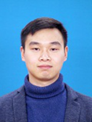
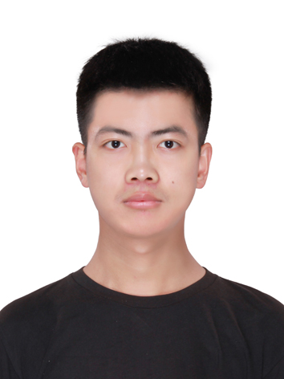
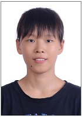
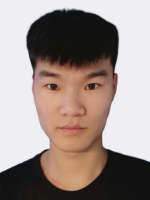
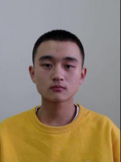
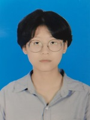
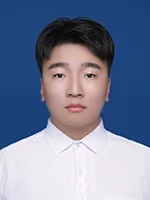

# 目前指导和协助指导的在读研究生
- 2020级：周瑞凯
- 2021级：熊玺、龙泽泓、舒曼、张玉树、马强、罗敬
- 2022级：朱文博、张鑫宇、张泽宇、林炟君、张少杰、钟太鸿、吴珺泓、安道龙
- 2023级：李松霖、袁健会、肖威
- 2024级：方文思、李贵祥、吴昊、孙耕浩、章晓丹、陈黄洋、张涛、檀磊、侯志斌

***

## 周瑞凯，男，瑶族，1992年07月生，广西壮族自治区桂林市人。
- 2012.09-2016.06，武汉轻工大学机械工程学院机械设计制造及其自动化专业，本科生
- 2017.09-2019.06，武汉理工大学汽车工程学院车辆工程专业，硕士生
- 2020.09至今，吉林大学计算机科学与技术学院计算机软件与理论专业，博士生（导师：吕帅副教授）
- 研究方向：人工智能、机器学习

## 【学术论文】在国内外期刊和会议上发表学术论文0篇，在审学术论文4篇。
1. **Zhou Ruikai**, Li Songlin, Lü Shuai*. EOP: Ensemble various on-policy learning to explore. 2024. (Submitted)
2. **Zhou Ruikai**, Zhong Taihong, Li Songlin, Lü Shuai*. Exposing what happened in policy gradient methods by Kullback-Leibler divergence. 2024. (Submitted)
3. **Zhou Ruikai**, Zhong Taihong, Zhu Wenbo, Han Shuai, Lü Shuai*. Revealing the potential of distributions: Balancing exploration and exploitation by reducing the entropy of action distribution. 2023. (Submitted)
4. **Zhou Ruikai**, Zhu Wenbo, Han Shuai, Kang Meng, Lü Shuai*. Online reinforcement learning exploration method based on visitation count of state-action pairs. 2023. (Submitted)

## 【荣誉奖励】
- 2020-2021学年，研究生学业奖学金
- 2021-2022学年，研究生学业奖学金
- 2022-2023学年，研究生学业奖学金

## 【联系方式】
- 邮箱：zhourk20@mails.jlu.edu.cn
- 办公：吉林大学王湘浩楼B227室
- 地址：长春市前进大街2699号，130012

***

## 熊玺，男，1997年05月生，山西省运城市人。
- 2017.09-2021.06，山西大学数学科学学院信息与计算科学专业，本科生
- 2021.09至今，吉林大学计算机科学与技术学院计算机科学与技术专业，硕士生（导师：吕帅副教授、申春副教授）
- 研究方向：人工智能、机器学习

## 【学术论文】在国内外期刊和会议上发表学术论文1篇，在审学术论文2篇。
1. **Xiong Xi**, Shen Chun, Wu Junhong, Lü Shuai*, Zhang Xiaodan. Combined data augmentation framework for generalizing deep reinforcement learning from pixels. 2023. (Submitted)
2. Wu Junhong, Liu Jie, **Xiong Xi**, An Daolong, Lü Shuai*. Focus on primary: Differential diverse data augmentation for generalization in visual reinforcement learning. 2023. (Submitted)
3. Zhang Junwei, Han Shuai, **Xiong Xi**, Zhu Sheng, Lü Shuai*. Explorer-Actor-Critic: Better actors for deep reinforcement learning. **Information Sciences**, 2024, 662: 120255. **(中科院1区TOP期刊, CCF推荐B类期刊, SCI, 目前IF: 8.1)**

## 【荣誉奖励】
- 2017-2018学年，校优秀学生干部
- 2018-2019学年，国家励志奖学金、校三好学生
- 2019-2020学年，国家励志奖学金、三等奖学金
- 2020-2021学年，三等奖学金、校三好学生
- 2021-2022学年，研究生学业奖学金
- 2022-2023学年，研究生学业奖学金

## 【联系方式】
- 邮箱：xiongxi21@mails.jlu.edu.cn
- 办公：吉林大学王湘浩楼B230室
- 地址：长春市前进大街2699号，130012

***

## 龙泽泓，男，1999年06月生，山西省大同市人。
- 2017.09-2021.06，山西大学数学科学学院信息与计算科学专业，本科生
- 2021.09至今，吉林大学计算机科学与技术学院计算机科学与技术专业，硕士生（导师：吕帅副教授）
- 研究方向：人工智能、机器学习

## 【学术论文】在国内外期刊和会议上发表学术论文0篇，在审学术论文5篇。
1. **Long Zehong**, Zhu Wenbo, Zhang Yushu, Lü Shuai*, Lin Dajun. Efficient exploration via state distribution discrepancy maximization in deep reinforcement learning. 2024. (Submitted)
2. Zhu Wenbo, Lü Shuai*, **Long Zehong**, Wu Junhong. Feature distillation for exploration in reinforcement learning. 2023. (Submitted)
3. Zhong Taihong, Han Shuai, Zhang Yushu, **Long Zehong**, Lü Shuai*, Wu Junhong. TATRC: Triple actor-critic structure with regularization for better performance. 2023. (Submitted)
4. **Long Zehong**, Zhu Wenbo, Lü Shuai*, Wu Junhong, Zhong Taihong. Breaking the sample efficiency barrier by rethinking experience replay. 2023. (Submitted)
5. Luo Jing, Liu Jie, **Long Zehong**, Zhu Wenbo, Zhang Yushu, Lü Shuai*. Reduce overestimation bias with single Q-function and use entropy regularization to increase exploration. 2023. (Submitted)

## 【联系方式】
- 邮箱：longzh21@mails.jlu.edu.cn
- 办公：吉林大学王湘浩楼B227室
- 地址：长春市前进大街2699号，130012

***

## 舒曼，女，1999年10月生，吉林省长春市人。
- 2017.09-2021.06，吉林大学软件学院软件工程专业，本科生
- 2021.09至今，吉林大学计算机科学与技术学院计算机技术专业，硕士生（导师：吕帅副教授）
- 研究方向：人工智能、机器学习

## 【学术论文】在国内外期刊和会议上发表学术论文0篇，在审学术论文1篇。
1. **Shu Man**, Lü Shuai*, Gong Xiaoyu, An Daolong, Li Songlin. Double actor-critic with episodic memory. 2023. (Submitted)

## 【荣誉奖励】
- 2017-2018学年，三等奖学金
- 2018.12，全国大学生数学建模竞赛，省级一等奖
- 2018-2019学年，三等奖学金
- 2019.04，美国大学生数学建模竞赛，国家级一等奖
- 2019.12，全国大学生数学建模竞赛，省级一等奖
- 2019-2020学年，三等奖学金
- 2022-2023学年，研究生学业奖学金

## 【联系方式】
- 邮箱：shuman21@mails.jlu.edu.cn
- 办公：吉林大学王湘浩楼B227室
- 地址：长春市前进大街2699号，130012

***

## 张玉树，男，1999年06月生，河北省辛集市人。
- 2017.09-2021.06，吉林大学计算机科学与技术学院计算机科学与技术专业，本科生
- 2021.09至今，吉林大学计算机科学与技术学院计算机科学与技术专业，硕士生（导师：吕帅副教授、申春副教授）
- 研究方向：人工智能、机器学习

## 【学术论文】在国内外期刊和会议上发表学术论文0篇，在审学术论文4篇。
1. Long Zehong, Zhu Wenbo, **Zhang Yushu**, Lü Shuai*, Lin Dajun. Efficient exploration via state distribution discrepancy maximization in deep reinforcement learning. 2024. (Submitted)
2. **Zhang Yushu**, Shen Chun, An Daolong, Wu Junhong, Lü Shuai*. Reinforcement learning with extreme minimum distribution. 2023. (Submitted) 
3. Zhong Taihong, Han Shuai, **Zhang Yushu**, Long Zehong, Lü Shuai*, Wu Junhong. TATRC: Triple actor-critic structure with regularization for better performance. 2023. (Submitted)
4. Luo Jing, Liu Jie, Long Zehong, Zhu Wenbo, **Zhang Yushu**, Lü Shuai*. Reduce overestimation bias with single Q-function and use entropy regularization to increase exploration. 2023. (Submitted)

## 【联系方式】
- 邮箱：yushu21@mails.jlu.edu.cn
- 办公：吉林大学王湘浩楼B230室
- 地址：长春市前进大街2699号，130012

***

## 马强，男，1996年01月生，山西省阳泉市人。
- 2014.09-2018.06，上海电机学院电子信息学院物联网工程专业，本科生
- 2021.09至今，吉林大学软件学院软件工程专业，硕士生（导师：吕帅副教授）
- 研究方向：人工智能、机器学习

## 【学术论文】在国内外期刊和会议上发表学术论文0篇，在审学术论文2篇。
1. **Ma Qiang**, Lü Shuai*, Zhang Shaojie, Wu Junhong, Zhou Wenbo. Contrastive label self-correction for unsupervised domain adaption. 2023. (Submitted)
2. Zhang Zeyu, Shen Chun, **Ma Qiang**, Kang Meng, Lü Shuai*. Prototype-driven active domain adaptation with density consideration. 2023. (Submitted)

## 【荣誉奖励】
- 2014-2015学年，二等奖学金
- 2015-2016学年，二等奖学金
- 2016-2017学年，上海市奖学金、一等奖学金、校三好学生
- 2017.08，全国大学生物联网设计竞赛（华为杯），华东赛区二等奖
- 2018.06，上海电机学院优秀本科毕业生

## 【联系方式】
- 邮箱：maqiang21@mails.jlu.edu.cn
- 办公：吉林大学王湘浩楼B230室
- 地址：长春市前进大街2699号，130012

***

## 罗敬，男，1999年07月生，四川省自贡市人。
- 2017.09-2021.06，成都信息工程大学计算机学院计算机科学与技术专业，本科生
- 2021.09至今，吉林大学计算机科学与技术学院计算机技术专业，硕士生（导师：吕帅副教授、刘杰副教授）
- 研究方向：人工智能、机器学习

## 【学术论文】在国内外期刊和会议上发表学术论文0篇，在审学术论文1篇。
1. **Luo Jing**, Liu Jie, Long Zehong, Zhu Wenbo, Zhang Yushu, Lü Shuai*. Reduce overestimation bias with single Q-function and use entropy regularization to increase exploration. 2023. (Submitted)

## 【荣誉奖励】
- 2017-2018学年，二等奖学金
- 2018-2019学年，国家励志奖学金、一等奖学金
- 2019.03，蓝桥杯全国软件和信息技术专业人才大赛，省级一等奖
- 2020.12，成都信息工程大学优秀本科毕业生
- 2020-2021学年，一等奖学金
- 2021-2022学年，二等奖学金
- 2022-2023学年，研究生学业奖学金

## 【联系方式】
- 邮箱：luojing21@mails.jlu.edu.cn
- 办公：吉林大学王湘浩楼B227室
- 地址：长春市前进大街2699号，130012

***

## 朱文博，女，2000年08月生，吉林省长春市人。
- 2018.09-2022.06，吉林大学软件学院软件工程专业，本科生
- 2022.09至今，吉林大学计算机科学与技术学院计算机科学与技术专业，推免硕士生（导师：吕帅副教授）
- 研究方向：人工智能、机器学习

## 【学术论文】在国内外期刊和会议上发表学术论文1篇，在审学术论文7篇。
1. Long Zehong, **Zhu Wenbo**, Zhang Yushu, Lü Shuai*, Lin Dajun. Efficient exploration via state distribution discrepancy maximization in deep reinforcement learning. 2024. (Submitted)
2. **Zhu Wenbo**, Lü Shuai*, Long Zehong, Wu Junhong. Feature distillation for exploration in reinforcement learning. 2023. (Submitted)
3. Zhou Ruikai, Zhong Taihong, **Zhu Wenbo**, Han Shuai, Lü Shuai*. Revealing the potential of distributions: Balancing exploration and exploitation by reducing the entropy of action distribution. 2023. (Submitted)
4. Long Zehong, **Zhu Wenbo**, Lü Shuai*, Wu Junhong, Zhong Taihong. Breaking the sample efficiency barrier by rethinking experience replay. 2023. (Submitted)
5. Zhou Ruikai, **Zhu Wenbo**, Han Shuai, Kang Meng, Lü Shuai*. Online reinforcement learning exploration method based on visitation count of state-action pairs. 2023. (Submitted)
6. Luo Jing, Liu Jie, Long Zehong, **Zhu Wenbo**, Zhang Yushu, Lü Shuai*. Reduce overestimation bias with single Q-function and use entropy regularization to increase exploration. 2023. (Submitted)
7. Zhu Sheng, Shen Chun, **Zhu Wenbo**, Han Shuai, Lü Shuai*. Actor-critic of multi-agent collaboration on single-agent task. 2022. (Submitted)
8. Li Jingyao, Lü Shuai, **Zhu Wenbo**, Li Zhanshan*. Enhancing transferability and discriminability simultaneously for unsupervised domain adaptation. **Knowledge-Based Systems**, 2022, 247: 108705. **(中科院1区TOP期刊, CCF推荐C类期刊, SCI, IF: 8.8)**

## 【荣誉奖励】
- 2018-2019学年，二等奖学金
- 2019.11，全国大学生数学建模竞赛，省级一等奖
- 2019-2020学年，二等奖学金
- 2020.11，全国大学生数学建模竞赛，省级一等奖
- 2020-2021学年，二等奖学金、院优秀学生
- 2022.06，吉林大学优秀本科毕业论文：基于策略参数多样性的深度强化学习算法的设计与实现
- 2022年度，研究生新生奖学金
- 2022-2023学年，一等奖学金、优秀研究生、研究生学业奖学金
- 2023-2024学年，研究生学业奖学金

## 【联系方式】
- 邮箱：zhuwb22@mails.jlu.edu.cn
- 办公：吉林大学王湘浩楼B227室
- 地址：长春市前进大街2699号，130012

***

## 张鑫宇，男，1999年04月生，黑龙江省齐齐哈尔市人。
- 2018.09-2022.06，吉林大学计算机科学与技术学院计算机科学与技术专业，本科生
- 2022.09至今，吉林大学计算机科学与技术学院计算机科学与技术专业，推免硕士生（导师：吕帅副教授）
- 研究方向：人工智能、机器学习

## 【学术论文】在国内外期刊和会议上发表学术论文2篇，在审学术论文1篇。
1. Lü Shuai, **Zhang Xinyu**, Li Zongze, Li Jingyao*, Kang Meng. Bi-classifier with neighborhood aggregation for unsupervised domain adaptation. 2022. (Submitted)
2. **Zhang Xinyu**, Kang Meng, Lü Shuai*. Low category uncertainty and high training potential instance learning for unsupervised domain adaptation. In: **Proceedings of the 38th Annual AAAI Conference on Artificial Intelligence (AAAI 2024)**, Vancouver, Canada, February 20-27, 2024, 16881-16889. **(CCF推荐A类会议)**
3. Lü Shuai, Li Zongze, **Zhang Xinyu**, Li Jingyao*. Consistency regularization-based mutual alignment for source-free domain adaptation. **Expert Systems with Applications**, 2024, 241: 122577. **(中科院1区TOP期刊, CCF推荐C类期刊, SCI, 目前IF: 8.5)**

## 【荣誉奖励】
- 2018-2019学年，二等奖学金、院优秀学生
- 2019-2020学年，二等奖学金、院优秀学生
- 2020-2021学年，二等奖学金、院优秀学生
- 2021-2022学年，三等奖学金
- 2022.06，吉林大学优秀本科毕业论文：基于双分类器确定性最大化的无监督领域自适应算法的设计和实现
- 2022年度，研究生新生奖学金
- 2022-2023学年，研究生学业奖学金
- 2023年度，南瑞继保奖学金
- 2023-2024学年，研究生学业奖学金

## 【联系方式】
- 邮箱：zhang_xinyu22@mails.jlu.edu.cn
- 办公：吉林大学王湘浩楼B230室
- 地址：长春市前进大街2699号，130012

***

## 张泽宇，男，2000年09月生，山东省滨州市人。
- 2018.09-2022.06，内蒙古大学计算机学院（软件学院）计算机科学与技术专业，本科生（学业排名和综合排名均为第1/38名）
- 2022.09至今，吉林大学计算机科学与技术学院计算机科学与技术专业，推免硕士生（导师：吕帅副教授、申春副教授）
- 研究方向：人工智能、机器学习

## 【学术论文】在国内外期刊和会议上发表学术论文1篇，在审学术论文2篇。
1. **Zhang Zeyu**, Shen Chun, Lü Shuai*, Zhang Shaojie. Reconfigurability-aware selection for contrastive active domain adaptation. 2024. (Submitted)
2. **Zhang Zeyu**, Shen Chun, Ma Qiang, Kang Meng, Lü Shuai*. Prototype-driven active domain adaptation with density consideration. 2023. (Submitted)
3. Zhang Shaojie, Shen Chun, Lü Shuai*, **Zhang Zeyu**. Reviewing the forgotten classes for domain adaptation of black-box predictors. In: **Proceedings of the 38th Annual AAAI Conference on Artificial Intelligence (AAAI 2024)**, Vancouver, Canada, February 20-27, 2024, 16830-16837. **(CCF推荐A类会议)**

## 【荣誉奖励】
- 2019.04，中国高校计算机大赛团体程序设计天梯赛，省级特等奖
- 2019-2020学年，一等奖学金、校三好学生
- 2020.10，东北地区大学生程序设计竞赛，优胜奖
- 2020.12，中国高校计算机大赛团体程序设计天梯赛，省级一等奖
- 2020-2021学年，国家奖学金
- 2022.06，内蒙古大学优秀本科毕业论文：面向OBE模式的工程教育认证自评与辅助管理系统
- 2022.12，中国研究生数学建模竞赛，国家级一等奖
- 2022-2023学年，一等奖学金、优秀研究生、研究生学业奖学金
- 2023年度，浪潮奖学金
- 2023-2024学年，研究生学业奖学金

## 【联系方式】
- 邮箱：zeyuz22@mails.jlu.edu.cn
- 办公：吉林大学王湘浩楼B230室
- 地址：长春市前进大街2699号，130012

***

## 林炟君，女，2000年08月生，福建省莆田市人。
- 2018.09-2022.06，海南大学计算机科学与技术学院软件工程专业，本科生
- 2022.09至今，吉林大学软件学院软件工程专业，推免硕士生（导师：吕帅副教授、刘磊教授）
- 研究方向：人工智能、机器学习

## 【学术论文】在国内外期刊和会议上发表学术论文0篇，在审学术论文1篇。
1. Long Zehong, Zhu Wenbo, Zhang Yushu, Lü Shuai*, **Lin Dajun**. Efficient exploration via state distribution discrepancy maximization in deep reinforcement learning. 2024. (Submitted)

## 【荣誉奖励】
- 2018-2019学年，三等奖学金、院优秀学生会干部
- 2019-2020学年，二等奖学金
- 2020.11，全国大学生数学建模竞赛，国家级二等奖、省级一等奖
- 2020-2021学年，三等奖学金
- 2022-2023学年，研究生学业奖学金
- 2023-2024学年，研究生学业奖学金

## 【联系方式】
- 邮箱：lindj22@mails.jlu.edu.cn
- 办公：吉林大学王湘浩楼B227室
- 地址：长春市前进大街2699号，130012

***

## 张少杰，男，2000年04月生，安徽省合肥市人。
- 2018.09-2022.06，哈尔滨工程大学软件学院软件工程专业，本科生
- 2022.09至今，吉林大学软件学院软件工程专业，推免硕士生（导师：吕帅副教授、申春副教授）
- 研究方向：人工智能、机器学习

## 【学术论文】在国内外期刊和会议上发表学术论文1篇，在审学术论文2篇。
1. Zhang Zeyu, Shen Chun, Lü Shuai*, **Zhang Shaojie**. Reconfigurability-aware selection for contrastive active domain adaptation. 2024. (Submitted)
2. Ma Qiang, Lü Shuai*, **Zhang Shaojie**, Wu Junhong, Zhou Wenbo. Contrastive label self-correction for unsupervised domain adaption. 2023. (Submitted)
3. **Zhang Shaojie**, Shen Chun, Lü Shuai*, Zhang Zeyu. Reviewing the forgotten classes for domain adaptation of black-box predictors. In: **Proceedings of the 38th Annual AAAI Conference on Artificial Intelligence (AAAI 2024)**, Vancouver, Canada, February 20-27, 2024, 16830-16837. **(CCF推荐A类会议)**

## 【荣誉奖励】
- 2018-2019学年，三等奖学金、二等奖学金
- 2019-2020学年，二等奖学金、二等奖学金
- 2020-2021学年，二等奖学金、二等奖学金、院三好学生
- 2021-2022学年，二等奖学金、一等奖学金
- 2022.12，中国研究生数学建模竞赛，国家级一等奖
- 2022-2023学年，二等奖学金、优秀研究生
- 2023-2024学年，研究生学业奖学金

## 【联系方式】
- 邮箱：sjzhang22@mails.jlu.edu.cn
- 办公：吉林大学王湘浩楼B230室
- 地址：长春市前进大街2699号，130012

***

## 钟太鸿，男，1999年11月生，辽宁省大连市人。
- 2018.09-2022.06，沈阳工业大学软件学院软件工程专业，本科生（学业排名和综合排名均为第1/296名）
- 2022.09至今，吉林大学软件学院软件工程专业，推免硕士生（导师：吕帅副教授）
- 研究方向：人工智能、机器学习

## 【学术论文】在国内外期刊和会议上发表学术论文0篇，在审学术论文4篇。
1. Zhou Ruikai, **Zhong Taihong**, Li Songlin, Lü Shuai*. Exposing what happened in policy gradient methods by Kullback-Leibler divergence. 2024. (Submitted)
2. Zhou Ruikai, **Zhong Taihong**, Zhu Wenbo, Han Shuai, Lü Shuai*. Revealing the potential of distributions: Balancing exploration and exploitation by reducing the entropy of action distribution. 2023. (Submitted)
3. **Zhong Taihong**, Han Shuai, Zhang Yushu, Long Zehong, Lü Shuai*, Wu Junhong. TATRC: Triple actor-critic structure with regularization for better performance. 2023. (Submitted)
4. Long Zehong, Zhu Wenbo, Lü Shuai*, Wu Junhong, **Zhong Taihong**. Breaking the sample efficiency barrier by rethinking experience replay. 2023. (Submitted)

## 【荣誉奖励】
- 2018-2019学年，辽宁省政府奖学金、一等奖学金、三好学生标兵
- 2019-2020学年，国家奖学金、特等奖学金、校三好学生
- 2020.11，软件设计师（软考中级）
- 2020-2021学年，国家奖学金、特等奖学金、校三好学生
- 2020-2021学年，“一带一路”耿飚奖学金
- 2022.06，沈阳工业大学优秀毕业生
- 2023-2024学年，研究生学业奖学金

## 【联系方式】
- 邮箱：zhongth22@mails.jlu.edu.cn
- 办公：吉林大学王湘浩楼B230室
- 地址：长春市前进大街2699号，130012

***

## 吴珺泓，男，2000年09月生，山东省莱西市人。
- 2018.09-2022.06，成都理工大学计算机与网络安全学院（牛津布鲁克斯学院）软件工程专业，本科生
- 2022.09至今，吉林大学软件学院软件工程专业，推免硕士生（导师：吕帅副教授、刘杰副教授）
- 研究方向：人工智能、机器学习

## 【学术论文】在国内外期刊和会议上发表学术论文1篇，在审学术论文7篇。
1. Xiong Xi, Shen Chun, **Wu Junhong**, Lü Shuai*, Zhang Xiaodan. Combined data augmentation framework for generalizing deep reinforcement learning from pixels. 2023. (Submitted)
2. **Wu Junhong**, Liu Jie, Xiong Xi, An Daolong, Lü Shuai*. Focus on primary: Differential diverse data augmentation for generalization in visual reinforcement learning. 2023. (Submitted)
3. Zhang Yushu, Shen Chun, An Daolong, **Wu Junhong**, Lü Shuai*. Reinforcement learning with extreme minimum distribution. 2023. (Submitted) 
4. Zhu Wenbo, Lü Shuai*, Long Zehong, **Wu Junhong**. Feature distillation for exploration in reinforcement learning. 2023. (Submitted)
5. Ma Qiang, Lü Shuai*, Zhang Shaojie, **Wu Junhong**, Zhou Wenbo. Contrastive label self-correction for unsupervised domain adaption. 2023. (Submitted)
6. Zhong Taihong, Han Shuai, Zhang Yushu, Long Zehong, Lü Shuai*, **Wu Junhong**. TATRC: Triple actor-critic structure with regularization for better performance. 2023. (Submitted)
7. Long Zehong, Zhu Wenbo, Lü Shuai*, **Wu Junhong**, Zhong Taihong. Breaking the sample efficiency barrier by rethinking experience replay. 2023. (Submitted)
8. Zhu Sheng, Shen Chun, Lü Shuai*, **Wu Junhong**, An Daolong. Double buffers CEM-TD3: More efficient evolution and richer exploration. In: **Proceedings of the 38th Annual AAAI Conference on Artificial Intelligence (AAAI 2024)**, Vancouver, Canada, February 20-27, 2024, 17193-17201. **(CCF推荐A类会议)**

## 【荣誉奖励】
- 2018-2019学年，一等奖学金、校优秀学生
- 2019-2020学年，一等奖学金、校优秀学生
- 2020.11，全国大学生数学建模竞赛，省级一等奖
- 2020-2021学年，国家奖学金、一等奖学金、校优秀学生
- 2021.12，成都理工大学十佳大学生
- 2022.03，四川省优秀大学毕业生
- 2022.06，成都理工大学优秀毕业生
- 2022.12，中国研究生数学建模竞赛，国家级一等奖
- 2022年度，研究生学术业绩三等奖学金
- 2022-2023学年，研究生学业奖学金

## 【联系方式】
- 邮箱：chwu22@mails.jlu.edu.cn
- 办公：吉林大学王湘浩楼B230室
- 地址：长春市前进大街2699号，130012

***

## 安道龙，男，1998年10月生，河南省濮阳市人。
- 2017.09-2021.06，吉林大学计算机科学与技术学院物联网工程专业，本科生
- 2022.09至今，吉林大学计算机科学与技术学院计算机技术专业，硕士生（导师：吕帅副教授、申春副教授）
- 研究方向：人工智能、机器学习

## 【学术论文】在国内外期刊和会议上发表学术论文1篇，在审学术论文3篇。
1. Wu Junhong, Liu Jie, Xiong Xi, **An Daolong**, Lü Shuai*. Focus on primary: Differential diverse data augmentation for generalization in visual reinforcement learning. 2023. (Submitted)
2. Zhang Yushu, Shen Chun, **An Daolong**, Wu Junhong, Lü Shuai*. Reinforcement learning with extreme minimum distribution. 2023. (Submitted) 
3. Shu Man, Lü Shuai*, Gong Xiaoyu, **An Daolong**, Li Songlin. Double actor-critic with episodic memory. 2023. (Submitted)
4. Zhu Sheng, Shen Chun, Lü Shuai*, Wu Junhong, **An Daolong**. Double buffers CEM-TD3: More efficient evolution and richer exploration. In: **Proceedings of the 38th Annual AAAI Conference on Artificial Intelligence (AAAI 2024)**, Vancouver, Canada, February 20-27, 2024, 17193-17201. **(CCF推荐A类会议)**

## 【荣誉奖励】
- 2019.07，全国大学生水利创新设计大赛，国家级二等奖
- 2019-2020学年，国家励志奖学金
- 2020.08，全国大学生物联网设计竞赛（华为杯），东北赛区一等奖
- 2020-2021学年，二等奖学金
- 2022-2023学年，二等奖学金
- 2023-2024学年，研究生学业奖学金

## 【联系方式】
- 邮箱：andl22@mails.jlu.edu.cn
- 办公：吉林大学王湘浩楼B230室
- 地址：长春市前进大街2699号，130012

***

## 李松霖，男，2000年12月生，吉林省长春市人。
- 2019.09-2023.06，吉林大学计算机科学与技术学院计算机科学与技术专业，本科生
- 2023.09至今，吉林大学计算机科学与技术学院计算机科学与技术专业，推免硕士生（导师：吕帅副教授）
- 研究方向：人工智能、机器学习

## 【学术论文】在国内外期刊和会议上发表学术论文0篇，在审学术论文3篇。
1. Zhou Ruikai, **Li Songlin**, Lü Shuai*. EOP: Ensemble various on-policy learning to explore. 2024. (Submitted)
2. Zhou Ruikai, Zhong Taihong, **Li Songlin**, Lü Shuai*. Exposing what happened in policy gradient methods by Kullback-Leibler divergence. 2024. (Submitted)
3. Shu Man, Lü Shuai*, Gong Xiaoyu, An Daolong, **Li Songlin**. Double actor-critic with episodic memory. 2023. (Submitted)

## 【荣誉奖励】
- 2019-2020学年，一等奖学金、院优秀学生
- 2020-2021学年，一等奖学金、校优秀学生
- 2021-2022学年，一等奖学金、院优秀学生
- 2022-2023学年，二等奖学金、院优秀学生
- 2023.06，吉林大学优秀本科毕业论文：基于集成策略和集成评估提高强化学习样本效率和泛化能力
- 2023-2024学年，研究生学业奖学金

## 【联系方式】
- 邮箱：lisl23@mails.jlu.edu.cn
- 办公：吉林大学王湘浩楼B230室
- 地址：长春市前进大街2699号，130012

***

## 袁健会，男，1999年06月生，吉林省长春市人。
- 2018.09-2022.06，东北电力大学计算机学院计算机科学与技术（卓越）专业，本科生（导师：李壮副教授）
- 2023.09至今，吉林大学软件学院软件工程专业，硕士生（导师：吕帅副教授）
- 研究方向：人工智能、机器学习

## 【学术论文】在国内外期刊和会议上发表学术论文1篇，在审学术论文0篇。
1. Li Zhuang, **Yuan Jianhui**, Li Guixiang, Wang Hao, Li Xingcan, Li Dan, Wang Xinhua*. RSI-YOLO: Object detection method for remote sensing images based on improved YOLO. **Sensors**, 2023, 23: 6414. **(中科院2区期刊, SCI, 目前IF: 3.9)**

## 【荣誉奖励】
- 2018-2019学年，国家励志奖学金、三等奖学金
- 2019-2020学年，国家励志奖学金、吉林省政府奖学金、二等奖学金、二等奖学金、校优秀学生干部标兵
- 2019-2020学年，芮捷助学金
- 2020.12，吉林省大学生电子设计竞赛，省级一等奖
- 2020-2021学年，三等奖学金、校优秀学生干部
- 2023-2024学年，研究生学业奖学金

## 【联系方式】
- 邮箱：jhyuan23@mails.jlu.edu.cn
- 办公：吉林大学王湘浩楼B227室
- 地址：长春市前进大街2699号，130012

***

## 肖威，男，2001年11月生，山东省菏泽市人。
- 2019.09-2023.06，山东师范大学信息科学与工程学院计算机科学与技术专业，本科生
- 2023.09至今，吉林大学计算机科学与技术学院计算机科学与技术专业，硕士生（导师：吕帅副教授）
- 研究方向：人工智能、机器学习

## 【学术论文】在国内外期刊和会议上发表学术论文0篇，在审学术论文0篇。

## 【荣誉奖励】
- 2019-2020学年，三等奖学金、校优秀学生、校优秀学生干部
- 2020-2021学年，二等奖学金
- 2020-2021学年，三兴未来助学金
- 2021.05，蓝桥杯全国软件和信息技术专业人才大赛山东赛区，省级一等奖

## 【联系方式】
- 邮箱：weixiao23@mails.jlu.edu.cn
- 办公：吉林大学王湘浩楼B227室
- 地址：长春市前进大街2699号，130012

***

## 方文思，女，1999年01月生，吉林省公主岭市人。
- 2016.09-2020.06，南昌大学信息工程学院计算机科学与技术专业，本科生
- 2020.09-2023.06，吉林大学计算机科学与技术学院计算机技术专业，硕士生（导师：李瑛副教授）
- 预计2024.09开始，吉林大学计算机科学与技术学院计算机系统结构专业，博士生（导师：李强教授、吕帅副教授）
- 研究方向：人工智能、机器学习

## 【学术论文】在国内外期刊和会议上发表学术论文3篇，在审学术论文2篇。
1. Li Ying, **Fang Wensi**, Jiang Xuyang, Sun Hang, Li Linlin, Du Wei*. MGRFE-web: A web server for molecular target identification of Alzheimer's disease based on feature selection. 2023. (Submitted)
2. Li Ying, **Fang Wensi**, Zhao Jianing, Yang Xiao, Sun Hang, Du Wei*. Training an end-to-end moonlighting long non-coding RNAs deep learning model based on reinforcement learning. 2023. (Submitted)
3. Li Ying, Sun Hang, **Fang Wensi**, Ma Qin, Han Siyu, Rui Wang-Sattler, Du Wei*, Yu Qiong*. SURE: Screening unlabeled samples for reliable negative samples based on reinforcement learning. **Information Sciences**, 2023, 629: 299-312. **(中科院1区TOP期刊, CCF推荐B类期刊, SCI, 目前IF: 8.1)**
4. Li Ying, **Fang Wensi**, Sun Hang, Liu Xiangyu, Du Wei, Liu Yijun, Li Qianqian*. PecidRL: Petition expectation correction and identification based on deep reinforcement learning. **Information Processing and Management**, 2023, 60(3): 103285. **(中科院1区TOP期刊, CCF推荐B类期刊, SCI, 目前IF: 8.6)**
5. Han Siyu, Yang Xiao, Sun Hang, Yang Hu, Zhang Qi, Peng Cheng, **Fang Wensi**, Li Ying*. LION: An integrated R package for effective prediction of ncRNA–protein interaction. **Briefings in Bioinformatics**, 2022, 23(6): bbac420. **(中科院1区期刊, CCF推荐B类期刊, SCI, IF: 9.5)**

## 【学位论文】
1. **方文思**. 基于强化学习的政府留言板标签更正与识别算法研究[硕士学位论文]. 长春: 吉林大学, 2023.

## 【荣誉奖励】
- 2016-2017学年，二等奖学金、院优秀学生干部
- 2017-2018学年，二等奖学金、院三好学生、院优秀学生干部
- 2018-2019学年，一等奖学金

## 【联系方式】
- 邮箱：待学校分配
- 办公：吉林大学王湘浩楼B227室
- 地址：长春市前进大街2699号，130012

***

## 李贵祥，男，2003年04月生，山东省聊城市人。
- 2020.09至今，东北电力大学计算机学院智能科学与技术专业，本科生（导师：李壮副教授）（学业排名和综合排名均为第1/76名）
- 预计2024.09开始，吉林大学软件学院软件工程专业，推免硕士生（导师：吕帅副教授）
- 研究方向：人工智能、机器学习

## 【学术论文】在国内外期刊和会议上发表学术论文1篇。
1. Li Zhuang, Yuan Jianhui, **Li Guixiang**, Wang Hao, Li Xingcan, Li Dan, Wang Xinhua*. RSI-YOLO: Object detection method for remote sensing images based on improved YOLO. **Sensors**, 2023, 23: 6414. **(中科院2区期刊, SCI, 目前IF: 3.9)**

## 【荣誉奖励】
- 2020-2021学年，一等奖学金、校优秀学生
- 2021-2022学年，一等奖学金、二等奖学金、校优秀学生标兵
- 2022-2023学年，二等奖学金
- 2023.04，蓝桥杯全国软件和信息技术专业人才大赛吉林赛区，省级一等奖
- 2023.05，美国大学生数学建模竞赛，国家级三等奖

## 【联系方式】
- 邮箱：待学校分配
- 办公：吉林大学王湘浩楼B2XX室
- 地址：长春市前进大街2699号，130012

***

## 吴昊，男，2002年02月生，内蒙古自治区额尔古纳市人。
- 2020.09至今，吉林大学计算机科学与技术学院计算机科学与技术专业，本科生
- 预计2024.09开始，吉林大学计算机科学与技术学院计算机科学与技术专业，推免硕士生（导师：吕帅副教授）
- 研究方向：人工智能、机器学习

## 【荣誉奖励】
- 2020-2021学年，三等奖学金
- 2021-2022学年，二等奖学金、院优秀学生
- 2022-2023学年，二等奖学金、院优秀学生
- 2023.04，蓝桥杯全国软件和信息技术专业人才大赛吉林赛区，省级一等奖
- 2023.06，蓝桥杯全国软件和信息技术专业人才大赛全国总决赛，国家级优秀奖
- 2023.08，中国大学生计算机博弈大赛海克斯项目，国家级一等奖（冠军）
- 2023年度，吉林大学智能基座产教融合协同育人基地奖学金

## 【联系方式】
- 邮箱：wuhao2120@mails.jlu.edu.cn
- 办公：吉林大学王湘浩楼B230室
- 地址：长春市前进大街2699号，130012

***

## 孙耕浩，男，2001年07月生，山东省德州市人。
- 2020.09至今，西安石油大学计算机学院计算机科学与技术专业，本科生（学业排名为第2/181名，综合排名为第1/181名）
- 预计2024.09开始，吉林大学软件学院软件工程专业，推免硕士生（导师：吕帅副教授、赖永副教授）
- 研究方向：人工智能、机器学习

## 【荣誉奖励】
- 2020-2021学年，国家励志奖学金、校三好学生、校优秀学生干部
- 2021-2022学年，国家奖学金、校三好学生、校优秀学生干部
- 2022.11，中国机器人大赛暨RoboCup机器人世界杯中国赛FIRA小型组半自主5vs5项目，国家级二等奖
- 2022.11，中国机器人大赛暨RoboCup机器人世界杯中国赛FIRA小型组半自主11vs11项目，国家级二等奖
- 2023.11，中国机器人大赛暨RoboCup机器人世界杯中国赛FIRA小型组半自主5vs5项目，国家级一等奖（亚军）
- 2023.11，中国机器人大赛暨RoboCup机器人世界杯中国赛FIRA小型组半自主标准任务项目，国家级一等奖（冠军）

## 【联系方式】
- 邮箱：待学校分配
- 办公：吉林大学王湘浩楼B2XX室
- 地址：长春市前进大街2699号，130012

***

## 章晓丹，女，2002年01月生，山东省威海市人。
- 2020.09至今，吉林大学计算机科学与技术学院计算机科学与技术专业，本科生
- 预计2024.09开始，吉林大学计算机科学与技术学院计算机科学与技术专业，推免硕士生（导师：吕帅副教授）
- 研究方向：人工智能、机器学习

## 【学术论文】在国内外期刊和会议上发表学术论文0篇，在审学术论文1篇。
1. Xiong Xi, Shen Chun, Wu Junhong, Lü Shuai*, **Zhang Xiaodan**. Combined data augmentation framework for generalizing deep reinforcement learning from pixels. 2023. (Submitted)

## 【荣誉奖励】
- 2020-2021学年，一等奖学金、校优秀学生
- 2021.11，全国大学生数学建模竞赛，国家级二等奖
- 2021.12，全国大学生数学建模竞赛吉林赛区，省级一等奖
- 2021-2022学年，二等奖学金、院优秀学生
- 2022.12，全国大学生数学建模竞赛吉林赛区，省级一等奖
- 2022-2023学年，三等奖学金
- 2023.05，美国大学生数学建模竞赛，国家级三等奖
- 2023.06，大学生创新创业训练计划——创新训练项目：基于Vtuber的对韩成语文化输出模式的探讨与实践，国家级优秀结题（项目成员）

## 【联系方式】
- 邮箱：zhangxd2120@mails.jlu.edu.cn
- 办公：吉林大学王湘浩楼B227室
- 地址：长春市前进大街2699号，130012

***

## 陈黄洋，男，2002年08月生，福建省漳州市人。
- 2020.09至今，东北电力大学计算机学院软件工程专业，本科生（学业排名和综合排名均为第1/70名）
- 预计2024.09开始，吉林大学软件学院软件工程专业，推免硕士生（导师：吕帅副教授、陈娟副教授）
- 研究方向：人工智能、机器学习

## 【荣誉奖励】
- 2020-2021学年，一等奖学金、校优秀学生标兵
- 2021-2022学年，一等奖学金、校优秀学生标兵、校优秀学生干部
- 2022.12，全国大学生数学建模竞赛吉林赛区，省级一等奖
- 2022-2023学年，国家奖学金、一等奖学金
- 2023.04，蓝桥杯全国软件和信息技术专业人才大赛吉林赛区，省级一等奖
- 2023.05，中国高校计算机设计大赛团体程序设计天梯赛，团队国家二等奖
- 2023.05，中国高校计算机设计大赛团体程序设计天梯赛，个人国家三等奖
- 2023.06，蓝桥杯全国软件和信息技术专业人才大赛全国总决赛，国家级一等奖

## 【联系方式】
- 邮箱：待学校分配
- 办公：吉林大学王湘浩楼B2XX室
- 地址：长春市前进大街2699号，130012

***

## 张涛，男，2002年10月生，河南省濮阳市人。
- 2020.09至今，辽宁科技大学计算机与软件工程学院网络工程专业，本科生（学业排名和综合排名均为第1/144名）
- 预计2024.09开始，吉林大学软件学院软件工程专业，推免硕士生（导师：吕帅副教授、朱允刚副教授）
- 研究方向：人工智能、机器学习

## 【荣誉奖励】
- 2020-2021学年，国家励志奖学金、二等奖学金、校三好学生
- 2021-2022学年，辽宁省政府奖学金、一等奖学金、校三好学生标兵
- 2022.05，美国大学生数学建模竞赛，国家级三等奖
- 2022.05，蓝桥杯全国软件和信息技术专业人才大赛辽宁赛区，省级一等奖
- 2022.08，中国大学生计算机博弈大赛苏拉卡尔塔棋项目，国家级二等奖
- 2022-2023学年，一等奖学金、校三好学生标兵
- 2023.04，蓝桥杯全国软件和信息技术专业人才大赛辽宁赛区，省级一等奖
- 2023.05，美国大学生数学建模竞赛，国家级二等奖

## 【联系方式】
- 邮箱：待学校分配
- 办公：吉林大学王湘浩楼B2XX室
- 地址：长春市前进大街2699号，130012

***

## 檀磊，男，2000年11月生，安徽省安庆市人。
- 2020.09至今，安徽农业大学信息与计算机学院物联网工程专业，本科生（学业排名和综合排名均为第1/59名）
- 预计2024.09开始，吉林大学软件学院软件工程专业，推免硕士生（导师：吕帅副教授、郭东教授）
- 研究方向：人工智能、机器学习

## 【学术论文】在国内外期刊和会议上发表学术论文1篇。
1. 马慧敏*, **檀磊**, 张京会, 张鹏飞, 宁孝梅, 刘海秋, 高彦伟. 基于深度学习的合成孔径成像系统共相误差检测研究综述. **量子电子学报**, 2022, 39(6): 927-941. (第一作者为指导教师)

## 【荣誉奖励】
- 2020-2021学年，特等奖学金、校三好学生
- 2021.11，中国互联网+大学生创新创业大赛，省级一等奖
- 2021-2022学年，特等奖学金、校三好学生、校自立自强大学生
- 2022.06，国际大学生智能农业装备创新大赛，国家级二等奖
- 2022.08，全国大学生生命科学竞赛，国家级一等奖
- 2022-2023学年，国家奖学金、一等奖学金
- 2023.06，中国大学生计算机设计大赛人工智能组，省级一等奖

## 【联系方式】
- 邮箱：待学校分配
- 办公：吉林大学王湘浩楼B2XX室
- 地址：长春市前进大街2699号，130012

***

## 侯志斌，男，1999年08月生，山东省菏泽市人。
- 2017.09-2021.06，临沂大学信息科学与工程学院网络工程专业，本科生
- 预计2024.09开始，吉林大学软件学院软件工程专业，硕士生（导师：刘雪洁副教授、吕帅副教授）
- 研究方向：人工智能、机器学习

## 【荣誉奖励】
- 2019.10，ACM-ICPC国际大学生程序设计竞赛亚洲区银川站，铜奖
- 2020.10，蓝桥杯全国软件和信息技术专业人才大赛山东赛区，省级一等奖
- 2020.11，蓝桥杯全国软件和信息技术专业人才大赛全国总决赛，国家级一等奖
- 2021.05，中国高校计算机设计大赛团体程序设计天梯赛，团队国家二等奖
- 2021.05，中国高校计算机设计大赛团体程序设计天梯赛，个人国家二等奖
- 2021.05，蓝桥杯全国软件和信息技术专业人才大赛山东赛区，省级一等奖
- 2021.05，山东省大学生程序设计竞赛，省级金奖

## 【联系方式】
- 邮箱：待学校分配
- 办公：吉林大学王湘浩楼B2XX室
- 地址：长春市前进大街2699号，130012
