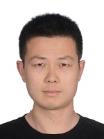

# 2010年至今指导和协助指导的毕业研究生

2010级：魏唯、邹婷婷
2011级：张鑫、刘冬清
2012级：牛当当、李壮
2014级：杨洋、刘丰
2015级：牛当当、李壮、王强、李广力、王冠成
2016级：贺甫霖、邹璐琨
2017级：周文博、张桐搏、徐玥
2018级：李静瑶、李俊劼、刘京、韩帅
2019级：于佳玉、张正昊、路笳艺
2020级：张峻伟、李宗泽、康勐、龚晓宇、朱盛

## 张峻伟，男，1998年12月生，吉林省通化市人。
- 2016.09-2020.06，吉林大学计算机科学与技术学院计算机科学与技术专业，本科生
- 2020.09-2023.06，吉林大学计算机科学与技术学院计算机科学与技术专业，推荐免试硕士研究生（导师：吕帅副教授）
- 研究方向：人工智能、机器学习
- 毕业去向：[北京] 天翼云科技有限公司

## 【学术论文】在国内外期刊和会议上发表学术论文7篇，在审学术论文1篇。
1. Zheng Mingsheng, **Zhang Junwei**, Zhan Changshuai, Ren Xinyu, Lü Shuai*. Proximal policy optimization with reward-based prioritization, 2023. (Submitted)
2. **Zhang Junwei**, Han Shuai, Xiong Xi, Zhu Sheng, Lü Shuai*. Explorer-Actor-Critic: Better actors for deep reinforcement learning. **Information Sciences**, 2024, 662: 120255. **(中科院1区TOP期刊, CCF推荐B类期刊, SCI, 目前IF: 8.1)**
3. **张峻伟**, 吕帅*, 张正昊, 于佳玉, 龚晓宇. 基于样本效率优化的深度强化学习方法综述. **软件学报**, 2022, 33(11): 4217-4238. **(CCF推荐中文A类期刊)**
4. Lu Jiayi, Han Shuai, Lü Shuai*, Kang Meng, **Zhang Junwei**. Sampling diversity driven exploration with state difference guidance. **Expert Systems with Applications**, 2022, 203: 117418. **(中科院1区TOP期刊, CCF推荐C类期刊, SCI, IF: 8.5)**
5. **Zhang Junwei**, Zhang Zhenghao, Han Shuai, Lü Shuai*. Proximal policy optimization via enhanced exploration efficiency. **Information Sciences**, 2022, 609: 750-765. **(中科院1区TOP期刊, CCF推荐B类期刊, SCI, IF: 8.1)**
6. 吕帅*, 龚晓宇, 张正昊, 韩帅, **张峻伟**. 结合进化算法的深度强化学习方法研究综述. **计算机学报**, 2022, 45(7): 1478-1499. **(CCF推荐中文A类期刊)**
7. Li Junjie, **Zhang Junwei**, Gong Xiaoyu, Lü Shuai*. Evolutionary generative adversarial networks with crossover based knowledge distillation. In: **Proceedings of the International Joint Conference on Neural Networks (IJCNN 2021)**, Virtual Event, July 18-22, 2021, 1-8. **(CCF推荐C类会议, CORE推荐B类会议)**
8. Lü Shuai*, Han Shuai, Zhou Wenbo, **Zhang Junwei**. Recruitment-imitation mechanism for evolutionary reinforcement learning. **Information Sciences**, 2021, 553: 172-188. **(中科院1区TOP期刊, CCF推荐B类期刊, SCI, IF: 8.233)**

## 【学位论文】
1. **张峻伟**.  基于过估计控制与探索增强的强化学习优化方法[硕士学位论文]. 长春: 吉林大学, 2023.

## 【荣誉奖励】
- 2016-2017学年，一等奖学金、校优秀学生
- 2017年度，吉工•励志奖学金
- 2017-2018学年，一等奖学金、院优秀学生
- 2018.04，美国大学生数学建模竞赛，国家级二等奖
- 2018-2019学年，一等奖学金、校优秀学生
- 2019.03，CCF计算机软件能力认证，300分
- 2019-2020学年，二等奖学金、院优秀学生
- 2020.05，吉林大学优秀本科毕业生
- 2020.06，吉林大学优秀本科毕业论文：基于增强探索效率的PPO强化学习算法的设计与实现
- 2020.12，中国研究生数学建模竞赛，国家级三等奖
- 2020年度，研究生新生奖学金
- 2020-2021学年，二等奖学金、优秀研究生、研究生学业奖学金
- 2021年度，解放领航奖学金
- 2021-2022学年，一等奖学金、优秀研究生、优秀研究生干部、研究生学业奖学金
- 2022年度，研究生国家奖学金
- 2022年度，南瑞继保奖学金
- 2022年度，研究生学术业绩二等奖学金
- 2022-2023学年，研究生学业奖学金
- 2023.06，吉林大学优秀毕业研究生
- 2023.06，吉林大学优秀硕士学位论文：基于过估计控制与探索增强的强化学习优化方法

## 【联系方式】
- 邮箱：junwei20@mails.jlu.edu.cn
- 办公：吉林大学王湘浩楼B227室
- 地址：长春市前进大街2699号，130012

## 李宗泽，

## 张鑫，女，1988年10月生，北京市人。
- 2007.09-2011.06，吉林大学计算机科学与技术学院计算机科学与技术专业，本科生
- 2011.09-2014.06，吉林大学计算机科学与技术学院计算机软件与理论专业，推荐免试硕士研究生
- 研究方向：人工智能、自动推理、软件安全与云计算
- 毕业去向：[北京] 中国工商银行业务研发中心

## 【学术论文】在国内外期刊和会议上发表学术论文3篇。
1. Niu Dangdang, Liu Lei, **Zhang Xin**, Lü Shuai*, Li Zhuang. Security analysis model, system architecture and relation model of enterprise cloud services. **International Journal of Automation and Computing**, 2016, 13(6): 574-584.
2. 刘磊, 李壮, **张鑫**, 吕帅*. 中文网络文本的语义信息处理研究综述. **计算机应用研究**, 2015, 32(1): 6-10, 16. **(CCF推荐中文C类期刊)**
3. Liu Lei, **Zhang Xin**, Wang Mengmeng, Lü Shuai*. An improved propositional tableau method based on ordering and indexing strategies. **International Journal of Advancements in Computing Technology**, 2013, 5(8): 971-978.

## 【学位论文】
1. **张鑫**. SaaS企业云服务安全问题研究[硕士学位论文]. 长春: 吉林大学, 2014.

## 【荣誉奖励】
- 2011-2012学年，一等奖学金、优秀研究生
- 2012-2013学年，二等奖学金

## 刘冬清，男，1989年01月生，山东省威海市人。
- 2007.09-2011.06，吉林大学计算机科学与技术学院计算机科学与技术专业，本科生
- 2011.09-2014.06，吉林大学计算机科学与技术学院计算机软件与理论专业，推荐免试硕士研究生
- 研究方向：云计算
- 毕业去向：[法国] University of Technology of Troyes（特鲁瓦技术大学）、[加拿大] University of Montreal（蒙特利尔大学）国家公派博士生（导师：Lyes Khoukhi教授，Abdelhakim Hafid教授），现为郑州大学附属第一医院科研人员

## 【学术论文】在国内外期刊和会议上发表学术论文1篇。
1. Liu Lei, **Liu Dongqing**, Lü Shuai*, Zhang Peng. An abstract description method of Map-Reduce-Merge using Haskell. **Mathematical Problems in Engineering**, 2013, 2013: 147593. **(中科院3区期刊, SCI, IF: 1.082)**

## 【学位论文】
1. **刘冬清**. 云计算编程模型的形式化描述方法研究[硕士学位论文]. 长春: 吉林大学, 2014.

## 【荣誉奖励】
- 2011-2012学年，二等奖学金
- 2012-2013学年，一等奖学金、优秀研究生
- 2013年度，研究生国家奖学金
- 2014.06，吉林大学优秀硕士学位论文：云计算编程模型的形式化描述方法研究
- 2014.06，吉林省优秀硕士学位论文：云计算编程模型的形式化描述方法研究
- 2014.06，吉林大学优秀毕业研究生
