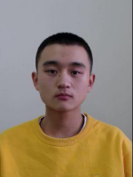
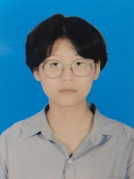
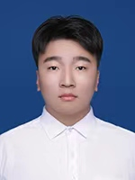
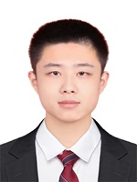

# 在读硕士生
- 2023级硕士生（3人）：李松霖，袁健会，肖威
- 2024级硕士生（9人）：李贵祥，吴昊，孙耕浩，章晓丹，陈黄洋，张涛，檀磊，侯志斌，张顺浩
- 2025级硕士生（5人）：巩锦程，甄德杰，钟金运，常钰，姜文康
- 2026级硕士生（X人）：邱天，崔永权

***

## 李松霖，男，2000年12月生，吉林省长春市人。
- 2019.09-2023.06，吉林大学计算机科学与技术学院计算机科学与技术专业，本科生
- 2023.09至今，吉林大学计算机科学与技术学院计算机科学与技术专业，推免硕士生（导师：吕帅教授）
- 研究方向：人工智能、机器学习

## 【学术论文】在国内外期刊和会议上发表学术论文3篇，在审学术论文6篇。
1. **Li Songlin**, Wu Hao, Chen Huangyang, Zhou Wenbo\*, Li Jingyao\*. Anchor-based perturbation-driven exploration for offline-to-online
reinforcement learning. 2025. (Submitted)
2. Xiao Wei, **Li Songlin**, An Daolong, Wu Hao, Zhang Xiaodan, Lü Shuai\*. Corrected critic and adaptive constraint for offline-to-online reinforcement learning. 2025. (Submitted)
3. Wu Hao, **Li Songlin**, Xiao Wei, Zhong Taihong, Lü Shuai\*. Offline-to-online reinforcement learning with triple-intensity policy constraints. 2025. (Submitted)
4. Lin Dajun, **Li Songlin**, Lü Shuai\*, Zhou Wenbo\*, Zhong Taihong, An Daolong. WCPC-TD3: Weighted contrastive policy constraint for offline reinforcement learning. 2026. (Submitted)
5. Zhou Ruikai, **Li Songlin**, Lü Shuai\*. From simple to complex: Mitigating the impact of critic accuracy fluctuations by multi-agent reinforcement learning. 2026. (Submitted)
6. Zhou Ruikai, Zhong Taihong, **Li Songlin**, Lü Shuai\*. A Kullback-Leibler divergence perspective on policy gradient methods in reinforcement learning. 2026. (Submitted)
7. An Daolong, Shen Chun, **Li Songlin**, Xiao Wei, Lü Shuai\*, Zhou Wenbo\*. Result constraint behavior clone for offline reinforcement learning. **Neural Networks**, 2026, 196: 108355. **(中科院2区TOP期刊, CCF推荐B类期刊, SCI, 目前IF: 6.3)**
8. **Li Songlin**, Xiao Wei, Wu Hao, Zhang Xiaodan, An Daolong, Lü Shuai\*. State proficiency-based adaptive fine-tuning for offline-to-online reinforcement learning. In: **Proceedings of the 40th AAAI Conference on Artificial Intelligence (AAAI 2026)**, Singapore, January 20-27, 2026. **(CCF推荐A类会议)**
9. Shu Man, Lü Shuai\*, Gong Xiaoyu, An Daolong, **Li Songlin**. Episodic memory-double actor-critic twin delayed deep deterministic policy gradient. **Neural Networks**, 2025, 187: 107286. **(中科院2区TOP期刊, CCF推荐B类期刊, SCI, 目前IF: 6.3)**

## 【荣誉奖励】
- 2019-2020学年，一等奖学金、院优秀学生
- 2020-2021学年，一等奖学金、校优秀学生
- 2021-2022学年，一等奖学金、院优秀学生
- 2022-2023学年，二等奖学金、院优秀学生
- 2023.06，吉林大学优秀本科毕业论文：基于集成策略和集成评估提高强化学习样本效率和泛化能力
- 2023-2024学年，二等奖学金、优秀研究生、研究生学业奖学金
- 2024.12，中国研究生数学建模竞赛，国家级三等奖
- 2024-2025学年，研究生学业奖学金

## 【联系方式】
- 邮箱：lisl23@mails.jlu.edu.cn
- 办公：吉林大学王湘浩楼B227室
- 地址：长春市前进大街2699号，130012

***

## 袁健会，男，1999年06月生，吉林省长春市人。
- 2018.09-2022.06，东北电力大学计算机学院计算机科学与技术（卓越）专业，本科生（导师：李壮副教授）
- 2023.09至今，吉林大学软件学院软件工程专业，硕士生（导师：吕帅教授）
- 研究方向：人工智能、机器学习

## 【学术论文】在国内外期刊和会议上发表学术论文1篇，在审学术论文3篇。
1. Tan Lei, Guo Dong, Fang Wensi, Li Guixiang, **Yuan Jianhui**, Zhang Xiaodan, Lü Shuai\*. Divide and correct: Alternating normalization and prototype alignment for continual test-time adaptation. 2025. (Submitted)
2. **Yuan Jianhui**, Zhang Xinyu, Li Guixiang, Tan Lei, Li Jingyao\*, Zhou Wenbo\*. GRACE: Enhancing source-free universal domain adaptation via gradient-aware contrastive learning and entropy-aware alignment. 2025. (Submitted)
3. Lü Shuai, **Yuan Jianhui**, Zhang Xinyu, Zhang Shaojie, Fang Wensi, Li Jingyao\*. Pre-trained initialization and memory-enhanced correction for source-free universal domain adaptation. 2025. (Submitted)
4. Li Zhuang, **Yuan Jianhui**, Li Guixiang, Wang Hao, Li Xingcan, Li Dan, Wang Xinhua\*. RSI-YOLO: Object detection method for remote sensing images based on improved YOLO. **Sensors**, 2023, 23: 6414. **(中科院2区期刊, SCI, IF: 3.4)**

## 【荣誉奖励】
- 2018-2019学年，国家励志奖学金、三等奖学金
- 2019-2020学年，国家励志奖学金、吉林省政府奖学金、二等奖学金、二等奖学金、校优秀学生干部标兵
- 2019-2020学年，芮捷助学金
- 2020.12，吉林省大学生电子设计竞赛，省级一等奖
- 2020-2021学年，三等奖学金、校优秀学生干部
- 2023-2024学年，优秀研究生、研究生学业奖学金
- 2024.12，中国研究生数学建模竞赛，国家级三等奖
- 2024-2025学年，研究生学业奖学金
- 2025-2026学年，研究生学业奖学金

## 【联系方式】
- 邮箱：jhyuan23@mails.jlu.edu.cn
- 办公：吉林大学王湘浩楼B227室
- 地址：长春市前进大街2699号，130012

***

## 肖威，男，2001年11月生，山东省菏泽市人。
- 2019.09-2023.06，山东师范大学信息科学与工程学院计算机科学与技术专业，本科生
- 2023.09至今，吉林大学计算机科学与技术学院计算机科学与技术专业，硕士生（导师：吕帅教授）
- 研究方向：人工智能、机器学习

## 【学术论文】在国内外期刊和会议上发表学术论文2篇，在审学术论文4篇。
1. **Xiao Wei**, Zhang Tao, Chen Huangyang, Li Jingyao\*, Zhou Wenbo\*. Q-bounded and adaptive Q-value constraints for offline-to-online reinforcement learning. 2025. (Submitted)
2. **Xiao Wei**, Li Songlin, An Daolong, Wu Hao, Zhang Xiaodan, Lü Shuai\*. Corrected critic and adaptive constraint for offline-to-online reinforcement learning. 2025. (Submitted)
3. Wu Hao, Li Songlin, **Xiao Wei**, Zhong Taihong, Lü Shuai\*. Offline-to-online reinforcement learning with triple-intensity policy constraints. 2025. (Submitted)
4. Zhu Wenbo, **Xiao Wei**, Lü Shuai*. Soft-penalty guided exploration in reinforcement learning. 2025. (Submitted)
5. An Daolong, Shen Chun, Li Songlin, **Xiao Wei**, Lü Shuai\*, Zhou Wenbo\*. Result constraint behavior clone for offline reinforcement learning. **Neural Networks**, 2026, 196: 108355. **(中科院2区TOP期刊, CCF推荐B类期刊, SCI, 目前IF: 6.3)**
6. Li Songlin, **Xiao Wei**, Wu Hao, Zhang Xiaodan, An Daolong, Lü Shuai\*. State proficiency-based adaptive fine-tuning for offline-to-online reinforcement learning. In: **Proceedings of the 40th AAAI Conference on Artificial Intelligence (AAAI 2026)**, Singapore, January 20-27, 2026. **(CCF推荐A类会议)**

## 【荣誉奖励】
- 2019-2020学年，三等奖学金、校优秀学生、校优秀学生干部
- 2020-2021学年，二等奖学金
- 2020-2021学年，三兴未来助学金
- 2021.05，蓝桥杯全国软件和信息技术专业人才大赛，省级一等奖
- 2023-2024学年，优秀研究生
- 2024.12，中国研究生数学建模竞赛，国家级三等奖
- 2024-2025学年，研究生学业奖学金

## 【联系方式】
- 邮箱：weixiao23@mails.jlu.edu.cn
- 办公：吉林大学王湘浩楼B227室
- 地址：长春市前进大街2699号，130012

***

## 李贵祥，男，2003年04月生，山东省聊城市人。
- 2020.09-2024.06，东北电力大学计算机学院智能科学与技术专业，本科生（导师：李壮副教授）（学业排名和综合排名均为第1/76名）
- 2024.09至今，吉林大学软件学院软件工程专业，推免硕士生（导师：吕帅教授）
- 研究方向：人工智能、机器学习

## 【学术论文】在国内外期刊和会议上发表学术论文2篇，在审学术论文2篇。
1. Tan Lei, Guo Dong, Fang Wensi, **Li Guixiang**, Yuan Jianhui, Zhang Xiaodan, Lü Shuai\*. Divide and correct: Alternating normalization and prototype alignment for continual test-time adaptation. 2025. (Submitted)
2. Yuan Jianhui, Zhang Xinyu, **Li Guixiang**, Tan Lei, Li Jingyao\*, Zhou Wenbo\*. GRACE: Enhancing source-free universal domain adaptation via gradient-aware contrastive learning and entropy-aware alignment. 2025. (Submitted)
3. Li Zhuang, **Li Guixiang**, Song Xiangyang, Wang Xinhua\*. EVD-YOLO: An efficient and dynamic framework for multi-scale target detection of underwater organisms. **Journal of Ocean University of China**, 2025. **(中科院2区期刊, SCI, 目前IF: 1.2)**
4. Li Zhuang, Yuan Jianhui, **Li Guixiang**, Wang Hao, Li Xingcan, Li Dan, Wang Xinhua\*. RSI-YOLO: Object detection method for remote sensing images based on improved YOLO. **Sensors**, 2023, 23: 6414. **(中科院2区期刊, SCI, IF: 3.4)**

## 【荣誉奖励】
- 2020-2021学年，一等奖学金、校优秀学生
- 2021-2022学年，一等奖学金、二等奖学金、校优秀学生标兵
- 2022-2023学年，二等奖学金
- 2023.04，蓝桥杯全国软件和信息技术专业人才大赛，省级一等奖
- 2023.05，美国大学生数学建模竞赛，国家级三等奖
- 2024.12，中国研究生数学建模竞赛，国家级三等奖
- 2024-2025学年，研究生学业奖学金

## 【联系方式】
- 邮箱：guixiang24@mails.jlu.edu.cn
- 办公：吉林大学王湘浩楼B227室
- 地址：长春市前进大街2699号，130012

***

## 吴昊，男，2002年02月生，内蒙古自治区额尔古纳市人。
- 2020.09-2024.06，吉林大学计算机科学与技术学院计算机科学与技术专业，本科生
- 2024.09至今，吉林大学计算机科学与技术学院计算机科学与技术专业，推免硕士生（导师：吕帅教授）
- 研究方向：人工智能、机器学习

## 【学术论文】在国内外期刊和会议上发表学术论文1篇，在审学术论文5篇。
1. Liu Xuejie, Zhang Shunhao, **Wu Hao**, Hou Zhibin. Non-parametric behavior policy density estimation for offline reinforcement learning. 2025. (Submitted)
2. **Wu Hao**, Zhang Shunhao, Chen Huangyang, Zhang Tao, Zhou Wenbo\*, Li Jingyao\*. UDPBC: Uncertainty-guided dual-perspective behavior cloning for offline-to-online reinforcement learning. 2025. (Submitted)
3. Li Songlin, **Wu Hao**, Chen Huangyang, Zhou Wenbo\*, Li Jingyao\*. Anchor-based perturbation-driven exploration for offline-to-online
reinforcement learning. 2025. (Submitted)
4. Xiao Wei, Li Songlin, An Daolong, **Wu Hao**, Zhang Xiaodan, Lü Shuai\*. Corrected critic and adaptive constraint for offline-to-online reinforcement learning. 2025. (Submitted)
5. **Wu Hao**, Li Songlin, Xiao Wei, Zhong Taihong, Lü Shuai\*. Offline-to-online reinforcement learning with triple-intensity policy constraints. 2025. (Submitted)
6. Li Songlin, Xiao Wei, **Wu Hao**, Zhang Xiaodan, An Daolong, Lü Shuai\*. State proficiency-based adaptive fine-tuning for offline-to-online reinforcement learning. In: **Proceedings of the 40th AAAI Conference on Artificial Intelligence (AAAI 2026)**, Singapore, January 20-27, 2026. **(CCF推荐A类会议)**

## 【荣誉奖励】
- 2020-2021学年，三等奖学金
- 2021-2022学年，二等奖学金、院优秀学生
- 2022-2023学年，二等奖学金、院优秀学生
- 2023.04，蓝桥杯全国软件和信息技术专业人才大赛，省级一等奖
- 2023.06，蓝桥杯全国软件和信息技术专业人才大赛全国总决赛，国家级优秀奖
- 2023.08，中国大学生计算机博弈大赛海克斯项目，国家级一等奖（冠军）
- 2023年度，吉林大学智能基座产教融合协同育人基地奖学金
- 2024-2025学年，研究生学业奖学金
- 2025.12，中国研究生数学建模竞赛，国家级二等奖

## 【联系方式】
- 邮箱：haowu24@mails.jlu.edu.cn
- 办公：吉林大学王湘浩楼B230室
- 地址：长春市前进大街2699号，130012

***

## 孙耕浩，男，2001年07月生，山东省德州市人。
- 2020.09-2024.06，西安石油大学计算机学院计算机科学与技术专业，本科生（学业排名为第2/181名，综合排名为第1/181名）
- 2024.09至今，吉林大学软件学院软件工程专业，推免硕士生（导师：吕帅教授）
- 研究方向：人工智能、机器学习

## 【学术论文】在国内外期刊和会议上发表学术论文0篇，在审学术论文1篇。
1. Chen Huangyang, Chen Juan, Zhang Tao, **Sun Genghao**, Lü Shuai\*. Reward shaping based on trajectory quality for offline and hybrid reinforcement learning. 2025. (Submitted)

## 【荣誉奖励】
- 2020-2021学年，国家励志奖学金、校三好学生、校优秀学生干部
- 2021-2022学年，国家奖学金、校三好学生、校优秀学生干部
- 2022.11，中国机器人大赛暨RoboCup机器人世界杯中国赛FIRA小型组半自主5vs5项目，国家级二等奖
- 2022.11，中国机器人大赛暨RoboCup机器人世界杯中国赛FIRA小型组半自主11vs11项目，国家级二等奖
- 2022-2023学年，国家励志奖学金
- 2023.11，中国机器人大赛暨RoboCup机器人世界杯中国赛FIRA小型组半自主5vs5项目，国家级一等奖（亚军）
- 2024.12，中国研究生数学建模竞赛，国家级三等奖
- 2024-2025学年，研究生学业奖学金

## 【联系方式】
- 邮箱：sungh24@mails.jlu.edu.cn
- 办公：吉林大学王湘浩楼B227室
- 地址：长春市前进大街2699号，130012

***

## 章晓丹，女，2002年01月生，山东省威海市人。
- 2020.09-2024.06，吉林大学计算机科学与技术学院计算机科学与技术专业，本科生
- 2024.09至今，吉林大学计算机科学与技术学院计算机科学与技术专业，推免硕士生（导师：吕帅教授）
- 研究方向：人工智能、机器学习

## 【学术论文】在国内外期刊和会议上发表学术论文2篇，在审学术论文3篇。
1. Tan Lei, Guo Dong, Fang Wensi, Li Guixiang, Yuan Jianhui, **Zhang Xiaodan**, Lü Shuai\*. Divide and correct: Alternating normalization and prototype alignment for continual test-time adaptation. 2025. (Submitted)
2. **Zhang Xiaodan**, Fang Wensi, Tan Lei, Lü Shuai\*. AutoVote: Adaptive learning rate modulation for continual test-time adaptation via sensitivity voting. 2025. (Submitted)
3. Xiao Wei, Li Songlin, An Daolong, Wu Hao, **Zhang Xiaodan**, Lü Shuai\*. Corrected critic and adaptive constraint for offline-to-online reinforcement learning. 2025. (Submitted)
4. Li Songlin, Xiao Wei, Wu Hao, **Zhang Xiaodan**, An Daolong, Lü Shuai\*. State proficiency-based adaptive fine-tuning for offline-to-online reinforcement learning. In: **Proceedings of the 40th AAAI Conference on Artificial Intelligence (AAAI 2026)**, Singapore, January 20-27, 2026. **(CCF推荐A类会议)**
5. Xiong Xi, Shen Chun, Wu Junhong, Lü Shuai\*, **Zhang Xiaodan**. Combined data augmentation framework for generalizing deep reinforcement learning from pixels. **Expert Systems with Applications**, 2025, 264: 125810. **(中科院1区TOP期刊, CCF推荐C类期刊, SCI, 目前IF: 7.5)**

## 【荣誉奖励】
- 2020-2021学年，一等奖学金、校优秀学生
- 2021.11，全国大学生数学建模竞赛，国家级二等奖
- 2021.12，全国大学生数学建模竞赛，省级一等奖
- 2021-2022学年，二等奖学金、院优秀学生
- 2022.12，全国大学生数学建模竞赛，省级一等奖
- 2022-2023学年，三等奖学金
- 2023.04，全国大学生市场调研与分析大赛，国家级三等奖
- 2023.05，美国大学生数学建模竞赛，国家级三等奖
- 2023.06，大学生创新创业训练计划——创新训练项目：基于Vtuber的对韩成语文化输出模式的探讨与实践，国家级优秀结题（项目成员）
- 2024.06，吉林大学优秀本科毕业生
- 2024.12，中国研究生数学建模竞赛，国家级三等奖
- 2024-2025学年，一等奖学金、优秀研究生、研究生学业奖学金
- 2025-2026学年，研究生学业奖学金

## 【联系方式】
- 邮箱：xdzhang24@mails.jlu.edu.cn
- 办公：吉林大学王湘浩楼B227室
- 地址：长春市前进大街2699号，130012

***

## 陈黄洋，男，2002年08月生，福建省漳州市人。
- 2020.09-2024.06，东北电力大学计算机学院软件工程专业，本科生（学业排名和综合排名均为第1/70名）
- 2024.09至今，吉林大学软件学院软件工程专业，推免硕士生（导师：吕帅教授、陈娟教授）
- 研究方向：人工智能、机器学习

## 【学术论文】在国内外期刊和会议上发表学术论文0篇，在审学术论文4篇。
1. Wu Hao, Zhang Shunhao, **Chen Huangyang**, Zhang Tao, Zhou Wenbo\*, Li Jingyao\*. UDPBC: Uncertainty-guided dual-perspective behavior cloning for offline-to-online reinforcement learning. 2025. (Submitted)
2. Xiao Wei, Zhang Tao, **Chen Huangyang**, Li Jingyao\*, Zhou Wenbo\*. Q-bounded and adaptive Q-value constraints for offline-to-online reinforcement learning. 2025. (Submitted)
3. Li Songlin, Wu Hao, **Chen Huangyang**, Zhou Wenbo\*, Li Jingyao\*. Anchor-based perturbation-driven exploration for offline-to-online
reinforcement learning. 2025. (Submitted)
4. **Chen Huangyang**, Chen Juan, Zhang Tao, Sun Genghao, Lü Shuai\*. Reward shaping based on trajectory quality for offline and hybrid reinforcement learning. 2025. (Submitted)

## 【荣誉奖励】
- 2020-2021学年，一等奖学金、校优秀学生标兵
- 2021-2022学年，一等奖学金、校优秀学生标兵、校优秀学生干部
- 2022.12，全国大学生数学建模竞赛，省级一等奖
- 2022-2023学年，国家奖学金、一等奖学金
- 2023.04，蓝桥杯全国软件和信息技术专业人才大赛，省级一等奖
- 2023.05，中国高校计算机设计大赛团体程序设计天梯赛，团队国家二等奖、个人国家三等奖
- 2023.06，蓝桥杯全国软件和信息技术专业人才大赛全国总决赛，国家级一等奖
- 2024.04，蓝桥杯全国软件和信息技术专业人才大赛，省级一等奖
- 2024.04，中国高校计算机设计大赛团体程序设计天梯赛，团队国家三等奖、个人国家二等奖
- 2024.06，蓝桥杯全国软件和信息技术专业人才大赛全国总决赛，国家级一等奖
- 2024.12，中国研究生数学建模竞赛，国家级三等奖
- 2024-2025学年，优秀研究生、研究生学业奖学金
- 2025-2026学年，研究生学业奖学金

## 【联系方式】
- 邮箱：hychen24@mails.jlu.edu.cn
- 办公：吉林大学王湘浩楼B227室
- 地址：长春市前进大街2699号，130012

***

## 张涛，男，2002年10月生，河南省濮阳市人。
- 2020.09-2024.06，辽宁科技大学计算机与软件工程学院网络工程专业，本科生（学业排名和综合排名均为第1/144名）
- 2024.09至今，吉林大学软件学院软件工程专业，推免硕士生（导师：吕帅教授、朱允刚副教授）
- 研究方向：人工智能、机器学习

## 【学术论文】在国内外期刊和会议上发表学术论文0篇，在审学术论文3篇。
1. Wu Hao, Zhang Shunhao, Chen Huangyang, **Zhang Tao**, Zhou Wenbo\*, Li Jingyao\*. UDPBC: Uncertainty-guided dual-perspective behavior cloning for offline-to-online reinforcement learning. 2025. (Submitted)
2. Xiao Wei, **Zhang Tao**, Chen Huangyang, Li Jingyao\*, Zhou Wenbo\*. Q-bounded and adaptive Q-value constraints for offline-to-online reinforcement learning. 2025. (Submitted)
3. Chen Huangyang, Chen Juan, **Zhang Tao**, Sun Genghao, Lü Shuai\*. Reward shaping based on trajectory quality for offline and hybrid reinforcement learning. 2025. (Submitted)

## 【荣誉奖励】
- 2020-2021学年，国家励志奖学金、二等奖学金、校三好学生
- 2021-2022学年，辽宁省政府奖学金、一等奖学金、校三好学生标兵
- 2022.05，美国大学生数学建模竞赛，国家级三等奖
- 2022.05，蓝桥杯全国软件和信息技术专业人才大赛，省级一等奖
- 2022.08，中国大学生计算机博弈大赛苏拉卡尔塔棋项目，国家级二等奖
- 2022-2023学年，一等奖学金、校三好学生标兵
- 2023.04，蓝桥杯全国软件和信息技术专业人才大赛，省级一等奖
- 2023.05，美国大学生数学建模竞赛，国家级二等奖
- 2024-2025学年，优秀研究生、研究生学业奖学金
- 2025-2026学年，研究生学业奖学金

## 【联系方式】
- 邮箱：zhangtao24@mails.jlu.edu.cn
- 办公：吉林大学王湘浩楼B227室
- 地址：长春市前进大街2699号，130012

***

## 檀磊，男，2000年11月生，安徽省安庆市人。
- 2020.09-2024.06，安徽农业大学信息与计算机学院物联网工程专业，本科生（学业排名和综合排名均为第1/59名）
- 2024.09至今，吉林大学软件学院软件工程专业，推免硕士生（导师：吕帅教授、郭东教授）
- 研究方向：人工智能、机器学习

## 【学术论文和发明专利】在国内外期刊和会议上发表学术论文1篇，在审学术论文3篇，申请发明专利（目前实质审查）1项。
1. **Tan Lei**, Guo Dong, Fang Wensi, Li Guixiang, Yuan Jianhui, Zhang Xiaodan, Lü Shuai\*. Divide and correct: Alternating normalization and prototype alignment for continual test-time adaptation. 2025. (Submitted)
2. Zhang Xiaodan, Fang Wensi, **Tan Lei**, Lü Shuai\*. AutoVote: Adaptive learning rate modulation for continual test-time adaptation via sensitivity voting. 2025. (Submitted)
3. Yuan Jianhui, Zhang Xinyu, Li Guixiang, **Tan Lei**, Li Jingyao\*, Zhou Wenbo\*. GRACE: Enhancing source-free universal domain adaptation via gradient-aware contrastive learning and entropy-aware alignment. 2025. (Submitted)
4. 马慧敏\*, **檀磊**, 张京会, 张鹏飞, 宁孝梅, 刘海秋, 高彦伟. 基于深度学习的合成孔径成像系统共相误差检测研究综述. **量子电子学报**, 2022, 39(6): 927-941. (第一作者为指导教师)
5. **檀磊**, 马慧敏, 王小申, 戴明宇, 代腾辉, 焦俊, 刘倩, 辜丽川. 基于多尺度生成对抗网络的大气湍流图像复原方法及系统. (申请号: CN2023 1 1725750.0, 申请日: 2023.12.14, 目前实质审查)

## 【荣誉奖励】
- 2020-2021学年，特等奖学金、校三好学生
- 2021.11，中国互联网+大学生创新创业大赛，省级一等奖
- 2021-2022学年，特等奖学金、校三好学生、校自立自强大学生
- 2022.06，国际大学生智能农业装备创新大赛，国家级二等奖
- 2022.08，全国大学生生命科学竞赛，国家级一等奖
- 2022-2023学年，国家奖学金、一等奖学金
- 2023.06，中国大学生计算机设计大赛，省级一等奖
- 2024.12，中国研究生数学建模竞赛，国家级三等奖
- 2025.12，中国研究生数学建模竞赛，国家级三等奖

## 【联系方式】
- 邮箱：tanlei24@mails.jlu.edu.cn
- 办公：吉林大学王湘浩楼B227室
- 地址：长春市前进大街2699号，130012

***

## 侯志斌，男，1999年08月生，山东省菏泽市人。
- 2017.09-2021.06，临沂大学信息科学与工程学院网络工程专业，本科生
- 2024.09至今，吉林大学软件学院软件工程专业，硕士生（导师：刘雪洁副教授、吕帅教授）
- 研究方向：人工智能、机器学习

## 【学术论文】在国内外期刊和会议上发表学术论文0篇，在审学术论文1篇。
1. Liu Xuejie, Zhang Shunhao, Wu Hao, **Hou Zhibin**. Non-parametric behavior policy density estimation for offline reinforcement learning. 2025. (Submitted)

## 【荣誉奖励】
- 2020.10，蓝桥杯全国软件和信息技术专业人才大赛，省级一等奖
- 2020.11，蓝桥杯全国软件和信息技术专业人才大赛全国总决赛，国家级一等奖
- 2021.05，中国高校计算机设计大赛团体程序设计天梯赛，团队国家二等奖、个人国家二等奖
- 2021.05，蓝桥杯全国软件和信息技术专业人才大赛，省级一等奖
- 2021.05，山东省大学生程序设计竞赛，省级金奖
- 2024.12，中国研究生数学建模竞赛，国家级三等奖
- 2025.12，中国研究生数学建模竞赛，国家级三等奖

## 【联系方式】
- 邮箱：houzb24@mails.jlu.edu.cn
- 办公：吉林大学王湘浩楼B226室
- 地址：长春市前进大街2699号，130012

***

## 张顺浩，男，2002年03月生，山东省济南市人。
- 2020.09-2024.06，重庆理工大学车辆工程学院车辆工程[新能源及智能汽车教改班]专业，本科生
- 2020.09-2024.06，重庆理工大学计算机科学与工程学院计算机科学与技术专业（辅修），本科生
- 2024.09至今，吉林大学计算机科学与技术学院计算机科学与技术专业，硕士生（导师：刘雪洁副教授、吕帅教授）
- 研究方向：人工智能、机器学习

## 【学术论文】在国内外期刊和会议上发表学术论文0篇，在审学术论文2篇。
1. Liu Xuejie, **Zhang Shunhao**, Wu Hao, Hou Zhibin. Non-parametric behavior policy density estimation for offline reinforcement learning. 2025. (Submitted)
2. Wu Hao, **Zhang Shunhao**, Chen Huangyang, Zhang Tao, Zhou Wenbo\*, Li Jingyao\*. UDPBC: Uncertainty-guided dual-perspective behavior cloning for offline-to-online reinforcement learning. 2025. (Submitted)

## 【荣誉奖励】
- 2020-2021学年，国家励志奖学金、综合甲等奖学金
- 2021-2022学年，综合乙等奖学金
- 2022-2023学年，综合乙等奖学金
- 2024-2025学年，优秀研究生
- 2025-2026学年，研究生学业奖学金

## 【联系方式】
- 邮箱：shunhao24@mails.jlu.edu.cn
- 办公：吉林大学王湘浩楼B226室
- 地址：长春市前进大街2699号，130012

***

## 巩锦程，男，2002年09月生，山东省淄博市人。
-	2021.09-2025.06，华北电力大学（保定）计算机系计算机科学与技术专业，本科生
-	2025.09至今，吉林大学软件学院软件工程专业，推免硕士生（导师：吕帅教授）
-	研究方向：人工智能、机器学习

## 【荣誉奖励】
-	2021-2022学年，国家励志奖学金、二等奖学金、校三好学生
-	2023-2024学年，国家励志奖学金、三等奖学金
-	2024.05，美国大学生数学建模竞赛，国家级一等奖
-	2025-2026学年，研究生学业奖学金

## 【联系方式】
-	邮箱：gongjc25@mails.jlu.edu.cn
-	办公：吉林大学王湘浩楼B230室
-	地址：长春市前进大街2699号，130012

***

## 甄德杰，男，2003年05月生，河北省邢台市人。
-	2021.09-2025.06，河北大学数学与信息科学学院软件工程专业，本科生（学业排名和综合排名均为第1/86名）
-	2025.09至今，吉林大学软件学院软件工程专业，推免硕士生（导师：吕帅教授）
-	研究方向：人工智能、机器学习

## 【荣誉奖励】
-	2021-2022学年，国家励志奖学金、一等奖学金
-	2022-2023学年，国家励志奖学金、一等奖学金、校三好学生
- 2023.10，全国大学生数学建模竞赛，省级一等奖
- 2023-2024学年，国家励志奖学金、一等奖学金
- 2024.04，中国高校计算机设计大赛团体程序设计天梯赛，个人国家三等奖
- 2025.12，中国研究生数学建模竞赛，国家级三等奖
- 2025-2026学年，研究生学业奖学金

## 【联系方式】
-	邮箱：zhendj25@mails.jlu.edu.cn
-	办公：吉林大学王湘浩楼B230室
-	地址：长春市前进大街2699号，130012

***

## 钟金运，男，2003年06月生，江西省瑞金市人。
-	2021.09-2025.06，西南科技大学国防科技学院信息对抗技术专业，本科生（学业排名和综合排名均为第2/79名）
-	2025.09至今，吉林大学计算机科学与技术学院计算机科学与技术专业，推免硕士生（导师：吕帅教授）
-	研究方向：人工智能、机器学习

## 【荣誉奖励】
-	2022-2023学年，国家励志奖学金
- 2023.03，全国大学生数学竞赛，省级一等奖
- 2023-2024学年，国家励志奖学金
- 2024.03，攀拓计算机能力测评-程序设计（甲级），97/100分(44/338名)
- 2024.04，蓝桥杯全国软件和信息技术专业人才大赛，省级一等奖
- 2024.06，蓝桥杯全国软件和信息技术专业人才大赛全国总决赛，国家级三等奖
- 2024.09，攀拓计算机能力测评-程序设计（顶级），二等奖
- 2024.10，CCSP大学生计算机系统与程序设计竞赛，国家级铜奖
- 2025-2026学年，研究生学业奖学金

## 【联系方式】
-	邮箱：zhongjy25@mails.jlu.edu.cn
-	办公：吉林大学王湘浩楼B230室
-	地址：长春市前进大街2699号，130012

***

## 常钰，女，2003年01月生，辽宁省大连市人。
- 2021.09-2025.06，东北师范大学信息科学与技术学院计算机科学与技术专业，本科生
- 2025.09至今，吉林大学软件学院软件工程专业，推免硕士生（导师：吕帅教授）
- 研究方向：人工智能、机器学习

## 【荣誉奖励】
- 2021-2022学年，一等奖学金、校优秀学生
- 2022-2023学年，校长奖学金
- 2023.04，全国大学生市场调研与分析大赛，国家级三等奖
- 2023-2024学年，二等奖学金、校优秀学生干部
- 2024.07，中国大学生计算机设计大赛，国家级三等奖
- 2025-2026学年，研究生学业奖学金

## 【联系方式】
-	邮箱：changyu25@mails.jlu.edu.cn
-	办公：吉林大学王湘浩楼B230室
-	地址：长春市前进大街2699号，130012

***

## 姜文康，男，2003年07月生，山东省德州市人。
- 2021.09-2025.06，新疆大学软件学院软件工程专业，本科生
- 2025.09至今，吉林大学软件学院软件工程专业，推免硕士生（导师：吕帅教授）
- 研究方向：人工智能、机器学习

## 【荣誉奖励】
- 2021-2022学年，新疆维吾尔自治区人民政府励志奖学金
- 2022.05，蓝桥杯全国软件和信息技术专业人才大赛，省级一等奖
- 2022-2023学年，国家励志奖学金、校三好学生 
- 2023.05，软件设计师（软考中级）
- 2025.12，中国研究生数学建模竞赛，国家级二等奖
- 2025-2026学年，研究生学业奖学金

## 【联系方式】
-	邮箱：jiangwk25@mails.jlu.edu.cn
-	办公：吉林大学王湘浩楼B230室
-	地址：长春市前进大街2699号，130012

***

## 邱天，女，2004年07月生，黑龙江省齐齐哈尔市人。
- 2022.09至今，吉林大学软件学院工科试验班（软件工程），本科生
- 预计2026.09开始，吉林大学计算机科学与技术学院计算机科学与技术专业，推免硕士生（导师：吕帅教授）
- 研究方向：人工智能、机器学习

## 【荣誉奖励】
- 2022-2023学年，二等奖学金、院优秀学生
- 2023.04，蓝桥杯全国软件和信息技术专业人才大赛，省级一等奖
- 2023.06，蓝桥杯全国软件和信息技术专业人才大赛全国总决赛，国家级三等奖
- 2023.12，ICPC国际大学生程序设计竞赛（杭州），铜牌
- 2023-2024学年，一等奖学金、院优秀学生
- 2024.04，蓝桥杯全国软件和信息技术专业人才大赛，省级一等奖
- 2024.04，中国高校计算机设计大赛团体程序设计天梯赛，团队二等奖、个人三等奖
- 2024.05，CCPC中国大学生程序设计竞赛全国邀请赛（长春）暨CCPC吉林省大学生程序设计竞赛，金牌
- 2024.05，CCPC中国大学生程序设计竞赛全国邀请赛（东北），金牌
- 2024.06，蓝桥杯全国软件和信息技术专业人才大赛全国总决赛，国家级二等奖
- 2024.10，CCPC中国大学生程序设计竞赛（哈尔滨），银牌
- 2024.11，CCPC中国大学生程序设计竞赛（女生专场），金牌
- 2024.12，ICPC国际大学生程序设计竞赛（昆明），铜牌
- 2024.12，ICPC国际大学生程序设计竞赛（香港），银牌
- 2025.04，蓝桥杯全国软件和信息技术专业人才大赛，省级一等奖
- 2025.04，中国高校计算机设计大赛团体程序设计天梯赛，团队二等奖、个人一等奖
- 2025.04，CCPC中国大学生程序设计竞赛北京市大学生程序设计竞赛，银牌
- 2025.04，ICPC国际大学生程序设计竞赛全国邀请赛（武汉），银牌
- 2025.05，ICPC国际大学生程序设计竞赛全国邀请赛（陕西），金牌
- 2025.05，CCPC吉林省大学生程序设计竞赛，冠军+金牌
- 2025.05，CCPC中国大学生程序设计竞赛全国邀请赛（东北），金牌
- 2025.06，蓝桥杯全国软件和信息技术专业人才大赛全国总决赛，国家级二等奖
- 2025.06，CCPC中国大学生程序设计竞赛全国邀请赛（福州），金牌
- 2025.08，百度之星程序设计大赛，省级一等奖
- 2025.10，ICPC国际大学生程序设计竞赛（西安），金牌
- 2025.10，CCPC中国大学生程序设计竞赛（女生专场），金牌
- 2025.11，CCPC中国大学生程序设计竞赛（哈尔滨），铜牌 
- 2025.11，ICPC国际大学生程序设计竞赛（上海），银牌
- 2025.11，CCPC中国大学生程序设计竞赛（重庆），铜牌 

## 【联系方式】
-	邮箱：待学校分配
-	办公：吉林大学王湘浩楼B2XX室
-	地址：长春市前进大街2699号，130012

***

## 崔永权，男，2004年09月生，河南省平顶山市人。
- 2022.09至今，长春理工大学计算机科学技术学院计算机科学与技术（基础拔尖班）专业，本科生
- 预计2026.09开始，吉林大学计算机科学与技术学院计算机科学与技术专业，推免硕士生（导师：吕帅教授）
- 研究方向：人工智能、机器学习

## 【荣誉奖励】
- 2022年度，学业奖学金三等奖
- 2022-2023学年，国家励志奖学金、一等奖学金、校长奖学金、校三好学生、校优秀学生干部
- 2023-2024学年，国家奖学金、校长奖学金、校长奖学金、校三好学生标兵
- 2024.04，蓝桥杯全国软件和信息技术专业人才大赛，省级一等奖
- 2024.06，蓝桥杯全国软件和信息技术专业人才大赛全国总决赛，国家级三等奖
- 2024.12，全国大学生数学建模竞赛，省级一等奖
- 2024-2025学年，一等奖学金
- 2025.05，中国大学生计算机设计大赛，省级一等奖
- 2025.07，中国机器人及人工智能大赛，省级一等奖
- 2025.08，中国大学生计算机设计大赛，国家级三等奖
- 2025.08，中国机器人及人工智能大赛全国总决赛，国家级一等奖

## 【联系方式】
-	邮箱：待学校分配
-	办公：吉林大学王湘浩楼B2XX室
-	地址：长春市前进大街2699号，130012
